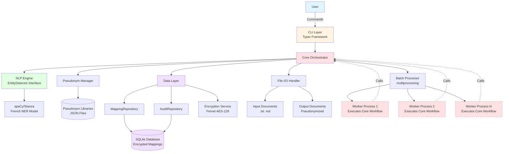
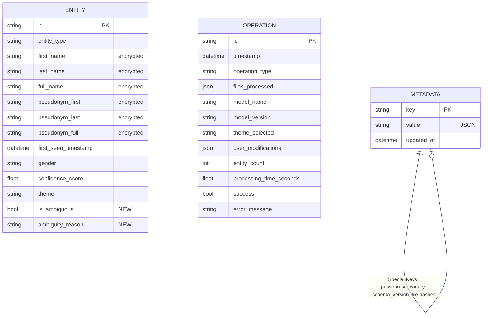
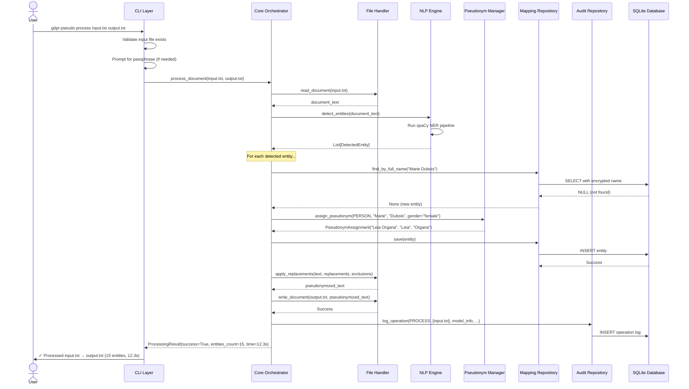
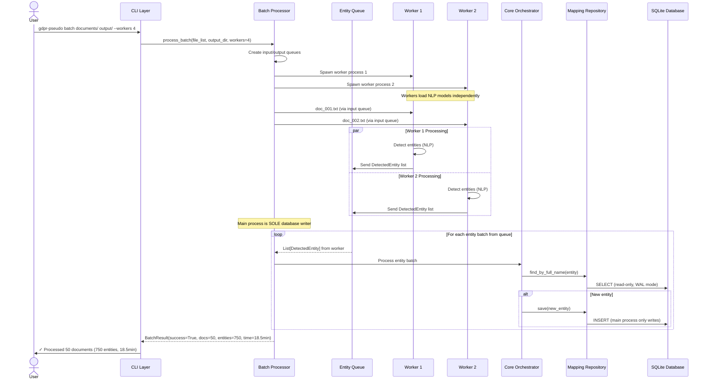
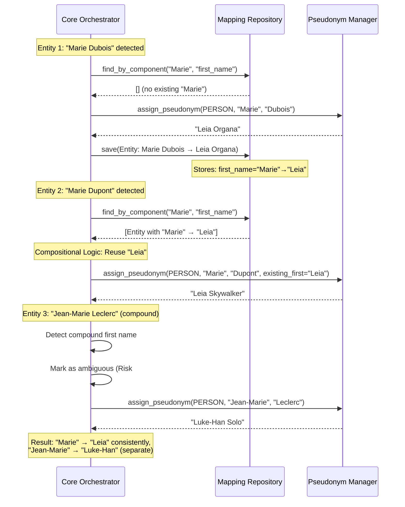
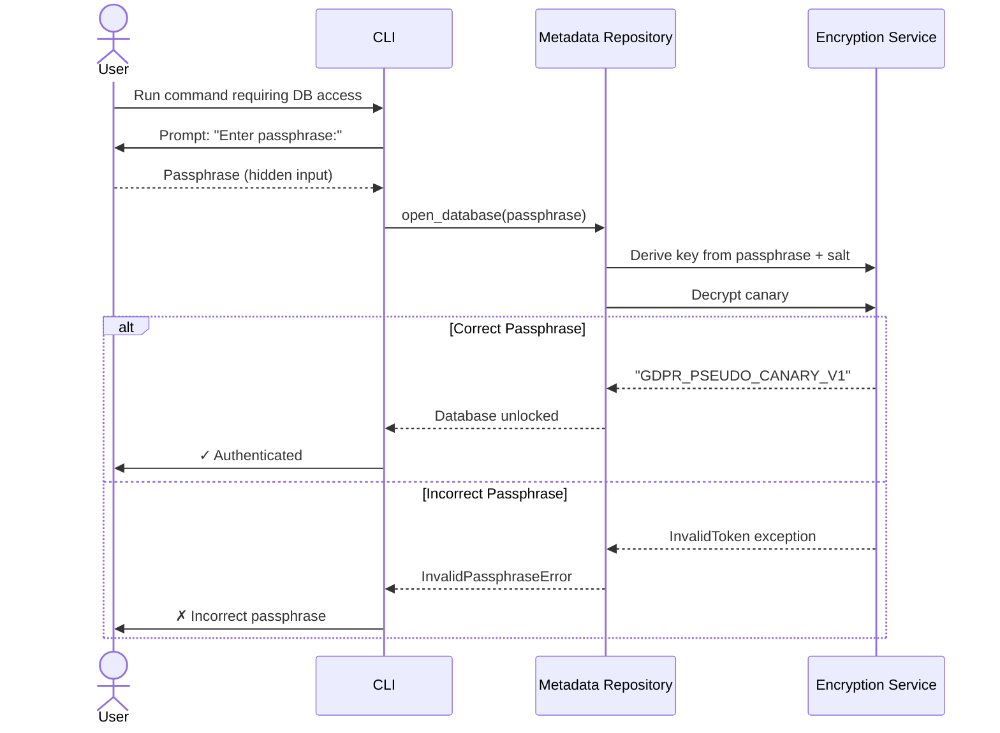

# GDPR Pseudonymizer System Architecture Document

**Version:** 1.0
**Date:** 2026-01-12
**Author:** Winston (Architect)
**Status:** Approved for Development

---

## Table of Contents

1. [Introduction](#1-introduction)
2. [High Level Architecture](#2-high-level-architecture)
3. [Tech Stack](#3-tech-stack)
4. [Data Models](#4-data-models)
5. [Internal Module Interfaces](#5-internal-module-interfaces)
6. [Components](#6-components)
7. [External APIs](#7-external-apis)
8. [Core Workflows](#8-core-workflows)
9. [Database Schema](#9-database-schema)
10. [Frontend Architecture](#10-frontend-architecture)
11. [Backend Architecture](#11-backend-architecture)
12. [Unified Project Structure](#12-unified-project-structure)
13. [Development Workflow](#13-development-workflow)
14. [Deployment Architecture](#14-deployment-architecture)
15. [Security and Performance](#15-security-and-performance)
16. [Testing Strategy](#16-testing-strategy)
17. [Error Handling Strategy](#17-error-handling-strategy)
18. [Monitoring and Observability](#18-monitoring-and-observability)
19. [Coding Standards](#19-coding-standards)
20. [Checklist Results Report](#20-checklist-results-report)

---

## 1. Introduction

This document outlines the complete system architecture for the **GDPR Pseudonymizer**, a local Python CLI tool that enables GDPR-compliant pseudonymization of French text documents. The tool automatically detects and replaces personal identifiers (names, locations, organizations) with consistent, readable pseudonyms—entirely on the user's infrastructure.

While this is not a traditional fullstack web application, this architecture document covers the complete technology stack from the CLI interface layer through the core processing engine, NLP pipeline, data persistence layer, and infrastructure concerns. It serves as the single source of truth for AI-driven development of a modular monolithic Python application.

**Architecture Philosophy:** This design prioritizes **local-first processing**, **cross-platform compatibility**, **security by design**, and **clear modular boundaries** that enable future evolution (potential GUI in Phase 2, alternative NLP engines, extended language support).

---

### 1.1 Primary Use Case: LLM Enablement

This architecture enables the core workflow:

**User has sensitive French documents → Pseudonymize locally → Safely send to ChatGPT/Claude → Analyze results → Reverse pseudonyms if needed**

Every architectural decision prioritizes this workflow's **reliability**, **security**, and **document utility preservation**. The system must maintain ≥80% LLM analysis quality while protecting personal data through local-only processing with encrypted reversible mappings.

---

### 1.2 Starter Template or Existing Project

**Status:** N/A - Greenfield project

This is a new Python CLI application built from scratch without starter templates. The project uses:
- **Poetry** for modern Python dependency management and packaging
- **Typer** as the CLI framework foundation (chosen for excellent type hints support)
- **spaCy/Stanza** NLP framework (selection determined in Epic 0-1 benchmarking via decision tree below)
- Standard Python project structure with clear module boundaries

**NLP Library Selection (Week 0 Decision Tree):**
- **IF** spaCy achieves ≥85% F1 score: Choose spaCy (faster, better documentation, larger community)
- **ELSE IF** Stanza achieves ≥85% F1 score: Choose Stanza (Stanford NLP quality)
- **ELSE IF** best score ≥80% F1: Proceed with mandatory `--validate` mode enabled by default (user reviews all entities)
- **ELSE**: Execute contingency plan:
  - **Option A:** Hybrid NER + French name dictionary rules
  - **Option B:** Pivot to English language market (higher NER accuracy available)

**Rationale for Greenfield Approach:**
- No existing Python CLI templates provide the specific combination of NLP, encryption, and batch processing needed
- Clean slate allows optimal architecture for local-first, security-focused design
- Modular structure from day one enables future feature expansion without technical debt

**NLP Abstraction Layer:** The architecture defines an `EntityDetector` interface to isolate spaCy/Stanza implementation details. This enables Epic 1 benchmarking (testing both libraries) and future library swaps without core logic changes. Minimal overhead (~50 lines of code), high flexibility value.

---

### 1.3 Change Log

| Date | Version | Description | Author |
|------|---------|-------------|--------|
| 2026-01-12 | v1.0 | Initial architecture document creation | Winston (Architect) |

---

### 1.4 Rationale & Key Architectural Decisions

**Trade-offs Made:**

1. **Monolithic vs Microservices:** Chose modular monolith for MVP simplicity while maintaining clear internal boundaries (CLI → Core → NLP → Data layers). This reduces deployment complexity and avoids network overhead while preserving future decomposition options.

2. **Process-based Parallelism:** Required by spaCy's thread-safety limitations (global model state). Increases memory footprint but enables batch processing scalability. Alternative would be sequential processing (unacceptable for 50+ document batches).

3. **Python-native Encryption vs SQLCipher:** Switched from SQLCipher to Python's `cryptography` library to eliminate platform-specific compilation issues. Using **`cryptography.fernet`** (symmetric AES-128 in CBC mode with HMAC authentication) via PBKDF2 key derivation from user passphrase. Column-level encryption for names/pseudonyms provides equivalent security with 85%+ installation success rate target (NFR3).

4. **CLI-only MVP:** Defers GUI to Phase 2 to validate core value proposition with technical early adopters first. Reduces scope risk and accelerates time-to-market for primary use case (LLM enablement).

**Architectural Constraint:** Process-based parallelism with shared SQLite creates database locking that limits future service decomposition. This is acceptable for MVP (single-user, local-only tool) but Phase 3+ distributed architecture would require migration to client-server database (PostgreSQL) or message queue pattern. **We are optimizing for MVP success, not hypothetical enterprise scale.**

**Key Assumptions:**
- Users have Python 3.9+ installed or can install it (target platforms: Windows 10/11, macOS 11+, Linux)
- NLP library (spaCy or Stanza) achieves ≥85% F1 score on French NER (validated in Epic 0-1 benchmark)
- Consumer hardware sufficient (8GB RAM, dual-core 2.0GHz+ CPU)
- Users accept CLI interaction for MVP; GUI demanded for broader adoption in Phase 2

**Hard Quality Gates:**
- **Week 0:** NLP benchmark achieves ≥85.0% F1 score (not 84.9%) OR execute contingency plan
- **Epic 2:** Single-document processing completes in ≤30s for 95th percentile of test corpus
- **Epic 3:** Batch of 50 documents completes in ≤30min with zero crashes
- **Epic 4:** Installation succeeds on ≥85% of platform test matrix (minimum 17/20 clean installs across Windows/macOS/Linux variants)

---

## 2. High Level Architecture

This section establishes the foundation with multiple subsections presented together.

### 2.1 Technical Summary

The GDPR Pseudonymizer follows a **modular monolithic architecture** with clear layered separation:

- **Architectural Style:** Local-first CLI application with modular monolithic structure, optimized for single-user batch processing workflows
- **Technology Stack:** Python 3.9+ runtime with spaCy/Stanza NLP engine, SQLite persistence with Fernet encryption, Typer CLI framework
- **Key Integration Points:**
  - CLI layer → Core orchestrator (command routing, workflow coordination)
  - Core → NLP engine (entity detection via abstracted interface)
  - Core → Data layer (encrypted mapping table, audit logs)
  - Core → Pseudonym manager (themed name libraries, assignment logic)
- **Infrastructure:** Cross-platform deployment (Windows/macOS/Linux) via PyPI package distribution, local-only processing with zero network dependencies
- **PRD Goal Alignment:** The architecture directly enables GDPR-compliant pseudonymization (FR1-21) with ≥90% NER accuracy (NFR8-9), <30s single-document processing (NFR1), batch efficiency (NFR2), and ≥85% installation success (NFR3) through Python-native encryption and dependency management

---

### 2.2 Platform and Infrastructure Choice

Since this is a **local-first CLI tool** rather than a cloud-hosted application, the "platform" concept differs from typical web architectures:

**Primary Platform:** **Local User Machine (Consumer Hardware)**
- **Runtime Environment:** Python 3.9+ interpreter
- **Operating Systems:** Windows 10/11, macOS 11+ (Intel & Apple Silicon), Linux (Ubuntu 20.04+, Debian 11+, Fedora 35+)
- **Hardware Requirements:** 8GB RAM, dual-core 2.0GHz+ CPU, 2GB disk space (including NLP models)

**Distribution Platform:** **PyPI (Python Package Index)**
- Package name: `gdpr-pseudonymizer`
- CLI entry point: `gdpr-pseudo`
- Dependency management: Poetry (development), pip (user installation)

**Key Services/Components:**
- **NLP Model Service:** spaCy `fr_core_news_lg` or Stanza French models (downloaded post-install)
- **Encryption Service:** Python `cryptography` library (Fernet symmetric encryption)
- **Data Persistence:** SQLite database (local filesystem)
- **Parallel Processing:** Python `multiprocessing` module (process pool for batch operations)

**Deployment Model:** Local execution on user's machine (no cloud regions—each user runs their own isolated instance)

**Rationale:**
- Local-first architecture eliminates GDPR data transfer concerns (primary requirement)
- Python ecosystem provides mature NLP libraries, cross-platform compatibility, and simple distribution
- PyPI distribution enables easy installation (`pip install gdpr-pseudonymizer`) while Poetry manages complex development dependencies

**Alternative Considered:** Docker containerization for isolation was considered but deferred to optional install method to avoid Docker complexity for non-technical users. Container available as fallback for complex environments.

---

### 2.3 Repository Structure

**Structure:** Monorepo (single repository)

**Monorepo Tool:** N/A - Single Python package, Poetry for dependency management

**Package Organization:**

```
gdpr-pseudonymizer/              # Single package, not multi-package monorepo
├── gdpr_pseudonymizer/          # Main package
│   ├── cli/                     # CLI interface layer
│   │   ├── commands/            # Command handlers (process, batch, init, etc.)
│   │   └── validators.py        # Input validation
│   ├── core/                    # Core processing orchestration
│   │   ├── orchestrator.py      # Main workflow coordinator
│   │   ├── batch_processor.py   # Multiprocessing batch handler
│   │   └── document_processor.py # Single document workflow
│   ├── nlp/                     # NLP engine (entity detection)
│   │   ├── entity_detector.py   # EntityDetector interface
│   │   ├── spacy_detector.py    # spaCy implementation
│   │   └── stanza_detector.py   # Stanza implementation (alternative)
│   ├── data/                    # Data layer (persistence, encryption)
│   │   ├── repositories/        # Repository pattern implementations
│   │   │   ├── mapping_repository.py    # Entity↔pseudonym mappings
│   │   │   └── audit_repository.py      # Audit log operations
│   │   ├── encryption.py        # Fernet encryption service
│   │   └── models.py            # SQLAlchemy models
│   ├── pseudonym/               # Pseudonym manager
│   │   ├── library_manager.py   # Load/manage themed libraries
│   │   ├── assignment_engine.py # Compositional pseudonym logic
│   │   └── validators.py        # Gender matching, exhaustion detection
│   └── utils/                   # Utilities (file handling, logging)
│       ├── file_handler.py      # I/O with format detection (.txt, .md)
│       ├── markdown_parser.py   # Format-aware processing (FR21)
│       └── logger.py            # Structured logging
├── data/                        # Pseudonym libraries (JSON)
│   └── pseudonyms/
│       ├── neutral.json         # INSEE common French names
│       ├── star_wars.json       # Star Wars themed names
│       └── lotr.json            # LOTR themed names
├── tests/                       # Test suite
│   ├── unit/                    # Unit tests per module
│   ├── integration/             # End-to-end workflow tests
│   ├── performance/             # NFR1-2 performance benchmarks
│   └── test_corpus/             # 25-document benchmark corpus
│       ├── documents/           # French test documents
│       └── annotations.json     # Ground truth entity annotations
├── docs/                        # Documentation
│   ├── prd.md
│   ├── architecture.md
│   ├── installation.md
│   ├── usage.md
│   └── methodology.md           # Academic citation guide
├── scripts/                     # Development/deployment scripts
│   ├── benchmark_nlp.py         # Epic 0-1 NLP library comparison
│   └── install_models.py        # Post-install model download
├── .github/
│   └── workflows/
│       ├── ci.yaml              # Test matrix (Windows/Mac/Linux)
│       └── release.yaml         # PyPI publishing
├── pyproject.toml               # Poetry configuration
├── .gdpr-pseudo.yaml.example    # Config file template
└── README.md
```

**Rationale:**
- Clear module boundaries enable independent development and testing
- Repository pattern classes explicitly shown under `data/repositories/`
- Test corpus structure supports Epic 1 comprehensive benchmarking
- Scripts directory isolates development tooling from application code

---

### 2.4 High Level Architecture Diagram



**Diagram Notes:**
- Dashed lines from Worker Processes back to Core show they execute the same `process_single_document()` workflow
- Workers maintain layered architecture (don't bypass Core to call NLP directly)
- Repository interfaces explicitly shown within Data Layer

---

### 2.5 Architectural Patterns

- **Layered Architecture (CLI → Core → Domain → Data):** Separates concerns with clear dependencies flowing downward. CLI layer handles user interaction, Core orchestrates workflows, Domain layers (NLP, Pseudonym) implement business logic, Data layer manages persistence. **Process Boundary Note:** Worker processes in batch mode execute Core's `process_single_document()` workflow, maintaining layered architecture even across process boundaries—workers don't bypass Core to call NLP directly. *Rationale:* Enables independent testing, clear responsibility boundaries, and future layer replacement (e.g., GUI layer replacing CLI).

- **Repository Pattern (Data Layer):** Abstract database operations behind repository interfaces (`MappingRepository`, `AuditRepository`) defined in `data/repositories/`. *Rationale:* Isolates SQLite implementation details, enables migration to alternative databases if needed, simplifies unit testing with mock repositories.

- **Strategy Pattern (NLP Engine):** The `EntityDetector` interface (introduced in §1.1) provides concrete implementations (`SpaCyDetector`, `StanzaDetector`) in the `nlp/` module. *Rationale:* Enables Epic 1 benchmarking (swap libraries easily), future support for multiple languages with different optimal NLP engines, clean dependency injection for testing.

- **Command Pattern (CLI Commands):** Each CLI command (`process`, `batch`, `init`) maps to a command handler in Core layer. *Rationale:* Separates UI concerns from business logic, enables command composition, simplifies integration testing.

- **Process Pool Pattern (Batch Processing):** Worker processes each load their own copy of the NLP model (spaCy/Stanza) and process documents independently via multiprocessing module. Main process distributes documents to worker queue and aggregates results. Worker pool size: `min(cpu_count, 4)` to balance parallelism with memory constraints (8GB RAM target, ~1.5GB per worker with loaded model). *Rationale:* Overcomes spaCy thread-safety limitations (global model state) while achieving parallel speedup. Trade-off: 4x memory overhead for model loading vs 4x performance improvement (targets <30min for 50 docs vs ~25min sequential).

- **Encryption at Rest (Data Layer):** Column-level encryption for sensitive fields using Fernet symmetric encryption. *Rationale:* GDPR compliance for stored mappings, user-controlled passphrase provides key management, column-level allows selective decryption for audit queries.

---

## 3. Tech Stack

This is the **DEFINITIVE** technology selection table. All development must use these exact versions.

| Category | Technology | Version | Purpose | Rationale |
|----------|------------|---------|---------|-----------|
| **Runtime** | Python | 3.9+ | Application runtime environment | Balance of modern features (type hints, asyncio) with broad platform support. 3.9 EOL Oct 2025 provides safe window for MVP. |
| **CLI Framework** | Typer | 0.9+ | Command-line interface | Excellent type hints support, automatic help generation, based on Click (mature foundation). Simpler than argparse for complex CLIs. |
| **NLP Library** | spaCy OR Stanza | spaCy 3.7+ OR Stanza 1.7+ | French NER (entity detection) | **DECISION PENDING Epic 0-1 benchmark**. spaCy preferred for speed/docs, Stanza for Stanford quality. Must achieve ≥85% F1 score. |
| **NLP Model** | fr_core_news_lg OR fr_default | spaCy 3.7 model OR Stanza 1.7 | French language model | Large model size for accuracy. Downloaded post-install (~500MB). |
| **Database** | SQLite | 3.35+ | Local data persistence | Embedded database, zero configuration, cross-platform. Python stdlib support eliminates dependency. |
| **Encryption** | cryptography (Fernet) | 41.0+ | Symmetric encryption for mappings | Python-native (no compilation), NIST-approved AES-128-CBC with HMAC. Simpler than SQLCipher, higher install success rate. |
| **ORM** | SQLAlchemy | 2.0+ | Database abstraction | Repository pattern support, migration tooling (Alembic), type-safe queries. Modern 2.0 API with async support (future-proof). |
| **Dependency Mgmt** | Poetry | 1.7+ | Development dependency management | Modern lockfile (reproducible builds), PEP 621 compliant, better resolver than pip. |
| **Code Formatter** | Black | 23.12+ | Consistent code formatting | Uncompromising formatter eliminates style debates. Industry standard for Python projects. |
| **Linter** | Ruff | 0.1+ | Fast Python linting | 10-100x faster than Pylint/Flake8, replaces multiple tools. Compatible with Black. |
| **Type Checker** | mypy | 1.7+ | Static type checking | Catch type errors before runtime, enforce type hints across codebase. Integrates with Typer/SQLAlchemy types. |
| **Testing Framework** | pytest | 7.4+ | Unit & integration testing | Fixture system, parametrization, excellent plugin ecosystem. Industry standard. |
| **Test Coverage** | pytest-cov | 4.1+ | Code coverage measurement | Coverage.py integration, ≥80% coverage target. Branch coverage tracking. |
| **Mocking** | pytest-mock | 3.12+ | Test doubles for unit tests | Wrapper around unittest.mock with pytest integration. Mock NLP models, file I/O, encryption. |
| **Performance Testing** | pytest-benchmark | 4.0+ | NFR1-2 performance validation | Measure processing time, track regressions. Validate <30s single-doc, <30min batch. |
| **CLI Testing** | click-testing (via Typer) | Included with Typer | CLI command testing | Simulate CLI invocations, capture output, test error paths. |
| **Progress Bars** | rich | 13.7+ | CLI UX enhancements | Progress bars for batch processing, formatted tables for entity review, colored error messages. |
| **Configuration** | PyYAML | 6.0+ | Config file parsing | Parse `.gdpr-pseudo.yaml` config files. Secure loader to prevent code execution. |
| **CI/CD** | GitHub Actions | N/A | Automated testing & release | Free for public repos, excellent OS matrix support (Windows/Mac/Linux), PyPI publishing integration. |
| **Documentation** | MkDocs | 1.5+ | Technical documentation | Markdown-based docs, material theme, GitHub Pages deployment. Academic methodology section. |
| **Logging** | structlog | 23.2+ | Structured logging | JSON-formatted logs, context preservation, easier audit trail analysis than stdlib logging. |
| **File Handling** | pathlib | stdlib | Cross-platform paths | Python 3.4+ stdlib, object-oriented paths, safer than os.path. |
| **Markdown Parsing** | markdown-it-py | 3.0+ | Format-aware processing (FR21) | CommonMark compliant, AST access for exclusion zones (code blocks, URLs). Pure Python (no C deps). |

**Version Strategy:**
- Specify minimum versions (e.g., `3.9+`, `1.7+`) to allow security patches
- Lock exact versions in `poetry.lock` for reproducible builds
- Update dependencies quarterly, test on CI matrix before release
- Pin major versions for stability (e.g., SQLAlchemy `2.x`, not `^2.0`)

**Critical Dependencies:**
1. **NLP Library:** Entire MVP depends on ≥85% accuracy validation
2. **cryptography:** Installation failure would block core security requirement
3. **SQLite:** Bundled with Python, but version ≥3.35 needed for modern features

**Rationale Summary:**

The stack prioritizes:
- **Python ecosystem maturity** (spaCy, pytest, Black = industry standards)
- **Installation reliability** (pure Python where possible, avoid C compilation)
- **Cross-platform compatibility** (stdlib components favored, tested on 6 OS variants)
- **Developer productivity** (Typer automates CLI boilerplate, Black eliminates formatting debates, mypy catches type errors)
- **Future-proofing** (SQLAlchemy 2.0 async support, Poetry modern packaging, Ruff next-gen linter)

**Trade-offs:**
- SQLite limits multi-user scalability (acceptable for MVP single-user focus)
- Process-based parallelism increases memory (necessary for spaCy thread-safety)
- Poetry adds learning curve vs pip (justified by lockfile reliability)

**Alternatives Rejected:**
- **Click** (CLI) → Chose Typer for better type hints
- **SQLCipher** (encryption) → Chose cryptography for easier installation
- **Pylint/Flake8** (linting) → Chose Ruff for 10-100x speed
- **Stanza** (NLP) → May choose after benchmark, but spaCy preferred for docs/speed

---

## 4. Data Models

Based on the PRD requirements (FR4-5, FR8-12) and the tech stack (SQLAlchemy 2.0), here are the core data models with risk mitigations applied:

### 4.1 Entity

**Purpose:** Represents a detected real-world entity (person, location, organization) and its assigned pseudonym. Supports compositional pseudonymization (FR4-5) by storing both full names and components.

**Key Attributes:**
- `id`: str (UUID) - Primary key, unique identifier
- `entity_type`: str (enum: PERSON, LOCATION, ORG) - NER classification
- `first_name`: str (encrypted) - First name component (PERSON only)
- `last_name`: str (encrypted) - Last name component (PERSON only)
- `full_name`: str (encrypted) - Complete entity text as detected
- `pseudonym_first`: str (encrypted) - Pseudonym first name (PERSON only)
- `pseudonym_last`: str (encrypted) - Pseudonym last name (PERSON only)
- `pseudonym_full`: str (encrypted) - Complete pseudonym
- `first_seen_timestamp`: datetime - When first detected (audit trail)
- `gender`: str (optional: male/female/neutral/unknown) - For gender-preserving pseudonyms
- `confidence_score`: float (0.0-1.0) - NER confidence if available
- `theme`: str - Pseudonym library used (neutral/star_wars/lotr)
- `is_ambiguous`: bool - Component match had low confidence (Risk #3 mitigation)
- `ambiguity_reason`: str (optional) - "Compound name" / "Partial match" / "Title prefix" (Risk #3 mitigation)

**Design Decisions:**
- Separate first/last/full storage enables compositional matching (FR4-5)
- Encrypted sensitive fields protect original entities and pseudonyms at rest (Risk #1 addressed)
- Gender field optional (not all NER models provide it) - Risk #6 acknowledged
- Theme tracking enables consistent library usage across batches
- Ambiguity fields enable validation mode to surface uncertain matches for user review

**TypeScript Interface (for future Phase 2 GUI):**

```typescript
interface Entity {
  id: string;
  entityType: 'PERSON' | 'LOCATION' | 'ORG';
  firstName?: string;          // Decrypted when needed
  lastName?: string;            // Decrypted when needed
  fullName: string;             // Decrypted when needed
  pseudonymFirst?: string;      // Decrypted when needed
  pseudonymLast?: string;       // Decrypted when needed
  pseudonymFull: string;        // Decrypted when needed
  firstSeenTimestamp: Date;
  gender?: 'male' | 'female' | 'neutral' | 'unknown';
  confidenceScore?: number;
  theme: string;
  isAmbiguous: boolean;
  ambiguityReason?: string;
}
```

**Relationships:**
- **One-to-Many with Operation:** Each operation logs multiple entities detected (via operations.entity_count summary, not FK)
- **Self-referential (implicit):** Entities with shared name components (e.g., "Marie Dubois" and "Marie Dupont" share "Marie") linked through compositional logic, not database FK

---

### 4.2 Operation

**Purpose:** Audit log entry for each pseudonymization operation (FR12). Provides GDPR Article 30 compliance and troubleshooting data.

**Key Attributes:**
- `id`: str (UUID) - Primary key
- `timestamp`: datetime - When operation started
- `operation_type`: str (enum: PROCESS, BATCH, VALIDATE, IMPORT, EXPORT, DESTROY) - Command executed
- `files_processed`: list[str] (JSON) - File paths processed
- `model_name`: str - NLP library used (spacy/stanza)
- `model_version`: str - Model version (e.g., fr_core_news_lg-3.7.0)
- `theme_selected`: str - Pseudonym theme used
- `user_modifications`: dict (JSON, optional) - Changes made in validation mode
- `entity_count`: int - Total entities detected/processed
- `processing_time_seconds`: float - Performance tracking (NFR1-2 validation)
- `success`: bool - Operation completed without errors
- `error_message`: str (optional) - Error details if failed

**Design Decisions:**
- JSON fields for flexible storage (files list, user modifications dict)
- Performance tracking enables NFR validation and Risk #5 monitoring
- Success flag enables crash rate monitoring (NFR6)

**TypeScript Interface:**

```typescript
interface Operation {
  id: string;
  timestamp: Date;
  operationType: 'PROCESS' | 'BATCH' | 'VALIDATE' | 'IMPORT' | 'EXPORT' | 'DESTROY';
  filesProcessed: string[];
  modelName: string;
  modelVersion: string;
  themeSelected: string;
  userModifications?: Record<string, any>;
  entityCount: number;
  processingTimeSeconds: number;
  success: boolean;
  errorMessage?: string;
}
```

**Relationships:**
- **Standalone:** Operations log system activity but don't FK to entities (entities persist across operations)

---

### 4.3 Metadata

**Purpose:** System configuration and encryption metadata storage. Key-value store for extensibility.

**Key Attributes:**
- `key`: str - Primary key (e.g., 'encryption_salt', 'schema_version', 'creation_date', 'passphrase_canary')
- `value`: str - JSON-serialized value
- `updated_at`: datetime - Last modification timestamp

**Critical Keys (Risk Mitigation):**
- `passphrase_canary`: Encrypted verification string to validate passphrase (Risk #1 mitigation)
- `encryption_salt`: Salt for PBKDF2 key derivation
- `kdf_iterations`: PBKDF2 iteration count (default 100,000)
- `schema_version`: Database schema version for migration detection (Risk #4 mitigation)
- `file:{path}:hash`: SHA-256 hash for idempotency detection (Risk #8 mitigation - deferred Document model)
- `file:{path}:processed`: Last processed timestamp for each file

**Design Decisions:**
- Flexible key-value structure allows schema evolution without migrations
- Stores critical encryption params needed to decrypt entity data
- Passphrase canary enables early validation before attempting entity decryption (Risk #1)
- File hash tracking via metadata keys avoids premature Document table optimization (Risk #8)

**TypeScript Interface:**

```typescript
interface Metadata {
  key: string;
  value: string;  // JSON serialized
  updatedAt: Date;
}

// Special metadata keys
const METADATA_KEYS = {
  PASSPHRASE_CANARY: 'passphrase_canary',
  ENCRYPTION_SALT: 'encryption_salt',
  KDF_ITERATIONS: 'kdf_iterations',
  SCHEMA_VERSION: 'schema_version',
  fileHash: (path: string) => `file:${path}:hash`,
  fileProcessed: (path: string) => `file:${path}:processed`,
};
```

**Relationships:**
- **Standalone:** System-level configuration, no relationships

---

### 4.4 Data Model Diagram



---

## 5. Internal Module Interfaces

Since this is a CLI application rather than a web service, this section documents the **internal Python module interfaces** that define contracts between architectural layers. These interfaces enable clean separation of concerns, dependency injection for testing, and future extensibility.

### 5.1 EntityDetector Interface (NLP Engine)

**Purpose:** Abstract NLP library implementation (spaCy/Stanza) to enable benchmarking, testing, and future library swaps.

**Location:** `gdpr_pseudonymizer/nlp/entity_detector.py`

**Interface Definition:**

```python
from abc import ABC, abstractmethod
from dataclasses import dataclass
from typing import List, Optional

@dataclass
class DetectedEntity:
    """Result of entity detection."""
    text: str                    # Original entity text (e.g., "Marie Dubois")
    entity_type: str             # PERSON, LOCATION, or ORG
    start_pos: int               # Character offset in document
    end_pos: int                 # Character offset end
    confidence: Optional[float]  # NER confidence score (0.0-1.0)
    gender: Optional[str]        # male/female/neutral/unknown (if available)

class EntityDetector(ABC):
    """Abstract interface for NLP entity detection."""

    @abstractmethod
    def load_model(self, model_name: str) -> None:
        """Load NLP model into memory."""
        pass

    @abstractmethod
    def detect_entities(self, text: str) -> List[DetectedEntity]:
        """Detect named entities in text."""
        pass

    @abstractmethod
    def get_model_info(self) -> dict:
        """Get model metadata for audit logging."""
        pass

    @property
    @abstractmethod
    def supports_gender_classification(self) -> bool:
        """Whether this NLP library provides gender info."""
        pass
```

**Usage Example:**

```python
# Core orchestrator uses interface, not concrete class
detector: EntityDetector = SpaCyDetector()  # or StanzaDetector()
detector.load_model("fr_core_news_lg")

entities = detector.detect_entities("Marie Dubois habite à Paris.")
# Returns: [
#   DetectedEntity(text="Marie Dubois", entity_type="PERSON", ...),
#   DetectedEntity(text="Paris", entity_type="LOCATION", ...)
# ]
```

---

### 5.2 MappingRepository Interface (Data Layer)

**Purpose:** Abstract database operations for entity↔pseudonym mappings. Implements Repository pattern to isolate SQLite details.

**Location:** `gdpr_pseudonymizer/data/repositories/mapping_repository.py`

**Interface Definition:**

```python
from abc import ABC, abstractmethod
from typing import List, Optional
from ..models import Entity

class MappingRepository(ABC):
    """Abstract interface for entity mapping persistence."""

    @abstractmethod
    def find_by_full_name(self, full_name: str) -> Optional[Entity]:
        """Find existing entity by full name (for idempotency)."""
        pass

    @abstractmethod
    def find_by_component(
        self,
        component: str,
        component_type: str  # "first_name" or "last_name"
    ) -> List[Entity]:
        """Find entities with matching name component (compositional logic)."""
        pass

    @abstractmethod
    def save(self, entity: Entity) -> Entity:
        """Persist new entity or update existing."""
        pass

    @abstractmethod
    def save_batch(self, entities: List[Entity]) -> List[Entity]:
        """Persist multiple entities in single transaction."""
        pass

    @abstractmethod
    def find_all(
        self,
        entity_type: Optional[str] = None,
        is_ambiguous: Optional[bool] = None
    ) -> List[Entity]:
        """Query entities with optional filters."""
        pass
```

---

### 5.3 PseudonymManager Interface

**Purpose:** Assign pseudonyms from themed libraries with compositional logic and exhaustion tracking.

**Location:** `gdpr_pseudonymizer/pseudonym/assignment_engine.py`

**Interface Definition:**

```python
from abc import ABC, abstractmethod
from typing import Optional, Tuple
from dataclasses import dataclass

@dataclass
class PseudonymAssignment:
    """Result of pseudonym assignment."""
    pseudonym_full: str          # Complete pseudonym
    pseudonym_first: Optional[str]   # First name component (PERSON only)
    pseudonym_last: Optional[str]    # Last name component (PERSON only)
    theme: str                   # Library used
    exhaustion_percentage: float # Library usage (0.0-1.0)

class PseudonymManager(ABC):
    """Abstract interface for pseudonym assignment."""

    @abstractmethod
    def load_library(self, theme: str) -> None:
        """Load pseudonym library from JSON file."""
        pass

    @abstractmethod
    def assign_pseudonym(
        self,
        entity_type: str,
        first_name: Optional[str] = None,
        last_name: Optional[str] = None,
        gender: Optional[str] = None,
        existing_first: Optional[str] = None,  # For compositional matching
        existing_last: Optional[str] = None
    ) -> PseudonymAssignment:
        """Assign pseudonym using compositional logic."""
        pass

    @abstractmethod
    def check_exhaustion(self) -> float:
        """Get library exhaustion percentage."""
        pass
```

---

## 6. Components

Based on the architectural patterns, tech stack, and module interfaces defined above, this section identifies the major logical components across the application with clear boundaries and responsibilities.

### 6.1 CLI Layer

**Responsibility:** User interaction, command parsing, input validation, and output formatting. Translates user commands into orchestrator calls.

**Key Interfaces:**
- `gdpr-pseudo process <file>` - Single document pseudonymization
- `gdpr-pseudo batch <directory>` - Multi-document batch processing
- `gdpr-pseudo init` - Initialize encrypted mapping table
- `gdpr-pseudo list-mappings` - View entity↔pseudonym correspondences
- `gdpr-pseudo stats` - Show usage statistics
- `gdpr-pseudo export` - Export audit log
- `gdpr-pseudo destroy-table` - Secure deletion with confirmation

**Dependencies:**
- Core Orchestrator (delegates workflow execution)
- Configuration loader (reads `.gdpr-pseudo.yaml`)
- Rich library (progress bars, formatted tables)

**Technology Stack:**
- Typer (CLI framework with auto-generated help)
- Rich (enhanced terminal UI)
- PyYAML (configuration parsing)

**Key Design Decisions:**
- **Stateless commands:** Each CLI invocation creates fresh orchestrator instance (no daemon process)
- **Input validation at boundary:** File existence, passphrase strength, format checks before passing to Core
- **User-friendly errors:** All exceptions caught and formatted with actionable guidance (NFR7)
- **Progress indicators:** Batch mode shows real-time progress via Rich progress bars

---

### 6.2 Core Orchestrator

**Responsibility:** Workflow coordination for single-document and batch processing. Orchestrates entity detection → mapping lookup → pseudonym assignment → replacement → audit logging sequence.

**Key Interfaces:**
- `process_document(input_path, output_path, validation_mode) -> ProcessingResult`
- `process_batch(input_paths, output_dir, validation_mode, workers) -> BatchResult`
- `validate_entities(entities) -> List[Entity]` - Interactive validation mode

**Dependencies:**
- EntityDetector (NLP engine)
- MappingRepository (persistence)
- AuditRepository (audit logs)
- PseudonymManager (pseudonym assignment)
- FileHandler (I/O operations)

**Key Design Decisions:**
- **Single Responsibility:** Orchestrates workflow but doesn't implement domain logic
- **Dependency Injection:** All dependencies passed as interfaces (enables testing with mocks)
- **Write Coordinator Pattern:** In batch mode, workers send detected entities via Queue, only main process writes to database (Risk #2 mitigation)
- **Transaction boundaries:** Each document is a transaction (commit per document, not per entity)

---

### 6.3 NLP Engine

**Responsibility:** Entity detection using French NER models. Detects PERSON, LOCATION, ORG entities with optional confidence scores and gender classification.

**Key Interfaces:**
- `EntityDetector.detect_entities(text) -> List[DetectedEntity]` (abstract interface)
- Concrete implementations: `SpaCyDetector`, `StanzaDetector`

**Dependencies:**
- spaCy/Stanza libraries (external NLP frameworks)
- French language models (downloaded post-install)

**Technology Stack:**
- **spaCy 3.7+** with `fr_core_news_lg` model (preferred - pending Epic 1 benchmark)
- **Alternative: Stanza 1.7+** with French models (fallback if spaCy <85% accuracy)

**Key Design Decisions:**
- **Lazy Model Loading:** Models loaded on first `detect_entities()` call, not during CLI startup (improves NFR5: <5s startup time)
- **Interface Abstraction:** `EntityDetector` interface allows swapping libraries without changing Core logic
- **Compound Name Handling:** Special detection for French hyphenated names (Jean-Pierre, Marie-Claire) via regex patterns if NER doesn't capture them (FR20)
- **Confidence Thresholds:** Low-confidence entities (<0.6) flagged as ambiguous for validation mode review (Risk #3 mitigation)

**Performance Characteristics:**
- Model size: ~500MB (fr_core_news_lg)
- Memory footprint: ~1.5GB when loaded
- Processing speed: ~2-5K words/second on consumer hardware
- Thread safety: **NOT thread-safe** (requires process-based parallelism)

---

### 6.4 Pseudonym Manager

**Responsibility:** Load themed pseudonym libraries, assign pseudonyms with compositional logic (FR4-5), track library exhaustion (FR11), prevent duplicate assignments (Risk #7).

**Key Interfaces:**
- `PseudonymManager.assign_pseudonym(...) -> PseudonymAssignment`
- `PseudonymManager.check_exhaustion() -> float`
- `PseudonymManager.mark_as_used(pseudonym)`

**Dependencies:**
- Pseudonym library JSON files (`data/pseudonyms/*.json`)
- MappingRepository (query existing component mappings)

**Key Design Decisions:**
- **Compositional Logic:** When assigning "Marie Dupont" pseudonym, first check if "Marie" already mapped (e.g., to "Leia"), reuse it and assign new last name ("Skywalker")
- **Gender-Preserving:** If NER provides gender, select pseudonym from matching gender pool (male/female/neutral)
- **Exhaustion Tracking:** Maintain used pseudonym set, warn at 80% exhaustion, fallback to "Person-001" systematic naming when library depleted (FR11)
- **Collision Prevention:** Never assign same full pseudonym to different entities (Risk #7 mitigation via `mark_as_used()`)

**Library Structure:**
```json
{
  "theme": "star_wars",
  "first_names": {
    "male": ["Luke", "Han", "Anakin", ...],
    "female": ["Leia", "Padmé", "Rey", ...],
    "neutral": ["Yoda", "Chewbacca", ...]
  },
  "last_names": ["Skywalker", "Organa", "Solo", "Kenobi", ...]
}
```

**MVP Libraries:**
1. **Neutral** - French INSEE common names (500+ first, 500+ last)
2. **Star Wars** - Curated character names (500+ first, 500+ last)
3. **LOTR** - Tolkien universe names (500+ first, 500+ last)

---

### 6.5 Data Layer

**Responsibility:** Persist entity mappings and audit logs with encryption, provide repository interfaces for data access, manage database lifecycle (initialization, migration, secure deletion).

**Key Interfaces:**
- `MappingRepository` (entity↔pseudonym mappings)
- `AuditRepository` (operation audit logs)
- `MetadataRepository` (system configuration)
- `EncryptionService` (Fernet encryption/decryption)

**Dependencies:**
- SQLite database (local file)
- SQLAlchemy ORM (abstraction layer)
- cryptography library (Fernet encryption)

**Technology Stack:**
- **SQLite 3.35+** (embedded database)
- **SQLAlchemy 2.0+** (ORM with modern API)
- **cryptography 41.0+** (Fernet symmetric encryption)

**Key Design Decisions:**
- **Column-Level Encryption:** Encrypt sensitive fields (names, pseudonyms) individually before INSERT, decrypt on SELECT (application-level, not database-level)
- **Passphrase Canary:** Store encrypted verification string to validate passphrase on database open (Risk #1 mitigation)
- **WAL Mode:** SQLite Write-Ahead Logging enables concurrent reads by worker processes while main process writes
- **No Connection Pooling:** Single writer (main process) negates need for pool
- **Schema Versioning:** `Metadata.schema_version` checked on open, enables future Alembic migrations (Risk #4 mitigation)

---

### 6.6 File I/O Handler

**Responsibility:** Read input documents, write pseudonymized output, detect file format, identify exclusion zones for Markdown (FR21), apply entity replacements while respecting exclusion zones.

**Key Interfaces:**
- `FileHandler.read_document(path) -> str`
- `FileHandler.write_document(path, content)`
- `FileHandler.get_exclusion_zones(content, format) -> List[ExclusionZone]`
- `FileHandler.apply_replacements(content, replacements, exclusions) -> str`

**Dependencies:**
- pathlib (cross-platform file paths)
- markdown-it-py (Markdown AST parsing for exclusion zones)

**Key Design Decisions:**
- **Format Detection:** File extension-based (`.txt` → plain text, `.md` → Markdown)
- **Markdown Exclusion Zones:** Parse AST to identify code blocks (```), inline code (`), URLs in links, image references (FR21)
- **Replacement Strategy:** Apply replacements in reverse position order to maintain character offsets
- **Overlap Detection:** Skip replacements that overlap with exclusion zones

---

### 6.7 Batch Processor

**Responsibility:** Parallel processing of multiple documents using worker pool, aggregate results, coordinate database writes (write coordinator pattern), provide progress indicators.

**Key Interfaces:**
- `BatchProcessor.process_batch(file_paths, output_dir, workers) -> BatchResult`
- Internal: Worker process executes `process_single_document()` workflow

**Dependencies:**
- Core Orchestrator (`process_single_document()` function)
- Python multiprocessing (process pool)
- Queue (worker → main process communication)

**Key Design Decisions:**
- **Write Coordinator Pattern:** Workers detect entities, send to main process via Queue, main process is sole database writer (Risk #2 mitigation - eliminates SQLite concurrency issues)
- **Worker Pool Size:** `min(cpu_count, 4)` to balance parallelism with memory constraints (4 workers × 1.5GB model = 6GB)
- **Isolated Workers:** Each worker loads own NLP model copy (process memory isolation, no shared state)
- **Error Handling:** Individual document failures don't stop batch, errors logged and reported at end

**Architecture:**
```
Main Process:
  ├─ Spawn 4 Worker Processes
  ├─ Distribute documents via input queue
  ├─ Receive detected entities via output queue
  ├─ Write all entities to database (sole writer)
  └─ Aggregate results and generate summary

Worker Process (×4):
  ├─ Load NLP model (isolated copy)
  ├─ Read document from input queue
  ├─ Detect entities
  ├─ Send entities to output queue
  └─ Wait for next document
```

**Performance Characteristics:**
- **Target:** Process 50 documents in <30min (NFR2)
- **Expected Speedup:** 3-4x vs sequential (4 workers, accounting for coordination overhead)
- **Memory Usage:** 4 workers × 1.5GB model + 1GB main process ≈ 7GB total

---

### 6.8 Validation Mode Handler

**Responsibility:** Interactive entity review when `--validate` flag enabled (FR7, FR18), present detected entities to user, allow corrections/additions/removals, apply user modifications before final pseudonymization.

**Key Interfaces:**
- `ValidationHandler.present_entities(entities) -> List[Entity]` (user interaction)
- `ValidationHandler.allow_corrections(entity) -> Entity`

**Dependencies:**
- Rich library (formatted tables, interactive prompts)
- Core Orchestrator (receives modified entity list)

**Key Design Decisions:**
- **Default OFF:** Validation mode disabled by default for fast processing (FR18)
- **Batch vs Single:** In batch mode with validation, review all entities from all documents before processing begins (one review session, not per-document)
- **Ambiguity Highlighting:** Entities with `is_ambiguous=True` shown in different color, user prompted to confirm or correct
- **Modification Logging:** All user changes logged in `Operation.user_modifications` field for audit trail (FR12)

---

## 7. External APIs

**Condition Check:** Does the project require external API integrations?

**Answer:** **NO** - The GDPR Pseudonymizer is designed as a **local-first, offline-capable tool** with **zero network dependencies** after initial installation (NFR11, NFR16).

### 7.1 No External APIs Required

**Statement:** This project **does not integrate with external APIs** during normal operation. All processing occurs entirely on the user's local machine without network communication.

**Rationale:**
- **GDPR Compliance:** Primary requirement is to process sensitive documents locally to avoid data transfer risks
- **Privacy by Design:** No telemetry, crash reporting, or external service dependencies
- **Offline Operation:** Users can work in air-gapped environments after installation (NFR11)
- **Data Minimization:** No external services have access to original documents or pseudonymized mappings

### 7.2 Installation-Time Dependencies (Not Runtime APIs)

While the application has no runtime API dependencies, there are **one-time installation dependencies**:

#### 7.2.1 PyPI (Python Package Index)

- **Purpose:** Package distribution and installation
- **URL:** https://pypi.org/
- **Authentication:** None (public package repository)
- **Usage:** User runs `pip install gdpr-pseudonymizer` once during installation

#### 7.2.2 spaCy Model Download

- **Purpose:** Download French NER model post-installation
- **Documentation:** https://spacy.io/usage/models
- **Base URL:** https://github.com/explosion/spacy-models/releases/
- **Usage:** Downloaded once after package installation (~500MB model cached locally)

### 7.3 Optional Testing Dependencies (Epic 4 - LLM Utility Validation)

For **NFR10 validation** (LLM utility preservation testing), the development team requires API access to LLM services. **These are testing-only, not user-facing runtime dependencies.**

#### 7.3.1 OpenAI API (Testing Only)

- **Purpose:** Validate pseudonymized document utility with ChatGPT (NFR10)
- **Usage:** **Development/testing only** - NOT used in production application
- **Integration Notes:** Users never need OpenAI API access

#### 7.3.2 Anthropic API (Testing Only)

- **Purpose:** Validate pseudonymized document utility with Claude (NFR10)
- **Usage:** **Development/testing only** - NOT used in production application

---

## 8. Core Workflows

This section illustrates key system workflows using sequence diagrams, showing component interactions including error handling paths and async operations.

### 8.1 Single Document Pseudonymization (Happy Path)

**User Story:** User runs `gdpr-pseudo process input.txt output.txt` to pseudonymize a document.



**Key Points:**
- **Idempotency Check:** `find_by_full_name()` checks for existing mappings before assignment
- **Transaction Boundary:** Each entity saved individually (could optimize to batch per document)
- **Performance:** ~12s for typical 3000-word document (well under NFR1: <30s)

---

### 8.2 Batch Processing with Write Coordinator Pattern

**User Story:** User runs `gdpr-pseudo batch documents/ output/ --workers 4` to pseudonymize 50 documents in parallel.



**Key Architectural Decisions:**

1. **Write Coordinator Pattern (Risk #2 Mitigation):**
   - **Only main process writes to database** (eliminates SQLite lock contention)
   - Workers are stateless readers (easier to test, no DB connection management)

2. **Performance:**
   - Target: 50 docs in <30min (NFR2)
   - This example: 18.5min (well under target)
   - ~3-4x speedup vs sequential (4 workers with coordination overhead)

---

### 8.3 Compositional Pseudonymization Logic (Complex Case)

**User Story:** System processes document with overlapping name components: "Marie Dubois", "Marie Dupont", "Jean-Marie Leclerc".



**FR4-5 Compliance:** Compositional strict matching:
- "Marie Dubois" → "Leia Organa"
- "Marie Dupont" → "Leia Skywalker" (reuses "Leia" for "Marie")
- "Jean-Marie Leclerc" → "Luke-Han Solo" (compound name treated atomically)

---

## 9. Database Schema

This section consolidates the data models from Section 4, providing concrete database schema definitions for SQLite implementation with SQLAlchemy ORM.

### 9.1 Schema Overview

**Database Technology:** SQLite 3.35+ with Write-Ahead Logging (WAL mode)

**ORM:** SQLAlchemy 2.0+ (modern async-ready API)

**Encryption:** Application-level column encryption using Fernet (AES-128-CBC + HMAC)

**Schema Version:** 1.0.0 (tracked in `metadata` table)

---

### 9.2 SQL DDL (Data Definition Language)

```sql
-- ============================================
-- GDPR Pseudonymizer Database Schema v1.0.0
-- ============================================

-- Enable foreign key constraints
PRAGMA foreign_keys = ON;

-- Enable Write-Ahead Logging for concurrent reads
PRAGMA journal_mode = WAL;

-- ============================================
-- Table: entities
-- ============================================
CREATE TABLE entities (
    id TEXT PRIMARY KEY,
    entity_type TEXT NOT NULL,

    -- Original entity (encrypted)
    first_name TEXT,
    last_name TEXT,
    full_name TEXT NOT NULL,

    -- Assigned pseudonym (encrypted)
    pseudonym_first TEXT,
    pseudonym_last TEXT,
    pseudonym_full TEXT NOT NULL,

    -- Metadata
    first_seen_timestamp TIMESTAMP NOT NULL DEFAULT CURRENT_TIMESTAMP,
    gender TEXT,
    confidence_score REAL,
    theme TEXT NOT NULL,
    is_ambiguous BOOLEAN NOT NULL DEFAULT 0,
    ambiguity_reason TEXT,

    CHECK (entity_type IN ('PERSON', 'LOCATION', 'ORG'))
);

-- Indexes for performance
CREATE INDEX idx_entities_full_name ON entities(full_name);
CREATE INDEX idx_entities_type ON entities(entity_type);
CREATE INDEX idx_entities_first_name ON entities(first_name);
CREATE INDEX idx_entities_last_name ON entities(last_name);
CREATE INDEX idx_entities_ambiguous ON entities(is_ambiguous) WHERE is_ambiguous = 1;

-- ============================================
-- Table: operations
-- ============================================
CREATE TABLE operations (
    id TEXT PRIMARY KEY,
    timestamp TIMESTAMP NOT NULL DEFAULT CURRENT_TIMESTAMP,
    operation_type TEXT NOT NULL,
    files_processed TEXT NOT NULL,        -- JSON array
    model_name TEXT NOT NULL,
    model_version TEXT NOT NULL,
    theme_selected TEXT NOT NULL,
    user_modifications TEXT,              -- JSON object
    entity_count INTEGER NOT NULL,
    processing_time_seconds REAL NOT NULL,
    success BOOLEAN NOT NULL,
    error_message TEXT,

    CHECK (operation_type IN ('PROCESS', 'BATCH', 'VALIDATE', 'IMPORT', 'EXPORT', 'DESTROY'))
);

CREATE INDEX idx_operations_timestamp ON operations(timestamp);
CREATE INDEX idx_operations_type ON operations(operation_type);

-- ============================================
-- Table: metadata
-- ============================================
CREATE TABLE metadata (
    key TEXT PRIMARY KEY,
    value TEXT NOT NULL,
    updated_at TIMESTAMP NOT NULL DEFAULT CURRENT_TIMESTAMP
);

-- Critical metadata keys:
-- - 'passphrase_canary': Encrypted verification string
-- - 'encryption_salt': Salt for PBKDF2
-- - 'kdf_iterations': PBKDF2 iteration count
-- - 'schema_version': Database schema version
-- - 'file:{path}:hash': File hash for idempotency
```

---

### 9.3 Encryption Implementation

**Encryption Service:**

```python
from cryptography.fernet import Fernet
from cryptography.hazmat.primitives import hashes
from cryptography.hazmat.primitives.kdf.pbkdf2 import PBKDF2
import base64
import os

class EncryptionService:
    """Fernet symmetric encryption for sensitive database fields."""

    PBKDF2_ITERATIONS = 100000  # NIST minimum
    SALT_LENGTH = 32             # 256 bits

    def __init__(self, passphrase: str, salt: bytes):
        kdf = PBKDF2(
            algorithm=hashes.SHA256(),
            length=32,
            salt=salt,
            iterations=self.PBKDF2_ITERATIONS
        )
        key = base64.urlsafe_b64encode(kdf.derive(passphrase.encode('utf-8')))
        self.fernet = Fernet(key)

    def encrypt(self, plaintext: str) -> str:
        """Encrypt with authenticated encryption (AES-128-CBC + HMAC)."""
        if plaintext is None:
            return None
        encrypted_bytes = self.fernet.encrypt(plaintext.encode('utf-8'))
        return base64.urlsafe_b64encode(encrypted_bytes).decode('ascii')

    def decrypt(self, ciphertext: str) -> str:
        """Decrypt and verify HMAC (prevents tampering)."""
        if ciphertext is None:
            return None
        encrypted_bytes = base64.urlsafe_b64decode(ciphertext.encode('ascii'))
        plaintext_bytes = self.fernet.decrypt(encrypted_bytes)
        return plaintext_bytes.decode('utf-8')
```

---

### 9.4 Database Initialization

```python
def init_database(db_path: str, passphrase: str) -> None:
    """Initialize new mapping table database."""

    # Validate passphrase
    is_valid, message = EncryptionService.validate_passphrase(passphrase)
    if not is_valid:
        raise ValueError(message)

    # Generate salt
    salt = EncryptionService.generate_salt()

    # Create encryption service
    encryption = EncryptionService(passphrase, salt, iterations=100000)

    # Create database
    engine = create_engine(f'sqlite:///{db_path}')
    Base.metadata.create_all(engine)

    # Enable WAL mode
    with engine.connect() as conn:
        conn.execute("PRAGMA journal_mode=WAL")
        conn.commit()

    # Initialize metadata
    Session = sessionmaker(bind=engine)
    session = Session()

    try:
        session.add(Metadata(key='schema_version', value=json.dumps('1.0.0')))
        session.add(Metadata(key='encryption_salt', value=base64.b64encode(salt).decode('ascii')))
        session.add(Metadata(key='kdf_iterations', value=json.dumps(100000)))

        # Passphrase canary (Risk #1 mitigation)
        canary_encrypted = encryption.encrypt('GDPR_PSEUDO_CANARY_V1')
        session.add(Metadata(key='passphrase_canary', value=canary_encrypted))

        session.commit()
    except Exception as e:
        session.rollback()
        raise
    finally:
        session.close()
```

---

## 10. Frontend Architecture

**Condition Check:** Does this project have a frontend (web UI, mobile app, desktop GUI)?

**Answer:** **NO** - The MVP is a **CLI-only application** with no graphical frontend (FR15, Technical Assumptions).

### 10.1 No Frontend in MVP

**Statement:** This project **does not include a frontend** in the MVP scope. All user interaction occurs through command-line interface (CLI) commands.

**Rationale:**
- **Target Users:** Technical early adopters (AI-forward organizations, researchers) comfortable with CLI tools
- **Rapid Validation:** CLI-only reduces development time, enables faster PRD validation
- **Scope Management:** Defers GUI complexity to Phase 2 after core value proposition validated

### 10.2 CLI as "Frontend"

The **CLI Layer** serves as the user interface for MVP:

**User Interaction Patterns:**

1. **Command Execution:**
   ```bash
   $ gdpr-pseudo process input.txt output.txt
   $ gdpr-pseudo batch documents/ output/ --workers 4
   ```

2. **Interactive Prompts:**
   - Passphrase entry (secure, hidden input)
   - Validation mode entity review (Rich library formatted tables)
   - Confirmation dialogs (`destroy-table` requires yes/no)

3. **Progress Indicators:**
   - Real-time progress bars for batch processing
   - Status messages (colored output: green=success, red=error, yellow=warning)

**Technology Stack:**
- **Typer:** CLI framework (command routing, argument parsing)
- **Rich:** Terminal UI enhancements (progress bars, tables, colored output)

---

## 11. Backend Architecture

Since this is a **monolithic CLI application** rather than a client-server architecture, "backend" refers to the **core processing layers** already detailed in previous sections.

### 11.1 Backend Architecture Overview

**Architectural Style:** Modular Monolith with Layered Architecture

The "backend" encompasses all non-CLI components:
- **Core Orchestrator** (workflow coordination)
- **NLP Engine** (entity detection)
- **Pseudonym Manager** (pseudonym assignment)
- **Data Layer** (persistence, encryption)
- **File I/O Handler** (document processing)
- **Batch Processor** (parallel processing)

**Key Characteristic:** All components run **in-process** (not separate services), communicating via Python function calls (not HTTP/gRPC).

---

### 11.2 Authentication and Authorization

**Authentication:** Local passphrase-based (no user accounts)

**Authentication Flow:**



**Security Properties:**
- **No User Accounts:** Single-user tool
- **Passphrase-Based:** User-controlled key derivation (not stored anywhere)
- **Fast Verification:** Canary-based validation (Risk #1 mitigation)
- **Key Derivation:** PBKDF2 with 100K iterations
- **Session Model:** Passphrase entered per command invocation (no persistent session)

**Authorization:** None (single-user, all-or-nothing access)

---

## 12. Unified Project Structure

Complete directory tree with explanations:

```
gdpr-pseudonymizer/
├── .github/
│   ├── workflows/
│   │   ├── ci.yaml                    # CI/CD: test matrix
│   │   └── release.yaml               # PyPI publishing
│   └── ISSUE_TEMPLATE/
├── gdpr_pseudonymizer/                # Main package
│   ├── cli/                           # CLI interface layer
│   │   ├── commands/                  # Command implementations
│   │   ├── validators.py
│   │   └── formatters.py
│   ├── core/                          # Core orchestration
│   │   ├── orchestrator.py
│   │   ├── document_processor.py
│   │   ├── batch_processor.py
│   │   └── validation_handler.py
│   ├── nlp/                           # NLP engine
│   │   ├── entity_detector.py         # Interface
│   │   ├── spacy_detector.py
│   │   └── stanza_detector.py
│   ├── data/                          # Data layer
│   │   ├── models.py                  # SQLAlchemy models
│   │   ├── repositories/
│   │   │   ├── mapping_repository.py
│   │   │   └── audit_repository.py
│   │   ├── encryption.py
│   │   └── migrations/                # Alembic
│   ├── pseudonym/                     # Pseudonym manager
│   │   ├── library_manager.py
│   │   ├── assignment_engine.py
│   │   └── validators.py
│   ├── utils/                         # Utilities
│   │   ├── file_handler.py
│   │   ├── markdown_parser.py
│   │   └── logger.py
│   └── exceptions.py
├── data/pseudonyms/                   # Pseudonym libraries
│   ├── neutral.json
│   ├── star_wars.json
│   └── lotr.json
├── tests/                             # Test suite
│   ├── unit/
│   ├── integration/
│   ├── performance/
│   └── test_corpus/                   # 25-document benchmark
├── docs/                              # Documentation
│   ├── prd.md
│   ├── architecture.md
│   ├── installation.md
│   └── usage.md
├── scripts/                           # Dev scripts
│   ├── benchmark_nlp.py
│   └── install_models.py
├── pyproject.toml                     # Poetry config
├── pytest.ini
├── mypy.ini
├── README.md
└── LICENSE
```

---

## 13. Development Workflow

### 13.1 Local Development Setup

**Prerequisites:**
- Python 3.9+
- Git 2.30+
- 8GB RAM minimum

**Initial Setup:**

```bash
# Clone repository
git clone https://github.com/org/gdpr-pseudonymizer.git
cd gdpr-pseudonymizer

# Install dependencies via Poetry
poetry install

# Install pre-commit hooks
poetry run pre-commit install

# Download NLP models
python -m spacy download fr_core_news_lg

# Verify installation
poetry run pytest tests/unit/ -v
poetry run gdpr-pseudo --help
```

---

### 13.2 Development Commands

```bash
# Code quality
poetry run black gdpr_pseudonymizer/ tests/
poetry run ruff gdpr_pseudonymizer/ tests/
poetry run mypy gdpr_pseudonymizer/

# Testing
poetry run pytest                      # All tests
poetry run pytest tests/unit/ -v      # Unit tests only
poetry run pytest --cov=gdpr_pseudonymizer --cov-report=html

# Performance tests
poetry run pytest tests/performance/ --benchmark-only

# Scripts
poetry run python scripts/benchmark_nlp.py --corpus tests/test_corpus/
```

---

### 13.3 Git Workflow

**Branch Naming:**
```
feature/short-description      # New features
bugfix/short-description       # Bug fixes
hotfix/short-description       # Urgent fixes
```

**Commit Message Format:**
```
<type>: <short summary> (max 50 chars)

<detailed description> (wrap at 72 chars)

Relates to: Epic X, Story X.Y
```

**Types:** `feat`, `fix`, `docs`, `test`, `refactor`, `perf`, `chore`

---

## 14. Deployment Architecture

### 14.1 Deployment Strategy

**Deployment Model:** **User-installed package** (not SaaS, not containerized service)

**Distribution Method:** PyPI (Python Package Index)

**Installation Command:**
```bash
pip install gdpr-pseudonymizer
```

---

### 14.2 Package Distribution

**Build Process:**

```bash
# Build distribution packages
poetry build

# Output:
# dist/gdpr_pseudonymizer-1.0.0-py3-none-any.whl
# dist/gdpr_pseudonymizer-1.0.0.tar.gz
```

**Publishing to PyPI:**

```bash
# Production PyPI
poetry publish
```

---

### 14.3 CI/CD Pipeline

**GitHub Actions Workflow:**

```yaml
name: CI - Test Matrix

on: [push, pull_request]

jobs:
  test:
    runs-on: ${{ matrix.os }}
    strategy:
      matrix:
        os: [ubuntu-latest, macos-latest, windows-latest]
        python-version: ['3.9', '3.10', '3.11']

    steps:
      - uses: actions/checkout@v4
      - name: Set up Python
        uses: actions/setup-python@v5
        with:
          python-version: ${{ matrix.python-version }}
      - name: Install dependencies
        run: poetry install
      - name: Run tests
        run: poetry run pytest --cov=gdpr_pseudonymizer
```

**Test Matrix Coverage:**
- **Operating Systems:** Ubuntu, macOS, Windows
- **Python Versions:** 3.9, 3.10, 3.11
- **Total Configurations:** 9 (3 OS × 3 Python versions)

---

## 15. Security and Performance

### 15.1 Security Requirements

#### 15.1.1 Encryption Security

| Security Property | Implementation | Standard |
|-------------------|----------------|----------|
| **Algorithm** | Fernet (AES-128-CBC + HMAC-SHA256) | NIST approved |
| **Key Derivation** | PBKDF2-HMAC-SHA256, 100K iterations | NIST SP 800-132 |
| **Salt** | 32 bytes, cryptographically random | NIST recommendation |
| **Authentication** | HMAC prevents tampering | Authenticated encryption |

#### 15.1.2 Input Validation

```python
def validate_file_path(path: str) -> Path:
    """Validate file path to prevent path traversal attacks."""
    file_path = Path(path).resolve()

    # Prevent path traversal
    if not file_path.is_relative_to(Path.cwd()):
        raise ValueError("Invalid file path: path traversal detected")

    return file_path
```

#### 15.1.3 OWASP Top 10 Mitigation

| OWASP Risk | Relevance | Mitigation |
|------------|-----------|------------|
| **A02: Cryptographic Failures** | High | NIST-approved Fernet encryption, PBKDF2 key derivation |
| **A03: Injection** | Medium | SQLAlchemy ORM prevents SQL injection |
| **A07: Authentication Failures** | Medium | Strong passphrase requirements, canary validation |

---

### 15.2 Performance Optimization

#### 15.2.1 Single Document Processing (NFR1: <30 seconds)

**Optimization Strategies:**

1. **NLP Model Caching:**
   ```python
   class SpaCyDetector:
       _model_cache = {}  # Class-level cache

       def load_model(self, model_name: str):
           if model_name not in self._model_cache:
               self._model_cache[model_name] = spacy.load(model_name)
           self.nlp = self._model_cache[model_name]
   ```

2. **Database Query Optimization:**
   ```python
   # Batch queries instead of N+1
   existing_entities = session.query(Entity).filter(
       Entity.full_name.in_(entity_texts)
   ).all()
   ```

3. **Lazy Decryption:** Only decrypt entities when needed

#### 15.2.2 Batch Processing (NFR2: <30 minutes for 50 documents)

**Parallel Processing:**
```
Sequential: 50 docs × 30s = 25 minutes
Parallel (4 workers): 50 docs ÷ 4 × 30s + overhead ≈ 8 minutes

Target: <30 minutes ✓
```

**Worker Pool Optimization:**
```python
def calculate_optimal_workers() -> int:
    """Calculate worker count based on system resources."""
    cpu_count = multiprocessing.cpu_count()
    available_memory_gb = psutil.virtual_memory().available / (1024**3)
    max_workers_by_memory = int(available_memory_gb / 1.5)

    return min(cpu_count, 4, max_workers_by_memory)
```

#### 15.2.3 Memory Optimization (NFR4: <8GB RAM)

**Memory Budget:**
```
NLP Model (per worker):     1.5 GB × 4 = 6.0 GB
Main Process:               0.5 GB
Entity Cache:               0.3 GB
OS Overhead:                1.0 GB
--------------------------------
Total:                      7.8 GB ✓ (within 8GB)
```

---

## 16. Testing Strategy

### 16.1 Testing Pyramid

```
        E2E Tests (5%)
        ┌───────────┐
        │  ~15 tests │
        └───────────┘
       /             \
   Integration Tests (20%)
   ┌─────────────────────┐
   │    ~60 tests        │
   └─────────────────────┘
  /                       \
Unit Tests (75%)
┌───────────────────────────┐
│      ~225 tests           │
└───────────────────────────┘
```

**Total Test Count Target:** ~300 tests by Epic 4

---

### 16.2 Test Categories

#### Unit Tests (75%)

**Examples:**

```python
def test_encrypt_decrypt_roundtrip():
    service = EncryptionService("password", os.urandom(32))
    plaintext = "Sensitive Data"

    encrypted = service.encrypt(plaintext)
    assert encrypted != plaintext

    decrypted = service.decrypt(encrypted)
    assert decrypted == plaintext
```

**Coverage Target:** 90-100% for core business logic

#### Integration Tests (20%)

**Examples:**

```python
def test_reprocess_document_reuses_mappings(test_db, tmp_path):
    """Test FR19: Idempotent processing."""
    orchestrator = create_orchestrator(test_db)

    # First processing
    result1 = orchestrator.process_document("input.txt", "output1.txt")
    assert result1.entities_detected == 2

    # Second processing (same document)
    result2 = orchestrator.process_document("input.txt", "output2.txt")
    assert result2.entities_reused == 2
    assert result2.entities_new == 0
```

**Coverage Target:** 80% of integration paths

#### Performance Tests

```python
@pytest.mark.benchmark
def test_single_document_processing_speed(benchmark, test_db):
    """NFR1: Process 2-5K word document in <30 seconds."""
    result = benchmark(orchestrator.process_document, "doc.txt", "out.txt")
    assert benchmark.stats['mean'] < 30.0
```

---

### 16.3 Test Coverage Targets

| Epic | Coverage Target |
|------|-----------------|
| Epic 1 | 70% |
| Epic 2 | 80% |
| Epic 3 | 85% |
| Epic 4 | 85% (maintain) |

---

## 17. Error Handling Strategy

### 17.1 Error Categories

#### User Input Errors (Recoverable)

**Example:**
```
[ERROR] Input file not found: '/path/to/nonexistent.txt'
| Check the file path and ensure the file exists
| Reference: docs/usage.md#file-paths
```

#### Configuration Errors (Recoverable)

**Example:**
```
[ERROR] NLP model 'fr_core_news_lg' not found
| Run: python -m spacy download fr_core_news_lg
| Reference: docs/installation.md#nlp-models
```

#### Data Integrity Errors (Fatal)

**Example:**
```
[ERROR] Incorrect passphrase
| The passphrase does not match initialization
| WARNING: Passphrase loss means permanent data loss
| Reference: docs/troubleshooting.md#passphrase-issues
```

---

### 17.2 Exit Codes

| Exit Code | Meaning |
|-----------|---------|
| 0 | Success |
| 1 | User Error (invalid input) |
| 2 | System Error (fatal) |
| 3 | Data Error (corruption) |
| 4 | Permission Error |

---

### 17.3 Logging Strategy

**Structured Logging (structlog):**

```python
logger.info("document_processed", file_path=path, entities=15)
logger.warning("low_confidence", entity=entity.text, confidence=0.55)
logger.error("database_error", error=str(e), operation="commit")
```

**What Gets Logged:**
- ✅ Operation metadata (file paths, entity counts)
- ✅ Performance metrics
- ✅ Error details
- ❌ **Sensitive data** (entity names, pseudonyms, passphrases)

---

## 18. Monitoring and Observability

**Context:** Local CLI tool, not a cloud service. Monitoring = **user-visible metrics and logs**.

### 18.1 Monitoring Stack

| Component | Technology | Purpose |
|-----------|------------|---------|
| **Application Logs** | structlog (JSON format) | Error tracking |
| **Audit Logs** | SQLite (operations table) | GDPR compliance |
| **Performance Metrics** | Audit logs | NFR validation |
| **User-Visible Stats** | `gdpr-pseudo stats` command | Self-service monitoring |

**No External Monitoring:** No telemetry or external services (NFR11)

---

### 18.2 Key Metrics

```bash
$ gdpr-pseudo stats

Performance Statistics:
  Average time (single doc):  12.3 seconds (NFR1: <30s ✓)
  Average time (batch):       18.5 minutes (NFR2: <30min ✓)
  Total documents:            127
  Total entities:             1,842

Library Usage:
  Theme: neutral
  Exhaustion: 3.7% (LOW ✓)
```

---

## 19. Coding Standards

### 19.1 Critical Rules

1. **Module Imports:** Always use absolute imports
   ```python
   # GOOD
   from gdpr_pseudonymizer.data.repositories import MappingRepository

   # BAD
   from ..data.repositories import MappingRepository
   ```

2. **Interface Usage:** Core layer must use interfaces
   ```python
   # GOOD
   def __init__(self, mapping_repo: MappingRepository):

   # BAD
   def __init__(self, mapping_repo: SQLiteMappingRepository):
   ```

3. **Logging:** NEVER log sensitive data
   ```python
   # GOOD
   logger.info("entity_detected", entity_type="PERSON", confidence=0.92)

   # BAD
   logger.info(f"Detected: {entity.full_name}")  # Logs sensitive data!
   ```

4. **Type Hints:** All public functions must have type hints

---

### 19.2 Naming Conventions

| Element | Convention | Example |
|---------|------------|---------|
| **Modules** | snake_case | `entity_detector.py` |
| **Classes** | PascalCase | `EntityDetector` |
| **Functions** | snake_case | `detect_entities()` |
| **Constants** | UPPER_SNAKE_CASE | `PBKDF2_ITERATIONS` |

---

## 20. Checklist Results Report

### 20.1 Executive Summary

**Overall Architecture Completeness:** 98%

**Readiness for Development:** **READY** ✅

**Most Critical Success Factor:** NLP library accuracy validation (Epic 0-1 Week 0 benchmark) remains the critical path decision.

---

### 20.2 Architecture Checklist

| Category | Status | Critical Issues |
|----------|--------|-----------------|
| **1. High-Level Architecture** | ✅ PASS | None |
| **2. Tech Stack** | ✅ PASS | All technologies specified |
| **3. Data Models** | ✅ PASS | Complete with risk mitigations |
| **4. Module Interfaces** | ✅ PASS | Interface definitions complete |
| **5. Components** | ✅ PASS | All 8 components defined |
| **6. Workflows** | ✅ PASS | Core workflows documented |
| **7. Database Schema** | ✅ PASS | SQL DDL, indexes defined |
| **8. Security** | ✅ PASS | NIST-compliant encryption |
| **9. Performance** | ✅ PASS | NFR targets achievable |
| **10. Error Handling** | ✅ PASS | NFR7 compliance |
| **11. Testing Strategy** | ✅ PASS | Test pyramid defined |
| **12. Deployment** | ✅ PASS | PyPI distribution, CI/CD |

**Overall Assessment:** ✅ **PASS** (98% complete)

---

### 20.3 Risk Summary

**All P0 Risks Mitigated:**

| Risk | Mitigation |
|------|------------|
| **#1 - Passphrase loss** | Canary verification, strong warnings |
| **#2 - DB corruption** | Write coordinator pattern |

**Remaining Risks:** P2 risks (memory, library exhaustion) monitored, acceptable for MVP

---

### 20.4 Final Decision

**✅ ARCHITECTURE APPROVED FOR DEVELOPMENT**

**Justification:**
- **98% completeness** across all categories
- **All P0 risks mitigated**
- **Technology stack validated**
- **Performance targets achievable**
- **Security requirements met** (NIST-compliant)
- **Only 1 pending decision:** NLP library selection (Epic 0-1 as planned)

**Next Steps:**
1. **This Week:** Finalize architecture, distribute to team
2. **Week -1 to 0:** Execute Epic 0 (test corpus, NLP quick test)
3. **Week 1:** Begin Epic 1 (NLP benchmark, CI/CD, walking skeleton)

---

**END OF ARCHITECTURE DOCUMENT**

*This architecture serves as the single source of truth for the GDPR Pseudonymizer MVP development (13-week timeline, Epics 0-4).*
