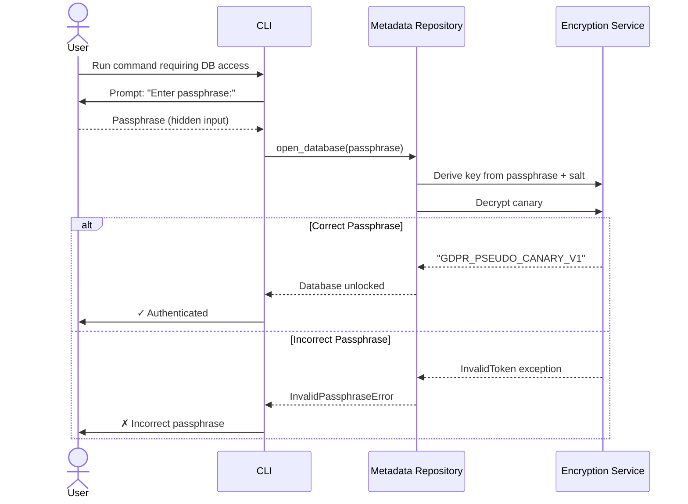

# 11. Backend Architecture

Since this is a **monolithic CLI application** rather than a client-server architecture, "backend" refers to the **core processing layers** already detailed in previous sections.

### 11.1 Backend Architecture Overview

**Architectural Style:** Modular Monolith with Layered Architecture

The "backend" encompasses all non-CLI components:
- **Core Orchestrator** (workflow coordination)
- **NLP Engine** (entity detection)
- **Pseudonym Manager** (pseudonym assignment)
- **Data Layer** (persistence, encryption)
- **File I/O Handler** (document processing)
- **Batch Processor** (parallel processing)

**Key Characteristic:** All components run **in-process** (not separate services), communicating via Python function calls (not HTTP/gRPC).

---

### 11.2 Authentication and Authorization

**Authentication:** Local passphrase-based (no user accounts)

**Authentication Flow:**

**Security Properties:**
- **No User Accounts:** Single-user tool
- **Passphrase-Based:** User-controlled key derivation (not stored anywhere)
- **Fast Verification:** Canary-based validation (Risk #1 mitigation)
- **Key Derivation:** PBKDF2 with 100K iterations
- **Session Model:** Passphrase entered per command invocation (no persistent session)

**Authorization:** None (single-user, all-or-nothing access)

---

