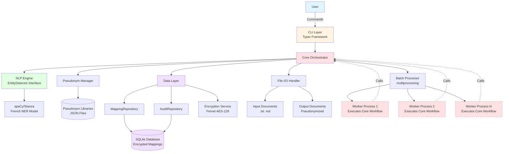

# 2. High Level Architecture

This section establishes the foundation with multiple subsections presented together.

### 2.1 Technical Summary

The GDPR Pseudonymizer follows a **modular monolithic architecture** with clear layered separation:

- **Architectural Style:** Local-first CLI application with modular monolithic structure, optimized for single-user batch processing workflows
- **Technology Stack:** Python 3.9+ runtime with spaCy/Stanza NLP engine, SQLite persistence with Fernet encryption, Typer CLI framework
- **Key Integration Points:**
  - CLI layer → Core orchestrator (command routing, workflow coordination)
  - Core → NLP engine (entity detection via abstracted interface)
  - Core → Data layer (encrypted mapping table, audit logs)
  - Core → Pseudonym manager (themed name libraries, assignment logic)
- **Infrastructure:** Cross-platform deployment (Windows/macOS/Linux) via PyPI package distribution, local-only processing with zero network dependencies
- **PRD Goal Alignment:** The architecture directly enables GDPR-compliant pseudonymization (FR1-21) with ≥90% NER accuracy (NFR8-9), <30s single-document processing (NFR1), batch efficiency (NFR2), and ≥85% installation success (NFR3) through Python-native encryption and dependency management

---

### 2.2 Platform and Infrastructure Choice

Since this is a **local-first CLI tool** rather than a cloud-hosted application, the "platform" concept differs from typical web architectures:

**Primary Platform:** **Local User Machine (Consumer Hardware)**
- **Runtime Environment:** Python 3.9+ interpreter
- **Operating Systems:** Windows 10/11, macOS 11+ (Intel & Apple Silicon), Linux (Ubuntu 20.04+, Debian 11+, Fedora 35+)
- **Hardware Requirements:** 8GB RAM, dual-core 2.0GHz+ CPU, 2GB disk space (including NLP models)

**Distribution Platform:** **PyPI (Python Package Index)**
- Package name: `gdpr-pseudonymizer`
- CLI entry point: `gdpr-pseudo`
- Dependency management: Poetry (development), pip (user installation)

**Key Services/Components:**
- **NLP Model Service:** spaCy `fr_core_news_lg` or Stanza French models (downloaded post-install)
- **Encryption Service:** Python `cryptography` library (Fernet symmetric encryption)
- **Data Persistence:** SQLite database (local filesystem)
- **Parallel Processing:** Python `multiprocessing` module (process pool for batch operations)

**Deployment Model:** Local execution on user's machine (no cloud regions—each user runs their own isolated instance)

**Rationale:**
- Local-first architecture eliminates GDPR data transfer concerns (primary requirement)
- Python ecosystem provides mature NLP libraries, cross-platform compatibility, and simple distribution
- PyPI distribution enables easy installation (`pip install gdpr-pseudonymizer`) while Poetry manages complex development dependencies

**Alternative Considered:** Docker containerization for isolation was considered but deferred to optional install method to avoid Docker complexity for non-technical users. Container available as fallback for complex environments.

---

### 2.3 Repository Structure

**Structure:** Monorepo (single repository)

**Monorepo Tool:** N/A - Single Python package, Poetry for dependency management

**Package Organization:**

```
gdpr-pseudonymizer/              # Single package, not multi-package monorepo
├── gdpr_pseudonymizer/          # Main package
│   ├── cli/                     # CLI interface layer
│   │   ├── commands/            # Command handlers (process, batch, init, etc.)
│   │   └── validators.py        # Input validation
│   ├── core/                    # Core processing orchestration
│   │   ├── orchestrator.py      # Main workflow coordinator
│   │   ├── batch_processor.py   # Multiprocessing batch handler
│   │   └── document_processor.py # Single document workflow
│   ├── nlp/                     # NLP engine (entity detection)
│   │   ├── entity_detector.py   # EntityDetector interface
│   │   ├── spacy_detector.py    # spaCy implementation
│   │   └── stanza_detector.py   # Stanza implementation (alternative)
│   ├── data/                    # Data layer (persistence, encryption)
│   │   ├── repositories/        # Repository pattern implementations
│   │   │   ├── mapping_repository.py    # Entity↔pseudonym mappings
│   │   │   └── audit_repository.py      # Audit log operations
│   │   ├── encryption.py        # Fernet encryption service
│   │   └── models.py            # SQLAlchemy models
│   ├── pseudonym/               # Pseudonym manager
│   │   ├── library_manager.py   # Load/manage themed libraries
│   │   ├── assignment_engine.py # Compositional pseudonym logic
│   │   └── validators.py        # Gender matching, exhaustion detection
│   └── utils/                   # Utilities (file handling, logging)
│       ├── file_handler.py      # I/O with format detection (.txt, .md)
│       ├── markdown_parser.py   # Format-aware processing (FR21)
│       └── logger.py            # Structured logging
├── data/                        # Pseudonym libraries (JSON)
│   └── pseudonyms/
│       ├── neutral.json         # INSEE common French names
│       ├── star_wars.json       # Star Wars themed names
│       └── lotr.json            # LOTR themed names
├── tests/                       # Test suite
│   ├── unit/                    # Unit tests per module
│   ├── integration/             # End-to-end workflow tests
│   ├── performance/             # NFR1-2 performance benchmarks
│   └── test_corpus/             # 25-document benchmark corpus
│       ├── documents/           # French test documents
│       └── annotations.json     # Ground truth entity annotations
├── docs/                        # Documentation
│   ├── prd.md
│   ├── architecture.md
│   ├── installation.md
│   ├── usage.md
│   └── methodology.md           # Academic citation guide
├── scripts/                     # Development/deployment scripts
│   ├── benchmark_nlp.py         # Epic 0-1 NLP library comparison
│   └── install_models.py        # Post-install model download
├── .github/
│   └── workflows/
│       ├── ci.yaml              # Test matrix (Windows/Mac/Linux)
│       └── release.yaml         # PyPI publishing
├── pyproject.toml               # Poetry configuration
├── .gdpr-pseudo.yaml.example    # Config file template
└── README.md
```

**Rationale:**
- Clear module boundaries enable independent development and testing
- Repository pattern classes explicitly shown under `data/repositories/`
- Test corpus structure supports Epic 1 comprehensive benchmarking
- Scripts directory isolates development tooling from application code

---

### 2.4 High Level Architecture Diagram



**Diagram Notes:**
- Dashed lines from Worker Processes back to Core show they execute the same `process_single_document()` workflow
- Workers maintain layered architecture (don't bypass Core to call NLP directly)
- Repository interfaces explicitly shown within Data Layer

---

### 2.5 Architectural Patterns

- **Layered Architecture (CLI → Core → Domain → Data):** Separates concerns with clear dependencies flowing downward. CLI layer handles user interaction, Core orchestrates workflows, Domain layers (NLP, Pseudonym) implement business logic, Data layer manages persistence. **Process Boundary Note:** Worker processes in batch mode execute Core's `process_single_document()` workflow, maintaining layered architecture even across process boundaries—workers don't bypass Core to call NLP directly. *Rationale:* Enables independent testing, clear responsibility boundaries, and future layer replacement (e.g., GUI layer replacing CLI).

- **Repository Pattern (Data Layer):** Abstract database operations behind repository interfaces (`MappingRepository`, `AuditRepository`) defined in `data/repositories/`. *Rationale:* Isolates SQLite implementation details, enables migration to alternative databases if needed, simplifies unit testing with mock repositories.

- **Strategy Pattern (NLP Engine):** The `EntityDetector` interface (introduced in §1.1) provides concrete implementations (`SpaCyDetector`, `StanzaDetector`) in the `nlp/` module. *Rationale:* Enables Epic 1 benchmarking (swap libraries easily), future support for multiple languages with different optimal NLP engines, clean dependency injection for testing.

- **Command Pattern (CLI Commands):** Each CLI command (`process`, `batch`, `init`) maps to a command handler in Core layer. *Rationale:* Separates UI concerns from business logic, enables command composition, simplifies integration testing.

- **Process Pool Pattern (Batch Processing):** Worker processes each load their own copy of the NLP model (spaCy/Stanza) and process documents independently via multiprocessing module. Main process distributes documents to worker queue and aggregates results. Worker pool size: `min(cpu_count, 4)` to balance parallelism with memory constraints (8GB RAM target, ~1.5GB per worker with loaded model). *Rationale:* Overcomes spaCy thread-safety limitations (global model state) while achieving parallel speedup. Trade-off: 4x memory overhead for model loading vs 4x performance improvement (targets <30min for 50 docs vs ~25min sequential).

- **Encryption at Rest (Data Layer):** Column-level encryption for sensitive fields using Fernet symmetric encryption. *Rationale:* GDPR compliance for stored mappings, user-controlled passphrase provides key management, column-level allows selective decryption for audit queries.

---

