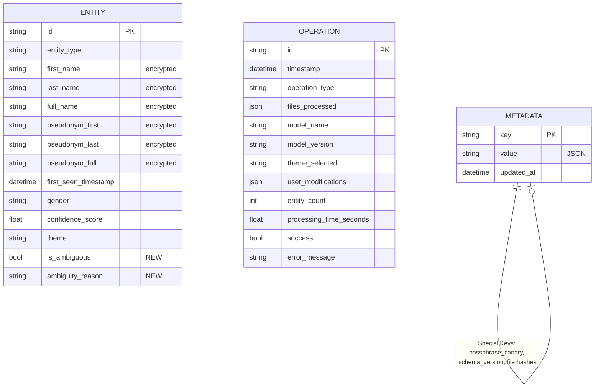

# 4. Data Models

Based on the PRD requirements (FR4-5, FR8-12) and the tech stack (SQLAlchemy 2.0), here are the core data models with risk mitigations applied:

### 4.1 Entity

**Purpose:** Represents a detected real-world entity (person, location, organization) and its assigned pseudonym. Supports compositional pseudonymization (FR4-5) by storing both full names and components.

**Key Attributes:**
- `id`: str (UUID) - Primary key, unique identifier
- `entity_type`: str (enum: PERSON, LOCATION, ORG) - NER classification
- `first_name`: str (encrypted) - First name component (PERSON only)
- `last_name`: str (encrypted) - Last name component (PERSON only)
- `full_name`: str (encrypted) - Complete entity text as detected
- `pseudonym_first`: str (encrypted) - Pseudonym first name (PERSON only)
- `pseudonym_last`: str (encrypted) - Pseudonym last name (PERSON only)
- `pseudonym_full`: str (encrypted) - Complete pseudonym
- `first_seen_timestamp`: datetime - When first detected (audit trail)
- `gender`: str (optional: male/female/neutral/unknown) - For gender-preserving pseudonyms
- `confidence_score`: float (0.0-1.0) - NER confidence if available
- `theme`: str - Pseudonym library used (neutral/star_wars/lotr)
- `is_ambiguous`: bool - Component match had low confidence (Risk #3 mitigation)
- `ambiguity_reason`: str (optional) - "Compound name" / "Partial match" / "Title prefix" (Risk #3 mitigation)

**Design Decisions:**
- Separate first/last/full storage enables compositional matching (FR4-5)
- Encrypted sensitive fields protect original entities and pseudonyms at rest (Risk #1 addressed)
- Gender field optional (not all NER models provide it) - Risk #6 acknowledged
- Theme tracking enables consistent library usage across batches
- Ambiguity fields enable validation mode to surface uncertain matches for user review

**TypeScript Interface (for future Phase 2 GUI):**

```typescript
interface Entity {
  id: string;
  entityType: 'PERSON' | 'LOCATION' | 'ORG';
  firstName?: string;          // Decrypted when needed
  lastName?: string;            // Decrypted when needed
  fullName: string;             // Decrypted when needed
  pseudonymFirst?: string;      // Decrypted when needed
  pseudonymLast?: string;       // Decrypted when needed
  pseudonymFull: string;        // Decrypted when needed
  firstSeenTimestamp: Date;
  gender?: 'male' | 'female' | 'neutral' | 'unknown';
  confidenceScore?: number;
  theme: string;
  isAmbiguous: boolean;
  ambiguityReason?: string;
}
```

**Relationships:**
- **One-to-Many with Operation:** Each operation logs multiple entities detected (via operations.entity_count summary, not FK)
- **Self-referential (implicit):** Entities with shared name components (e.g., "Marie Dubois" and "Marie Dupont" share "Marie") linked through compositional logic, not database FK

---

### 4.2 Operation

**Purpose:** Audit log entry for each pseudonymization operation (FR12). Provides GDPR Article 30 compliance and troubleshooting data.

**Key Attributes:**
- `id`: str (UUID) - Primary key
- `timestamp`: datetime - When operation started
- `operation_type`: str (enum: PROCESS, BATCH, VALIDATE, IMPORT, EXPORT, DESTROY) - Command executed
- `files_processed`: list[str] (JSON) - File paths processed
- `model_name`: str - NLP library used (spacy/stanza)
- `model_version`: str - Model version (e.g., fr_core_news_lg-3.7.0)
- `theme_selected`: str - Pseudonym theme used
- `user_modifications`: dict (JSON, optional) - Changes made in validation mode
- `entity_count`: int - Total entities detected/processed
- `processing_time_seconds`: float - Performance tracking (NFR1-2 validation)
- `success`: bool - Operation completed without errors
- `error_message`: str (optional) - Error details if failed

**Design Decisions:**
- JSON fields for flexible storage (files list, user modifications dict)
- Performance tracking enables NFR validation and Risk #5 monitoring
- Success flag enables crash rate monitoring (NFR6)

**TypeScript Interface:**

```typescript
interface Operation {
  id: string;
  timestamp: Date;
  operationType: 'PROCESS' | 'BATCH' | 'VALIDATE' | 'IMPORT' | 'EXPORT' | 'DESTROY';
  filesProcessed: string[];
  modelName: string;
  modelVersion: string;
  themeSelected: string;
  userModifications?: Record<string, any>;
  entityCount: number;
  processingTimeSeconds: number;
  success: boolean;
  errorMessage?: string;
}
```

**Relationships:**
- **Standalone:** Operations log system activity but don't FK to entities (entities persist across operations)

---

### 4.3 Metadata

**Purpose:** System configuration and encryption metadata storage. Key-value store for extensibility.

**Key Attributes:**
- `key`: str - Primary key (e.g., 'encryption_salt', 'schema_version', 'creation_date', 'passphrase_canary')
- `value`: str - JSON-serialized value
- `updated_at`: datetime - Last modification timestamp

**Critical Keys (Risk Mitigation):**
- `passphrase_canary`: Encrypted verification string to validate passphrase (Risk #1 mitigation)
- `encryption_salt`: Salt for PBKDF2 key derivation
- `kdf_iterations`: PBKDF2 iteration count (default 100,000)
- `schema_version`: Database schema version for migration detection (Risk #4 mitigation)
- `file:{path}:hash`: SHA-256 hash for idempotency detection (Risk #8 mitigation - deferred Document model)
- `file:{path}:processed`: Last processed timestamp for each file

**Design Decisions:**
- Flexible key-value structure allows schema evolution without migrations
- Stores critical encryption params needed to decrypt entity data
- Passphrase canary enables early validation before attempting entity decryption (Risk #1)
- File hash tracking via metadata keys avoids premature Document table optimization (Risk #8)

**TypeScript Interface:**

```typescript
interface Metadata {
  key: string;
  value: string;  // JSON serialized
  updatedAt: Date;
}

// Special metadata keys
const METADATA_KEYS = {
  PASSPHRASE_CANARY: 'passphrase_canary',
  ENCRYPTION_SALT: 'encryption_salt',
  KDF_ITERATIONS: 'kdf_iterations',
  SCHEMA_VERSION: 'schema_version',
  fileHash: (path: string) => `file:${path}:hash`,
  fileProcessed: (path: string) => `file:${path}:processed`,
};
```

**Relationships:**
- **Standalone:** System-level configuration, no relationships

---

### 4.4 Data Model Diagram



---

