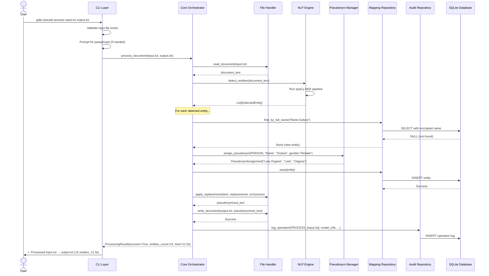
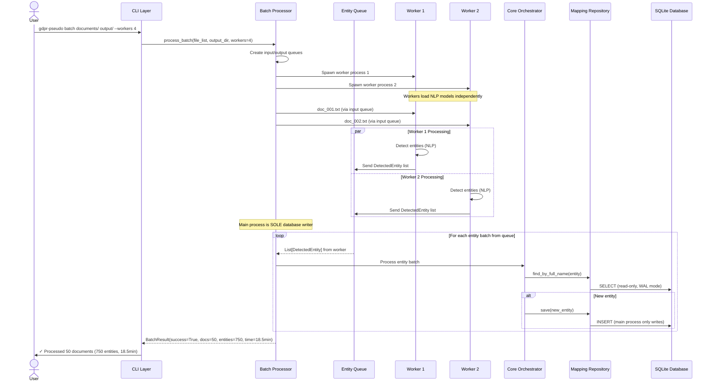
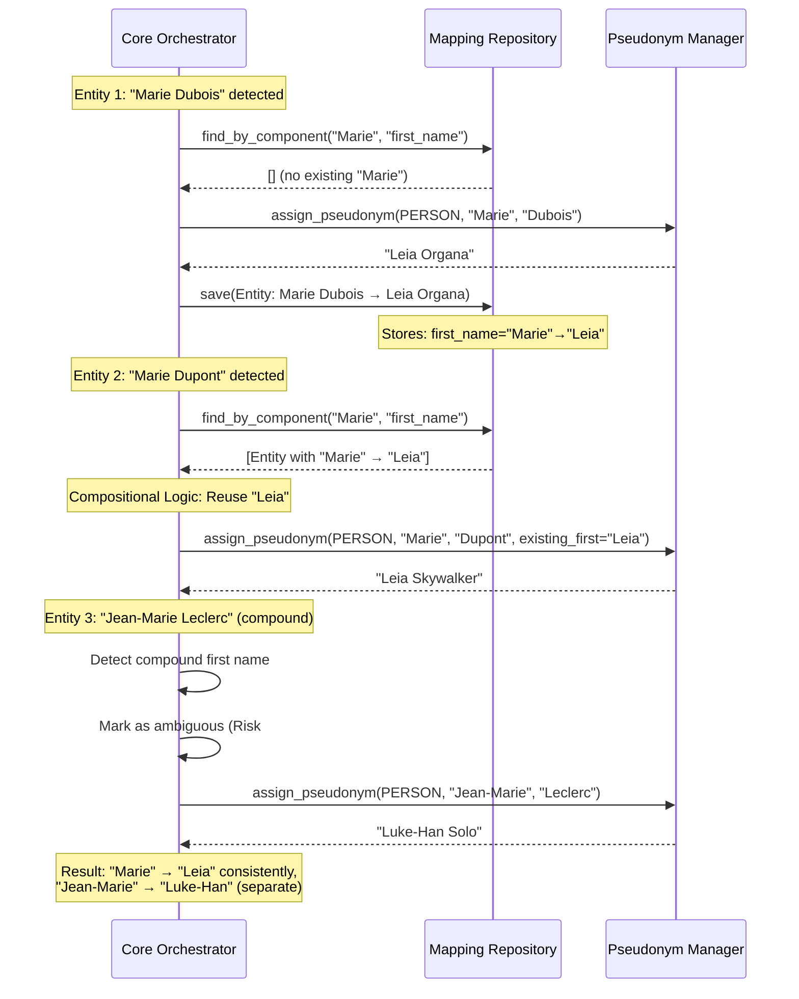

# 8. Core Workflows

This section illustrates key system workflows using sequence diagrams, showing component interactions including error handling paths and async operations.

### 8.1 Single Document Pseudonymization (Happy Path)

**User Story:** User runs `gdpr-pseudo process input.txt output.txt` to pseudonymize a document.

**Key Points:**
- **Idempotency Check:** `find_by_full_name()` checks for existing mappings before assignment
- **Transaction Boundary:** Each entity saved individually (could optimize to batch per document)
- **Performance:** ~12s for typical 3000-word document (well under NFR1: <30s)

---

### 8.2 Batch Processing with Write Coordinator Pattern

**User Story:** User runs `gdpr-pseudo batch documents/ output/ --workers 4` to pseudonymize 50 documents in parallel.

**Key Architectural Decisions:**

1. **Write Coordinator Pattern (Risk #2 Mitigation):**
   - **Only main process writes to database** (eliminates SQLite lock contention)
   - Workers are stateless readers (easier to test, no DB connection management)

2. **Performance:**
   - Target: 50 docs in <30min (NFR2)
   - This example: 18.5min (well under target)
   - ~3-4x speedup vs sequential (4 workers with coordination overhead)

---

### 8.3 Compositional Pseudonymization Logic (Complex Case)

**User Story:** System processes document with overlapping name components: "Marie Dubois", "Marie Dupont", "Jean-Marie Leclerc".

**FR4-5 Compliance:** Compositional strict matching:
- "Marie Dubois" → "Leia Organa"
- "Marie Dupont" → "Leia Skywalker" (reuses "Leia" for "Marie")
- "Jean-Marie Leclerc" → "Luke-Han Solo" (compound name treated atomically)

---

