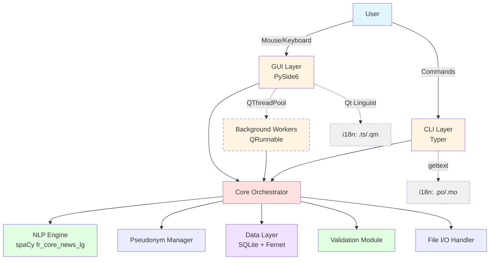

# GUI Framework Decision — Story 6.1 AC1/AC4/AC5/AC6

**Status:** APPROVED — PO Approved 2026-02-16
**Date:** 2026-02-16
**Author:** Winston (Architect Agent)
**Supersedes:** N/A (new document)
**Related:** Epic 6 PRD (`docs/prd/epic-6-v2.0-desktop-gui-accessibility.md`), Tech Stack (`docs/architecture/3-tech-stack.md`)

---

## 1. Decision Summary

| Decision | Selection | Rationale |
|----------|-----------|-----------|
| **GUI Framework** | PySide6 (Qt for Python) — `PySide6-Essentials` | Only candidate satisfying all must-have criteria: direct Python integration, rich text entity highlighting, WCAG AA accessibility, mature i18n, native drag-and-drop |
| **Distribution Tool** | PyInstaller 6.x (`--onedir` mode) | Best PySide6 compatibility, dedicated Qt hooks, active maintenance, proven in v1.1 CI |
| **i18n Framework** | Qt Linguist (GUI) + gettext (CLI `--help`) | Qt Linguist is production-grade (20yr maturity); gettext avoids touching Typer 0.9.x/click internals |
| **Repository Structure** | Monorepo — new `gdpr_pseudonymizer/gui/` package | Same pattern as `cli/`; shared CI/CD, versioning, and core module access |
| **Installer Format** | NSIS (Windows), DMG (macOS), AppImage (Linux) | Standard platform conventions for standalone desktop apps |

---

## 2. Evaluation Criteria

Derived from Story 6.1 acceptance criteria and Epic 6 constraints.

| # | Criterion | Type | Source |
|---|-----------|------|--------|
| C1 | Direct Python integration (call existing core modules) | **Must-have** | Epic 6 key constraint |
| C2 | Rich text with inline entity highlighting + click handlers | **Must-have** | Story 6.4 (entity validation) |
| C3 | WCAG AA accessibility (screen readers, keyboard nav) | **Must-have** | Story 6.7 |
| C4 | i18n with runtime language switching (FR/EN) | **Must-have** | Story 6.6 |
| C5 | Native file drag-and-drop | **Must-have** | Stories 6.3, 6.5 |
| C6 | Standalone executable packaging | **Must-have** | Story 6.8 |
| C7 | License compatible with MIT project | **Must-have** | Project license |
| C8 | Bundle size <500MB (excluding spaCy model) | Target | Story 6.8 AC6 |
| C9 | Startup time <5s (excluding spaCy model load) | Target | Story 6.2 AC11 |
| C10 | Native/professional look-and-feel | Important | Target audience: corporate/academic |
| C11 | Low learning curve for Python-first team | Important | Team composition |

---

## 3. Candidates Evaluated

Six frameworks were evaluated:

1. **PySide6** (Qt for Python) — Native Python, LGPL, mature Qt ecosystem
2. **Tauri v2** — Rust backend + web frontend, MIT/Apache, lightweight
3. **CustomTkinter** — Modern Tkinter wrapper, MIT, Python-native
4. **Kivy** — Python-native, MIT, OpenGL-rendered, mobile-capable
5. **BeeWare (Toga)** — Python-native, BSD, truly native platform widgets
6. **Electron** — Chromium + Node.js, MIT, web-based

---

## 4. Comparison Matrix

| Criterion | PySide6 | Tauri v2 | CustomTkinter | Kivy | Toga | Electron |
|-----------|---------|----------|---------------|------|------|----------|
| **C1: Python integration** | Direct | Sidecar/IPC | Direct | Direct | Direct | Sidecar/IPC |
| **C2: Rich text + click** | QTextEdit + anchors | HTML/CSS (excellent) | Text widget tags | BBCode markup | **None** | HTML/CSS |
| **C3: Accessibility** | QAccessible (MSAA, VoiceOver, AT-SPI) | Manual ARIA | Linux only (Tka11y) | **None** | Native (best) | Manual ARIA |
| **C4: i18n** | Qt Linguist (20yr mature) | i18next (web) | Manual gettext | Community libs | Basic built-in | i18next |
| **C5: Drag-and-drop** | QMimeData (native) | Tauri events | TkinterDnD2 (3rd party) | Built-in | **None** | Chromium native |
| **C6: Packaging** | PyInstaller (dedicated hooks) | Tauri bundler + PyInstaller sidecar | PyInstaller | PyInstaller | Briefcase | electron-builder |
| **C7: License** | LGPL (compatible) | MIT/Apache | MIT | MIT | BSD | MIT |
| **C8: Bundle size (GUI)** | ~80-150MB | ~10MB + sidecar | ~20-30MB | ~40-60MB | ~80-190MB | ~150-200MB |
| **C9: Startup** | 1-3s | <500ms + sidecar 1-3s | 1-3s | 5-10s | 2-5s | 2-4s |
| **C10: Native look** | Themeable (good) | Web aesthetic | Modern (not native) | Custom (OpenGL) | True native | Web aesthetic |
| **C11: Learning curve** | Low (Python API) | **High** (Rust + web) | Low | Medium | Low | Medium (JS + IPC) |

### Legend

- **Bold text** in cells = showstopper (fails must-have criterion)
- Bundle sizes exclude application code and Python dependencies

---

## 5. Elimination Reasoning

### 5.1 Electron — ELIMINATED

- **Bundle size:** 150-200MB runtime alone (Chromium + Node.js) — exceeds target before any application code
- **Python integration:** Requires zerorpc or sidecar IPC; no direct module calls
- **Memory:** 200-400MB RAM per instance; disproportionate for a document processing tool
- **Verdict:** Massively overbuilt. Bundle size and memory make it unsuitable.

### 5.2 Kivy — ELIMINATED

- **Showstopper (C3):** Zero accessibility support. No screen reader integration on any platform. No keyboard navigation API. Open issue #2820 acknowledged for 10+ years with no resolution. AccessKit integration discussed for Kivy 3.0 with no timeline.
- **Additional concerns:** 5-10s startup time; non-native OpenGL-rendered widgets don't match corporate/academic expectations.
- **Verdict:** WCAG AA (Story 6.7) cannot be achieved.

### 5.3 BeeWare (Toga) — ELIMINATED

- **Showstopper (C2):** No rich text widget. Only plain `MultilineTextInput` available. Cannot implement inline color-coded entity highlighting with click handlers. Story 6.4 (entity validation) is the GUI's defining feature — 80% of user interaction time.
- **Showstopper (C5):** No drag-and-drop support. Open issues #805 and #3088; not on 2026 roadmap.
- **Mitigating factor:** Best-in-class native accessibility. If Toga adds rich text and DnD widgets in future, it becomes a strong candidate.
- **Verdict:** Missing critical widget coverage disqualifies it despite excellent native integration.

### 5.4 CustomTkinter — ELIMINATED

- **Showstopper (C3):** Screen reader support only on Linux (via Tka11y/ATK). No accessibility on Windows or macOS — the primary platforms for the target audience (French corporate/academic).
- **Additional concerns:** 3 years old, limited production usage at scale, uncertain long-term maintenance.
- **Mitigating factor:** Entity highlighting works well via Tkinter Text widget tags. Good choice if accessibility were not a requirement.
- **Verdict:** WCAG AA (Story 6.7) cannot be achieved on Windows/macOS.

### 5.5 Tauri v2 — ELIMINATED

- **Barrier (C1/C11):** Rust expertise required. Python integration forces either a sidecar architecture (PyInstaller binary + IPC protocol design + process lifecycle management) or PyO3 FFI (requires learning Rust ownership/borrowing model).
- **Learning curve:** 1-2 month ramp-up for a Python-first team before productive development.
- **Complexity tax:** Two build systems (Cargo + Poetry), cross-language debugging, IPC serialization overhead.
- **Experimental alternative:** PyTauri (Python bindings, v0.8) is too immature for production.
- **Mitigating factor:** Excellent rich text via web technologies; smallest bundle for the GUI layer itself (~10MB).
- **Verdict:** The rich text advantage doesn't justify the systemic complexity cost. The team would spend more time fighting the framework than building features.

---

## 6. Selected Framework: PySide6

### 6.1 Why PySide6

PySide6 is the **only framework that satisfies all must-have criteria simultaneously**:

| Must-Have | How PySide6 Satisfies It |
|-----------|--------------------------|
| C1: Python integration | Direct Python API — `from gdpr_pseudonymizer.core.processor import DocumentProcessor` works inside GUI code. No IPC, no serialization, no sidecar. |
| C2: Rich text + click | `QTextEdit` with `QTextCharFormat.setAnchor()` + `anchorAt(pos)` for clickable entities. `QSyntaxHighlighter` for efficient color-coding. `setExtraSelections()` for non-destructive highlighting. |
| C3: Accessibility | `QAccessible` API: MSAA on Windows (NVDA/JAWS), macOS Accessibility (VoiceOver), AT-SPI on Linux. Standard widgets expose metadata automatically. |
| C4: i18n | Qt Linguist workflow: `self.tr()` → `pyside6-lupdate` → `.ts` files → translate → `pyside6-lrelease` → `.qm` runtime. Supports pluralization, context, XLIFF export. |
| C5: Drag-and-drop | `QMimeData` + `QDropEvent`. Override `dragEnterEvent()` / `dropEvent()` on any widget. Native platform integration. |
| C6: Packaging | PyInstaller 6.x has dedicated PySide6 hooks. `pyside6-deploy` tool for optimized builds. Well-maintained, no known blockers. |
| C7: License | LGPL v3 — compatible with MIT. No source disclosure required for application code. PyInstaller's directory layout satisfies LGPL relinking requirement. |

### 6.2 Specific Package: PySide6-Essentials

Use `PySide6-Essentials` instead of full `PySide6` to reduce bundle size:

- **Included:** QtCore, QtGui, QtWidgets, QtNetwork, QtSvg, QtConcurrent — all modules needed for the GUI
- **Excluded:** QtWebEngine (~176MB), QtQuick3D, QtCharts, QtDataVisualization, QtMultimedia — none needed
- **Estimated GUI layer size:** 60-80MB (vs 150-250MB for full PySide6)

### 6.3 Threading Model

spaCy NLP processing is CPU-bound and takes 2-30 seconds per document. The GUI must stay responsive.

**Approach:** `QThreadPool` + worker signals

```
┌─────────────┐         ┌──────────────────┐
│  GUI Thread  │ ◄─────  │  QThreadPool     │
│  (main)      │ signals │  Worker Thread   │
│              │         │                  │
│  - UI events │         │  - processor.py  │
│  - progress  │         │  - NLP pipeline  │
│  - results   │         │  - file I/O      │
└─────────────┘         └──────────────────┘
```

- Worker emits `progress(int)` signal → GUI updates progress bar
- Worker emits `finished(result)` signal → GUI shows results screen
- Worker emits `error(str)` signal → GUI shows error dialog
- Thread-safe via Qt signal/slot mechanism (automatic cross-thread marshaling)

### 6.4 Entity Validation UI (Story 6.4 Feasibility)

The entity validation screen — the GUI's defining feature — maps directly to Qt APIs:

| Requirement (from Story 6.4) | Qt Implementation |
|-------------------------------|-------------------|
| AC1: Color-coded entity highlighting | `QTextCharFormat.setBackground(QColor)` per entity type |
| AC1: Pseudonym as tooltip | `QTextCharFormat.setToolTip(pseudonym)` |
| AC2: Entity sidebar panel | `QListWidget` or `QTreeWidget` grouped by type |
| AC2: Click entity → scroll to position | `QTextEdit.setTextCursor()` + `ensureCursorVisible()` |
| AC3: Context menu (accept/reject/edit) | `QMenu` on right-click, connected to validation model |
| AC4: Select text → add as entity | `QTextEdit.textCursor().selectedText()` + dialog |
| AC5: Bulk accept/reject | Multi-select in sidebar + batch signal |
| AC7: Keyboard shortcuts | `QShortcut` / `QAction` with configurable key sequences |
| AC8: 100+ entities performance | `setExtraSelections()` is O(n) efficient; no DOM overhead |

### 6.5 Known Concerns and Mitigations

| Concern | Severity | Mitigation |
|---------|----------|------------|
| Bundle size ~80-150MB for GUI layer | Medium | Use `PySide6-Essentials`. Exclude unused modules via PyInstaller `--exclude-module`. Validate with early prototype (Story 6.2). |
| Not pixel-perfect native on Windows 11 | Low | Use custom QSS stylesheets (light/dark). Evaluate `qdarkstyle` or `pyqtdarktheme` during Story 6.2 — pyqtdarktheme is currently unmaintained (no releases since 2023, Python 3.13 issue open); prefer `qdarkstyle` or custom QSS as fallback. Target audience values "professional" over "pixel-perfect native." |
| Cold start 1-3s | Low | Acceptable — spaCy model loading (3-10s) dominates startup regardless of GUI framework. Use splash screen. |
| PySide6 version-to-version regressions | Low | Pin to a specific minor version in `pyproject.toml` (e.g., `PySide6-Essentials = "~6.7.0"`). Test upgrades in CI before bumping. |
| Custom widgets need explicit accessibility | Medium | Budget accessibility work into Story 6.7. Entity editor widget requires manual `QAccessible` implementation — plan for this during Story 6.4. |

---

## 7. Distribution Architecture (AC5)

### 7.1 Packaging Tool: PyInstaller

| Criterion | PyInstaller | cx_Freeze | Briefcase | Nuitka |
|-----------|-------------|-----------|-----------|--------|
| PySide6 support | Dedicated hooks, actively maintained | Basic support | Not designed for Qt | Compiles to C, experimental Qt support |
| spaCy model bundling | `--add-data` flag | `include_files` | Resource bundling | `--include-data-dir` |
| Cross-platform CI | GitHub Actions matrix (proven in v1.1) | Similar | Own CI tooling | Similar |
| Bundle mode | `--onedir` (fast startup) or `--onefile` | Directory only | App bundle | Compiled binary |
| Maturity | 20+ years, 12k+ GitHub stars | 15+ years | 5+ years | 10+ years |
| Known issues with project | None (clean v1.1 CI) | Untested | Untested | Untested |

**Selection: PyInstaller** — proven track record, dedicated PySide6 hooks, already used in project CI infrastructure.

### 7.2 Bundle Mode: `--onedir`

Use directory mode, not single-file (`--onefile`):
- **Faster startup:** No temporary extraction step
- **Easier debugging:** Files visible in directory
- **LGPL compliance:** Qt DLLs are separate files, satisfying relinking requirement
- **Wrapped in installer:** NSIS (Windows) or DMG (macOS) provides single-file download experience

### 7.3 Expected Bundle Sizes

| Component | Estimated Size |
|-----------|---------------|
| Python runtime | ~30MB |
| PySide6-Essentials (Qt libs) | ~60-80MB |
| Application code + dependencies | ~20-30MB |
| spaCy `fr_core_news_lg` model | ~541MB |
| Pseudonym libraries + resources | ~5MB |
| **Total (uncompressed)** | **~660-690MB** |
| **Total (compressed installer)** | **~400-450MB** |

**Assessment:** Compressed installer meets the <500MB target. Uncompressed install directory will be ~660-690MB on disk. The spaCy model dominates — this is inherent to the NLP requirement, not a framework choice issue.

**Future optimization:** Evaluate `fr_core_news_md` (~100MB) as optional smaller model with accuracy trade-off. Could offer "lite" installer variant.

### 7.4 Auto-Update Mechanism

**Deferred to v2.1.** Implementing a self-update mechanism adds significant complexity (differential downloads, signature verification, rollback on failure, platform-specific restart logic). For v2.0, users will download new versions manually from GitHub Releases. Candidates to evaluate in v2.1: **Sparkle** (macOS, mature), **WinSparkle** (Windows port), or **Qt Installer Framework / Maintenance Tool** (cross-platform, Qt-native). The PyInstaller `--onedir` layout is compatible with all three approaches.

### 7.5 Installer Formats

| Platform | Format | Tool | Notes |
|----------|--------|------|-------|
| Windows | `.exe` installer | NSIS | Includes Start Menu shortcut, uninstaller. SmartScreen warning without code signing. |
| macOS | `.dmg` containing `.app` | PyInstaller + `hdiutil` | Gatekeeper warning without notarization. |
| Linux | AppImage | `appimagetool` | Optional/lower priority per PRD. Self-contained, no install needed. |

### 7.6 Code Signing

| Platform | Requirement | Cost | Priority |
|----------|-------------|------|----------|
| Windows (Authenticode) | Suppresses SmartScreen "unknown publisher" warning | ~$200-400/year (EV certificate) | HIGH — without signing, users see scary warning |
| macOS (notarization) | Required by Gatekeeper on macOS 10.15+ | $99/year (Apple Developer Program) | HIGH — app won't open without notarization on modern macOS |

**Recommendation:** Budget for both certificates before v2.0 stable release. Ship unsigned builds for beta testing.

### 7.7 CI/CD Build Pipeline

```yaml
# .github/workflows/build-executables.yaml (outline)
jobs:
  build-windows:
    runs-on: windows-latest
    steps:
      - poetry install --extras "formats gui"
      - poetry run pyinstaller gdpr-pseudo-gui.spec
      - sign with Authenticode (if cert available)
      - upload artifact

  build-macos:
    runs-on: macos-latest
    steps:
      - poetry install --extras "formats gui"
      - poetry run pyinstaller gdpr-pseudo-gui.spec
      - create .app bundle + .dmg
      - notarize (if cert available)
      - upload artifact

  build-linux:
    runs-on: ubuntu-latest
    steps:
      - poetry install --extras "formats gui"
      - poetry run pyinstaller gdpr-pseudo-gui.spec
      - create AppImage
      - upload artifact
```

---

## 8. Repository Structure (AC6)

### 8.1 Decision: Monorepo

Add `gdpr_pseudonymizer/gui/` as a new package within the existing repository.

**Rationale:**
- Same architectural pattern as `cli/` — thin presentation layer over core logic
- Shared CI/CD pipeline (one workflow matrix tests CLI + GUI)
- Single version number (`pyproject.toml` version applies to both interfaces)
- No cross-repo dependency management
- Core module changes are immediately testable against both CLI and GUI

**Alternative rejected:** Separate GUI repository would require publishing `gdpr-pseudonymizer-core` as a separate PyPI package, splitting the test suite, and managing cross-repo version synchronization — significant overhead for a single-developer/small-team project.

### 8.2 Proposed Structure

```
gdpr_pseudonymizer/
├── cli/                      # Existing — UNCHANGED
│   ├── commands/
│   └── main.py
├── core/                     # Existing — UNCHANGED
├── nlp/                      # Existing — UNCHANGED
├── pseudonym/                # Existing — UNCHANGED
├── data/                     # Existing — UNCHANGED
├── validation/               # Existing — UNCHANGED
├── utils/                    # Existing — UNCHANGED
├── gui/                      # NEW — GUI presentation layer
│   ├── __init__.py
│   ├── app.py                # QApplication setup, main window, theme init
│   ├── main_window.py        # QMainWindow: menu bar, navigation, status bar
│   ├── screens/              # One module per screen
│   │   ├── __init__.py
│   │   ├── home.py           # Welcome screen, drop zone, recent files
│   │   ├── processing.py     # Progress display during document processing
│   │   ├── validation.py     # Entity validation interface (Story 6.4)
│   │   ├── results.py        # Pseudonymized output preview + save
│   │   ├── batch.py          # Batch processing dashboard (Story 6.5)
│   │   └── settings.py       # Configuration management
│   ├── widgets/              # Reusable custom widgets
│   │   ├── __init__.py
│   │   ├── entity_editor.py  # QTextEdit subclass: entity highlighting + clicks
│   │   ├── entity_panel.py   # Sidebar: entity list grouped by type
│   │   ├── drop_zone.py      # Drag-and-drop file target widget
│   │   └── progress_bar.py   # Multi-phase progress indicator
│   ├── workers/              # QRunnable background workers
│   │   ├── __init__.py
│   │   ├── processor_worker.py   # Wraps core/processor.py
│   │   ├── batch_worker.py       # Wraps core/batch_processor.py
│   │   └── model_loader.py       # spaCy model download/load
│   ├── i18n/                 # Translation files
│   │   ├── fr.ts             # French translations (source)
│   │   ├── en.ts             # English translations (source)
│   │   ├── fr.qm             # French translations (compiled, gitignored)
│   │   └── en.qm             # English translations (compiled, gitignored)
│   └── resources/            # GUI-specific assets
│       ├── icons/            # Application icon, toolbar icons
│       ├── themes/           # QSS stylesheets (light/dark)
│       └── splash.png        # Splash screen image
├── resources/                # Existing — shared resources (geography dict, etc.)
└── exceptions.py             # Existing — UNCHANGED
```

### 8.3 Entry Points

```toml
# pyproject.toml additions
[tool.poetry.scripts]
gdpr-pseudo = "gdpr_pseudonymizer.cli.main:cli_main"        # Existing
gdpr-pseudo-gui = "gdpr_pseudonymizer.gui.app:main"          # NEW
```

- `gdpr-pseudo` → CLI (unchanged)
- `gdpr-pseudo-gui` → GUI launcher
- Standalone executables default to GUI, with CLI available via command-line flags

### 8.4 Dependency Changes

```toml
# pyproject.toml additions
[tool.poetry.dependencies]
# ... existing dependencies unchanged ...
PySide6-Essentials = {version = "~6.7.0", optional = true}

[tool.poetry.extras]
gui = ["PySide6-Essentials"]
formats = ["pdfplumber", "python-docx"]                      # Existing
all = ["PySide6-Essentials", "pdfplumber", "python-docx"]    # NEW
```

**Installation paths:**
- `pip install gdpr-pseudonymizer` → CLI only (unchanged, no GUI deps)
- `pip install gdpr-pseudonymizer[gui]` → CLI + GUI
- `pip install gdpr-pseudonymizer[all]` → CLI + GUI + PDF/DOCX support
- Standalone executable → everything bundled

---

## 9. i18n Architecture (AC4)

### 9.1 Dual-Track Approach

The GUI and CLI have different i18n needs and different technical constraints:

| Interface | Framework | File Format | Tooling | Rationale |
|-----------|-----------|-------------|---------|-----------|
| **GUI** | Qt Linguist | `.ts` (source) / `.qm` (compiled) | `pyside6-lupdate`, `pyside6-lrelease`, Qt Linguist GUI | Native PySide6 integration; mature; supports runtime switching |
| **CLI --help** | gettext | `.po` (source) / `.mo` (compiled) | `xgettext`, `msgfmt`, Babel | Standard Python i18n; avoids modifying Typer 0.9.x internals; compatible with click <8.2.0 |

### 9.2 GUI i18n Workflow

```
Developer writes:     self.tr("Pseudonymized document")
                           ↓
pyside6-lupdate:      Extracts → gui/i18n/fr.ts (XML)
                           ↓
Translator edits:     Qt Linguist GUI or text editor
                           ↓
pyside6-lrelease:     Compiles → gui/i18n/fr.qm (binary)
                           ↓
Runtime:              QTranslator.load("fr.qm") → all tr() calls return French
```

**Runtime language switching:**
1. User selects language in Settings screen
2. Remove current `QTranslator`, install new one
3. Emit `LanguageChange` event → all widgets call `retranslateUi()`
4. Persist preference to `.gdpr-pseudo.yaml`

### 9.3 CLI i18n Workflow

```
Developer writes:     _("Process a single document")  # in help strings
                           ↓
xgettext:             Extracts → locale/fr/LC_MESSAGES/cli.po
                           ↓
Translator edits:     .po file (text editor or Poedit)
                           ↓
msgfmt:               Compiles → locale/fr/LC_MESSAGES/cli.mo
                           ↓
Runtime:              LANG=fr or --lang fr → gettext returns French
```

**Typer 0.9.x safety:** CLI i18n wraps help strings in `_()` calls before passing to Typer. No Typer internals are modified. The `--lang` flag is handled in the CLI wrapper layer, not in Typer/click.

### 9.4 Shared Glossary

Maintain `docs/i18n-glossary.csv` to ensure consistent terminology:

```csv
en,fr,context
"entity","entit??","NER detected item"
"pseudonym","pseudonyme","replacement name"
"mapping","correspondance","entity-to-pseudonym link"
"passphrase","phrase secr??te","encryption key input"
```

### 9.5 RTL Support

**Deferred to post-v2.0.** FR and EN are both LTR scripts — no RTL work is needed for the v2.0 scope. Qt Linguist and `QLayout` natively support RTL layout mirroring (`Qt::RightToLeft`), so adding Arabic or Hebrew in a future release would require translation files and a one-line layout direction change, not architectural rework.

### 9.6 Language Detection

1. Check `.gdpr-pseudo.yaml` → `language: fr`
2. If not set, detect system locale: `QLocale.system().language()` (GUI) or `locale.getdefaultlocale()` (CLI)
3. Fallback to English if locale is unsupported

---

## 10. Architecture Diagram (v2.0)



**Key point:** GUI and CLI are peer presentation layers. Both call the same Core orchestrator. No core logic is duplicated in the GUI layer.

---

## 11. Tech Stack Additions (for `3-tech-stack.md`)

These entries should be added to the tech stack document when Story 6.2 begins:

| Category | Technology | Version | Purpose | Rationale |
|----------|------------|---------|---------|-----------|
| **GUI Framework** | PySide6-Essentials | ~6.7.0 | Desktop GUI framework | LGPL-licensed Qt binding. Only Python GUI framework satisfying all requirements: rich text entity highlighting, WCAG AA accessibility, mature i18n, native drag-and-drop, PyInstaller compatibility. |
| **GUI Theming** | qdarkstyle or custom QSS | ^3.2.0 (qdarkstyle) | Light/dark theme | Cross-platform professional appearance. pyqtdarktheme is unmaintained (no release since 2023); qdarkstyle is actively maintained or custom QSS provides full control. Validate in Story 6.2. |
| **Packaging** | PyInstaller | ^6.0.0 | Standalone executables | Bundles Python + dependencies + spaCy model into distributable installer. Dedicated PySide6 hooks. |
| **Windows Installer** | NSIS | 3.x | Windows .exe installer | Wraps PyInstaller directory into user-friendly installer with Start Menu integration. |

---

## 12. Risk Assessment

| Risk | Likelihood | Impact | Mitigation |
|------|-----------|--------|------------|
| PySide6 bundle size exceeds target | MEDIUM | MEDIUM | Prototype in Story 6.2; use `PySide6-Essentials`; exclude unused modules. Fallback: accept larger bundle (compressed installer still <500MB). |
| Qt accessibility gaps for custom entity editor | LOW | HIGH | Budget explicit QAccessible implementation in Story 6.4; test with NVDA/VoiceOver early. Standard widgets are accessible by default. |
| PySide6 version regression (startup, rendering) | LOW | MEDIUM | Pin minor version (`~6.7.0`); test version bumps in CI before upgrading. |
| Typer/click conflict with PySide6 dependency tree | LOW | HIGH | PySide6 does not depend on click. GUI and CLI dependency trees are independent. Verify in Story 6.2. |
| PyInstaller fails to bundle spaCy model correctly | MEDIUM | HIGH | Test PyInstaller bundling with `--add-data` for spaCy model in Story 6.2 prototype. Known working pattern in Python packaging community. |
| LGPL compliance oversight | LOW | MEDIUM | PyInstaller `--onedir` mode naturally satisfies LGPL relinking requirement. Document compliance in README. |

---

## 13. Decision Log

| Date | Decision | Alternatives Considered | Decided By |
|------|----------|------------------------|------------|
| 2026-02-16 | PySide6-Essentials as GUI framework | Tauri v2, CustomTkinter, Kivy, Toga, Electron | Winston (Architect) — **PO Approved** |
| 2026-02-16 | PyInstaller for distribution | cx_Freeze, Briefcase, Nuitka | Winston (Architect) — **PO Approved** |
| 2026-02-16 | Monorepo (gui/ package) | Separate GUI repository | Winston (Architect) — **PO Approved** |
| 2026-02-16 | Qt Linguist (GUI) + gettext (CLI) for i18n | Unified gettext, unified Qt Linguist | Winston (Architect) — **PO Approved** |
| 2026-02-16 | qdarkstyle/custom QSS over pyqtdarktheme | pyqtdarktheme (unmaintained) | Winston (Architect) — **PO Approved** |
| 2026-02-16 | Auto-update deferred to v2.1 | Sparkle, WinSparkle, Qt Maintenance Tool | Winston (Architect) — **PO Approved** |

---

## Appendix A: Key References

- PySide6 documentation: https://doc.qt.io/qtforpython-6/
- PySide6-Essentials (PyPI): https://pypi.org/project/PySide6-Essentials/
- Qt Accessibility: https://doc.qt.io/qt-6/accessible.html
- Qt Linguist: https://doc.qt.io/qtforpython-6/tools/pyside-linguist.html
- PyInstaller PySide6 deployment: https://doc.qt.io/qtforpython-6/deployment/deployment-pyinstaller.html
- pyqtdarktheme: https://pyqtdarktheme.readthedocs.io/
- LGPL obligations for Qt: https://www.qt.io/development/open-source-lgpl-obligations

---

**Document Status:** APPROVED
**Approved By:** Sarah (Product Owner) — 2026-02-16
**Next Action:** Update `3-tech-stack.md` with Section 11 entries, proceed to Story 6.2 (GUI Application Foundation)
