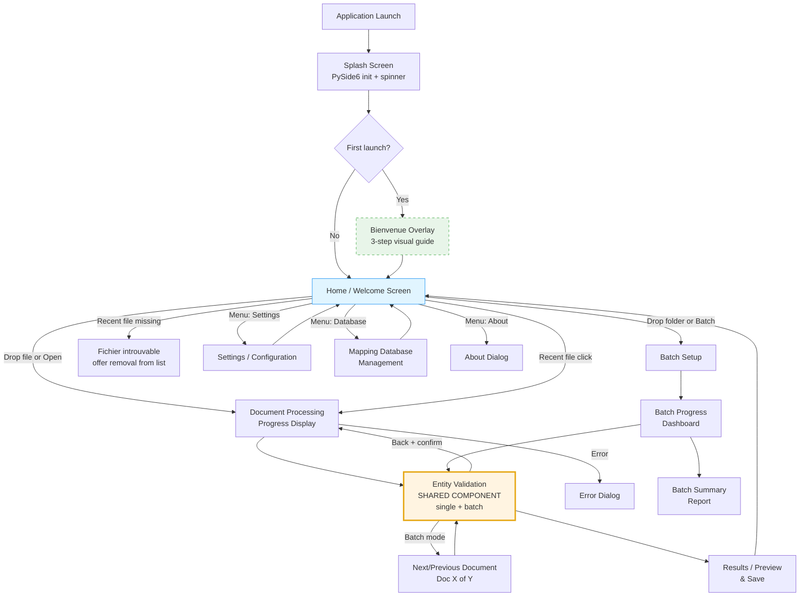
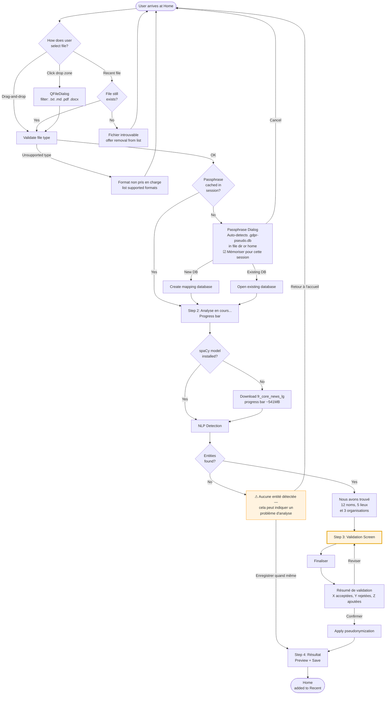
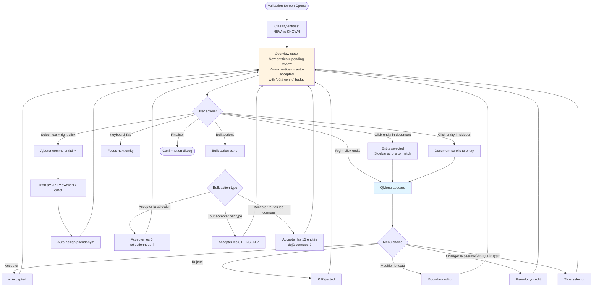

# GUI UX Specification — Story 6.1 AC2/AC3

**Status:** ✅ PM APPROVED — 2026-02-16
**Date:** 2026-02-16
**Author:** Sally (UX Expert Agent)
**Supersedes:** N/A (new document)
**Related:** Epic 6 PRD (`docs/prd/epic-6-v2.0-desktop-gui-accessibility.md`), Framework Decision (`docs/architecture/gui-framework-decision.md`)

---

## 1. Introduction

This document defines the user experience goals, information architecture, user flows, and visual design specifications for **GDPR Pseudonymizer v2.0's desktop GUI**. It serves as the foundation for visual design and frontend development using PySide6, ensuring a cohesive and user-centered experience for non-technical French-speaking professionals.

### 1.1 Target User Personas

**Primary Persona — Marie (HR Compliance Officer)**
- French-speaking, corporate environment (100-500 employees)
- Processes employee files containing names, addresses, organizational data
- Zero CLI comfort — uses Word, Excel, Outlook daily
- Needs: drag-and-drop simplicity, visual entity review, French-language UI
- Pain point: currently sends documents to IT for pseudonymization (delays, privacy concerns about sharing sensitive files)

**Primary Persona — Karim (Academic Researcher)**
- French-speaking, university/CNRS research lab
- Processes interview transcripts, survey responses, field notes
- Minimal technical skills — uses R/SPSS for statistics but not comfortable with command-line tools
- Needs: batch processing of transcript sets, careful entity boundary editing (names within quotes, partial names)
- Pain point: manual find-and-replace is error-prone and doesn't scale

**Secondary Persona — Chloé (Legal Analyst)**
- French-speaking, law firm or compliance department
- Processes legal documents, contracts, correspondence
- Needs: high precision (cannot afford missed entities), Article 17 erasure workflow
- Pain point: reviewing 50+ entities per document is tedious without visual context

**Tertiary Persona — Thomas (Power User / IT Admin)**
- Comfortable with CLI, but also manages the tool for non-technical colleagues
- Needs: batch processing, configuration management, mapping database administration
- Uses both CLI and GUI depending on context

### 1.2 Usability Goals

1. **5-minute onboarding:** A first-time user (Marie) can open the app, drop a file, review entities, and save a pseudonymized document — without reading documentation
2. **80% mouse-driven:** All primary workflows completable with mouse/trackpad alone. Keyboard shortcuts are a bonus, not a requirement
3. **Visual confidence:** Users can see exactly what will change before committing — color-coded highlighting gives instant comprehension
4. **Error prevention over error recovery:** Confirm destructive actions (reject all, overwrite file). Make the "safe" action (accept) the most prominent
5. **Under 3 clicks to core action:** File drop → validation screen → save. The happy path is as short as possible

### 1.3 Design Principles

1. **Clarity over cleverness** — French labels, obvious icons, no jargon. "Accepter" not "Valider l'entité détectée"
2. **Progressive disclosure** — Home screen shows only the drop zone. Advanced options (batch, settings, database) are accessible but not competing for attention
3. **Visual context is king** — Entities are always shown within their document context, never as isolated items in a table
4. **Forgiving interaction** — Every entity decision is reversible until the user clicks "Finaliser." No permanent action during validation
5. **Professional aesthetic** — Clean, muted palette appropriate for corporate/academic settings. Not a consumer app — no bright gradients, no playful icons

### 1.4 Change Log

| Date | Version | Description | Author |
|------|---------|-------------|--------|
| 2026-02-16 | 1.0 | Initial UX specification — Story 6.1 AC2/AC3 | Sally (UX Expert Agent) |

---

## 2. Information Architecture

### 2.1 Screen Inventory



### 2.2 Navigation Structure

**Primary Navigation: Menu Bar (QMenuBar)**

| Menu | Items | Context Rules |
|------|-------|---------------|
| **Fichier** | Ouvrir un document... / Ouvrir un dossier... / Fichiers récents > / --- / Quitter | Always enabled |
| **Affichage** | Thème clair / Thème sombre / --- / Panneau des entités (toggle) | "Panneau des entités" greyed out unless on validation screen |
| **Outils** | Base de correspondances... / Paramètres... | Always enabled |
| **Aide** | Raccourcis clavier... / À propos | "Raccourcis clavier" greyed out unless on validation screen |

**Secondary Navigation: Home Screen Action Cards**

- **Drop zone** (primary, center) — drag-and-drop or click to open file
- **"Traitement par lot"** card — batch processing entry point
- **Recent files list** — quick re-access. Files that no longer exist show inline "Fichier introuvable — Retirer de la liste ?"

**First-Launch Onboarding Overlay**

On first launch only, a semi-transparent overlay ("Bienvenue") appears over the home screen:
- Visual 3-step diagram: **Déposer** → **Vérifier** → **Enregistrer**
- Brief tagline: "Pseudonymisez vos documents en 3 étapes"
- "Commencer" (primary button) dismisses overlay
- "Ne plus afficher" checkbox (persisted to `.gdpr-pseudo.yaml`)

**Step Indicator (single-doc mode):**

```
[1. Sélection] → [2. Analyse] → [3. Validation] → [4. Résultat]
```

**Step Indicator (batch mode):**

```
[1. Sélection] → [2. Traitement] → [3. Validation (Doc X/Y)] → [4. Résumé]
```

### 2.3 Back-Navigation Rules

| From | Back To | Behavior | Confirmation Required? |
|------|---------|----------|----------------------|
| Validation → Processing | Re-analyze document | Discards current validation state | **Yes** — "Vos modifications de validation seront perdues. Continuer ?" |
| Results → Home | Return to start | Safe — output already saved or user chose not to save | No |
| Settings → Home | Return to start | Settings auto-saved on change | No |
| Database → Home | Return to start | Safe | No |
| BatchValidation → BatchDashboard | Return to batch overview | Current doc validation preserved, can resume | No |
| BatchSummary → Home | Return to start | Safe — batch complete | No |

### 2.4 Validation Screen Reuse (Single + Batch)

The entity validation interface is a **single shared component** used in both contexts:

| Aspect | Single-Doc Mode | Batch Mode |
|--------|----------------|------------|
| Header | Document filename | "Document X sur Y — filename" |
| Extra controls | None | "← Précédent / Suivant →" navigation buttons |
| "Finaliser" action | Save dialog | Advance to next document (or batch summary if last) |
| Back button | Returns to Processing (with confirm) | Returns to Batch Dashboard (validation state preserved) |

### 2.5 Window Layout Architecture

```
┌─────────────────────────────────────────────────────────┐
│ Menu Bar: Fichier | Affichage | Outils | Aide           │
├─────────────────────────────────────────────────────────┤
│ Step Indicator: [Sélection] → [Analyse] → [Validation] → [Résultat] │
├─────────────────────────────────────────────────────────┤
│                                                         │
│                  Main Content Area                       │
│            (swaps per current screen)                    │
│                                                         │
├─────────────────────────────────────────────────────────┤
│ Status Bar: Prêt                                    🌙  │
└─────────────────────────────────────────────────────────┘
```

The **entity validation screen** overrides this layout with a split-panel arrangement (see Section 4.4).

### 2.6 Interrupted Workflow Policy

- **Recent files** reopen at the **Results screen** (read-only view of last pseudonymized output) if the mapping database still contains the session
- **Re-validation requires reprocessing** — NLP detection must run again. Documented in UI: "Pour modifier les entités, relancez l'analyse du document"
- Rationale: persisting mid-validation state across sessions adds significant complexity. Deferred to v2.1 if user feedback demands it.

---

## 3. User Flows

### 3.1 Single Document Processing Flow

**User Goal:** Pseudonymize one document with visual entity review

**Entry Points:** Home screen drop zone, File > Ouvrir un document, Recent files list

**Success Criteria:** User saves a pseudonymized document with all entities reviewed



**Key design decisions:**
- **Passphrase dialog** auto-detects existing `.gdpr-pseudo.db` in the file's directory and user home, pre-filling as default. "Mémoriser pour cette session" checkbox caches the passphrase. App holds a single long-lived `MappingRepository` instance.
- **Entity summary** uses plain French: "Nous avons trouvé **12 noms de personnes**, **5 lieux** et **3 organisations** dans votre document."
- **0 entities** triggers amber warning with guidance about possible analysis problems.

**Edge Cases & Error Handling:**
- **Password-protected PDF:** "Ce PDF est protégé par mot de passe. Veuillez le déverrouiller avant traitement."
- **Empty document:** "Le document ne contient aucun texte exploitable." Return to Home.
- **Corrupt file:** "Impossible de lire ce fichier. Il est peut-être corrompu."
- **0 entities detected:** Amber warning — "⚠ Aucune entité détectée — cela peut indiquer un problème d'analyse. Vérifiez que le document contient du texte français."
- **spaCy download failure:** Retry button + "Le modèle linguistique n'a pas pu être téléchargé. Vérifiez votre connexion internet."
- **Processing crash:** Global error handler — "Une erreur inattendue s'est produite" + return to Home.

### 3.2 Entity Validation Flow (The 80% Screen)

**User Goal:** Review every detected entity, correct NLP errors, ensure pseudonymization quality

**Entry Points:** Automatically entered after NLP detection completes

**Success Criteria:** User has made a conscious decision (accept/reject/edit) for every entity, or used bulk actions for high-confidence batches



**Entity Classification on Screen Open:**

| Entity State | Visual Treatment | Default Status | Sidebar Badge |
|---|---|---|---|
| **New** (first detection, not in mapping DB) | Full color highlight, needs attention | Pending (neutral) | — |
| **Known** (already in mapping DB from prior session/doc) | Muted highlight, pseudonym pre-filled | Auto-accepted | "déjà connu" grey badge |

Known entities are auto-accepted but user can still override. "Accepter toutes les entités déjà connues" bulk action confirms all previously-mapped entities in one click.

**Edge Cases:**
- **Overlapping entities:** Show both, let user reject partial match. Overlap indicated with subtle pattern.
- **Entity at document boundary:** Context shows "[début du document]" or "[fin du document]."
- **Very long entity name:** Truncated in sidebar with tooltip, full in document view.
- **Text selection overlaps existing entity:** "Cette sélection chevauche une entité existante. Remplacer ?"
- **Known entity with changed type:** If mapping DB says "Martin" = PERSON but NLP detects it as ORG, flag as "⚠ Type différent du précédent" and require manual review.

**Notes:** The entity validation flow is deliberately **non-linear**. Unlike the overall app workflow (linear pipeline), validation is a **workspace** — users jump between entities in any order, switch between document view and sidebar, and alternate between individual and bulk actions.

### 3.3 Batch Processing Flow

**User Goal:** Pseudonymize a folder of documents with batch progress tracking

**Entry Points:** Home screen "Traitement par lot" card, File > Ouvrir un dossier, drag-and-drop folder

**Success Criteria:** All documents in batch processed, validated, and saved with summary report

```mermaid
graph TD
    Start([Batch entry]) --> Select{Selection method}
    Select -->|Drop folder| ScanFolder[Scan for supported files]
    Select -->|Click batch card| FolderDialog[Folder dialog]
    Select -->|Multi-select| MultiFile[Multi-file dialog]

    FolderDialog --> ScanFolder
    MultiFile --> FileList

    ScanFolder --> FileList["X fichiers trouvés<br/>(Y .txt, Z .pdf...)"]
    FileList --> SessionCheck{Passphrase<br/>cached?}
    SessionCheck -->|Yes| Config
    SessionCheck -->|No| Passphrase[Passphrase Dialog<br/>☑ Mémoriser pour cette session]
    Passphrase -->|Cancel| Home([Home])
    Passphrase --> Config

    Config[Batch options:<br/>• Validation par document<br/>• Validation globale<br/>• Continuer en cas d'erreur] --> Process

    Process[Step 2: Traitement<br/>Doc X sur Y — progress bar]

    Process --> ValMode{Validation mode}
    ValMode -->|Per-document| PerDoc[Pause after each doc]
    ValMode -->|Global| AllDocs[Process all, then validate]

    PerDoc --> ValidationScreen[Validation Screen<br/>"Document X sur Y"<br/>Known entities auto-accepted<br/>← Précédent / Suivant →]
    ValidationScreen --> NextDoc{More docs?}
    NextDoc -->|Yes| Process
    NextDoc -->|No| Summary

    AllDocs --> GlobalValidation[Validation Screen<br/>Document selector dropdown<br/>Known entities auto-accepted]
    GlobalValidation --> Summary

    Summary[Step 4: Résumé du lot]
    Summary --> FreqTable[Entity Frequency Table<br/>Entities in less than 50 percent docs flagged<br/>as potential inconsistencies]
    FreqTable --> Export["Exporter le rapport"]
    Summary --> Home

    Process -->|File error| ErrorHandling{Continue on<br/>error?}
    ErrorHandling -->|Yes| SkipFile[Log + skip]
    ErrorHandling -->|No| PauseError[Pause + show error]
    PauseError -->|Skip| SkipFile
    PauseError -->|Cancel| Summary
    SkipFile --> Process

    style ValidationScreen fill:#fff4e1,stroke:#e6a817,stroke-width:3px
    style Summary fill:#e8f5e9
```

**Key design decisions:**
- **Session passphrase** reused from single-doc flow (shared `MappingRepository` instance)
- **Known entities auto-accepted in batch** — as docs progress, the mapping DB grows. By doc 5, most recurring entities are already known.
- **Entity frequency table** in batch summary — entities appearing in <50% of documents flagged with "⚠ Incohérence potentielle"

**Edge Cases:**
- **Empty folder:** "Aucun fichier pris en charge trouvé dans ce dossier."
- **Mixed formats:** Show list, unsupported files greyed out with count.
- **Mid-batch cancel:** Confirm dialog — already-processed files preserved.
- **Large batch (100+):** Estimated time shown, warn if >50 files.

### 3.4 Deferred to v2.1

| Feature | Reason |
|---|---|
| Full cross-document consistency dashboard | Adds significant scope; entity frequency table provides 80% of the value |
| Batch "add entity across all documents" | Complex multi-document editing model; known-entity auto-acceptance covers the most common case |
| Dry-run / preview mode | Validation IS the preview — nothing commits until "Finaliser" |
| Mid-validation session persistence | Serializing partial validation decisions adds complexity for a rare use case |

---

## 4. Wireframes & Screen Layouts

### 4.1 Home / Welcome Screen

```
┌─────────────────────────────────────────────────────────────────┐
│ Fichier | Affichage | Outils | Aide                            │
├─────────────────────────────────────────────────────────────────┤
│                                                                 │
│          ┌─ ─ ─ ─ ─ ─ ─ ─ ─ ─ ─ ─ ─ ─ ─ ─ ─ ─┐              │
│          │                                       │              │
│          │      ┌──────────────────────┐         │              │
│          │      │    📄 (file icon)    │         │              │
│          │      └──────────────────────┘         │              │
│          │                                       │              │
│          │   Glissez un fichier ici               │              │
│          │   ou cliquez pour ouvrir               │              │
│          │                                       │              │
│          │   .txt  .md  .pdf  .docx              │              │
│          └─ ─ ─ ─ ─ ─ ─ ─ ─ ─ ─ ─ ─ ─ ─ ─ ─ ─┘              │
│                                                                 │
│     ┌────────────────────────────┐                              │
│     │  📁 Traitement par lot     │                              │
│     │  Traiter un dossier entier │                              │
│     └────────────────────────────┘                              │
│                                                                 │
│  ── Fichiers récents ──────────────────────────────────         │
│  │ 📄 contrat_dupont.pdf         il y a 2 heures     │         │
│  │ 📄 entretien_03.txt           hier                 │         │
│  │ 📄 dossier_rh_martin.docx     13 février           │         │
│  └─────────────────────────────────────────────────────         │
│                                                                 │
├─────────────────────────────────────────────────────────────────┤
│ Prêt                                                       🌙  │
└─────────────────────────────────────────────────────────────────┘
```

**Key Elements:**
- **Drop zone** (center, dashed border, 60% of content area) — dashed border animates to solid blue on drag-hover. Supported format badges shown below text.
- **Batch card** (below drop zone) — clearly secondary. Single row, muted background.
- **Recent files** (bottom) — last 10 files, relative timestamps in French ("il y a 2 heures", "hier"). Missing files show "Fichier introuvable" with "Retirer" link.
- **Status bar** — theme toggle (sun/moon icon), status text.
- **First launch:** semi-transparent "Bienvenue" overlay with 3-step guide.
- **Empty state** (no recent files): drop zone expands, recent files section hidden.

### 4.2 Passphrase Dialog

```
┌──────────────────────────────────────────────────┐
│  Phrase secrète                              [X]  │
├──────────────────────────────────────────────────┤
│                                                   │
│  Base de correspondances :                        │
│  ┌──────────────────────────────────────┐ [📁]   │
│  │ C:\Users\marie\contrats\.gdpr-pseudo │         │
│  └──────────────────────────────────────┘         │
│  ℹ Base existante détectée dans le dossier        │
│                                                   │
│  Phrase secrète :                                  │
│  ┌──────────────────────────────────────┐ [👁]   │
│  │ ••••••••••••••••                     │         │
│  └──────────────────────────────────────┘         │
│                                                   │
│  ☑ Mémoriser pour cette session                   │
│                                                   │
│  ┌─────────────┐          ┌──────────────┐        │
│  │  Annuler    │          │  Continuer ▶ │        │
│  └─────────────┘          └──────────────┘        │
│                                                   │
└──────────────────────────────────────────────────┘
```

**Key Elements:**
- **DB path field** — auto-populated if `.gdpr-pseudo.db` found in file's directory or user home.
- **Info label** — contextual: "Base existante détectée" or "Nouvelle base sera créée."
- **Session checkbox** — checked by default. Caches passphrase for all operations until app closes.

### 4.3 Processing / Progress Screen

```
┌─────────────────────────────────────────────────────────────────┐
│ Fichier | Affichage | Outils | Aide                            │
├─────────────────────────────────────────────────────────────────┤
│ [✓ Sélection] → [● Analyse] → [ Validation] → [ Résultat]     │
├─────────────────────────────────────────────────────────────────┤
│                                                                 │
│              Analyse en cours...                                │
│              📄 contrat_dupont.pdf                              │
│                                                                 │
│              ┌──────────────────────────────────┐               │
│              │████████████████░░░░░░░░░░░░░░░░░░│  45%         │
│              └──────────────────────────────────┘               │
│                                                                 │
│              Phase : Détection des entités (NLP)                │
│              Temps estimé : environ 30 secondes                 │
│                                                                 │
├─────────────────────────────────────────────────────────────────┤
│ Traitement en cours...                                     🌙  │
└─────────────────────────────────────────────────────────────────┘
```

**Three processing phases:**
1. "Lecture du fichier" (file reading) — 0-10%
2. "Chargement du modèle linguistique" (spaCy load, first run only) — 10-40%
3. "Détection des entités (NLP)" — 40-100%

**First-use spaCy messaging:**
- First document ever: "Première utilisation : chargement du modèle linguistique — cette opération n'a lieu qu'une seule fois par session"
- Model download needed: "Téléchargement du modèle linguistique (541 Mo) — ce téléchargement n'a lieu qu'une seule fois"

**Time estimate:** Shown for files >20KB. Formula: `file_size_bytes / 5000 ≈ seconds`. Displayed as rounded range.

### 4.4 Entity Validation Screen (THE CORE SCREEN)

```
┌─────────────────────────────────────────────────────────────────────────────┐
│ Fichier | Affichage | Outils | Aide                                        │
├─────────────────────────────────────────────────────────────────────────────┤
│ [✓ Sélection] → [✓ Analyse] → [● Validation] → [ Résultat]               │
├──────────────────────────────────────────────┬──────────────────────────────┤
│ ☐ Masquer les rejetées      🔍 Ctrl+F        │ Entités (24)  Reste : 6 ⏳  │
├──────────────────────────────────────────────┤                              │
│                                              │ ── PERSONNES (12) ────────  │
│  DOCUMENT VIEW (QTextEdit, read-only)        │ ☐ ✓ Jean Dupont             │
│                                              │     → Pierre Lambert        │
│  Le contrat entre [M. Jean Dupont]           │ ☐ ✓ Marie Martin  déjà connu│
│  résidant au [15 rue de la Paix, Paris]      │     → Claire Dubois         │
│  et la société [Nexia Corp] représentée      │ ☐ ○ Sophie Bernard          │
│  par [Mme Sophie Bernard], directrice        │     → Élise Fournier        │
│  des ressources humaines, ci-après           │ ☐ ✗ l'Employeur             │
│  dénommé "l'Employeur"...                    │     (rejeté)                │
│                                              │                             │
│  [M. Dupont] exercera les fonctions          │ ── LIEUX (7) ────────────── │
│  de consultant senior au sein du             │ ☐ ✓ 15 rue de la Paix      │
│  département [Innovation] à compter          │     → 8 avenue Foch         │
│  du 1er mars 2026.                           │ ☐ ✓ Paris  déjà connu       │
│                                              │     → Marseille             │
│                                              │ ☐ ○ Lyon                    │
│                                              │     → Toulouse              │
│                                              │                             │
│                                              │ ── ORGANISATIONS (5) ────── │
│                                              │ ☐ ✓ Nexia Corp              │
│                                              │     → Altaris SA            │
│                                              │ ☐ ✗ Innovation              │
│                                              │     (rejeté — nom commun)   │
│                                              ├──────────────────────────────┤
│                                              │ Actions groupées :           │
│                                              │ [Accepter la sélection (N)]  │
│                                              │ [Rejeter la sélection (N)]   │
│                                              │ [Tout accepter: PERSONNES]   │
│                                              │ [Accepter les déjà connues]  │
│──────────────────────────────────────────────┤──────────────────────────────│
│              [◀ Retour]          [Finaliser ▶]                              │
├─────────────────────────────────────────────────────────────────────────────┤
│ 18/24 entités traitées │ 14 acceptées, 2 rejetées, 2 modifiées        🌙  │
└─────────────────────────────────────────────────────────────────────────────┘
```

**Layout:** Horizontal split panel (QSplitter) — 65% document view, 35% entity sidebar. Splitter is user-draggable. Minimum sidebar width: 250px.

**Entity Color Coding (document view):**

| Entity Type | Background | Text | Rationale |
|---|---|---|---|
| PERSON | `#BBDEFB` (light blue) | `#0D47A1` (dark blue) | Blue = people |
| LOCATION | `#C8E6C9` (light green) | `#1B5E20` (dark green) | Green = places |
| ORG | `#FFE0B2` (light orange) | `#E65100` (dark orange) | Orange = organizations |
| Rejected | `#FFCDD2` (light red) + strikethrough | `#B71C1C` (dark red) | Red = removed |
| Known (auto-accepted) | Same type color, 50% opacity | Same | Muted = already handled |

**Sidebar Entity States:**

| Icon | Status | Meaning |
|---|---|---|
| ○ | Pending | Not yet reviewed |
| ✓ | Accepted | User confirmed |
| ✗ | Rejected | False positive |
| ✎ | Modified | Text, pseudonym, or type changed |

**"Reste : X" counter** at top of sidebar — updates live. When X reaches 0: "✓ Toutes vérifiées" in green.

**"Masquer les rejetées" toggle** — when checked, rejected entities lose highlight in document view. Sidebar still shows them with ✗.

**Context Menu (right-click on entity):**

```
┌──────────────────────────┐
│ ✓ Accepter               │
│ ✗ Rejeter                │
│ ─────────────────────────│
│ ✎ Modifier le texte...   │
│ 🔄 Changer le pseudonyme │
│ 📋 Changer le type    ▶  │
│   ├─ Personne            │
│   ├─ Lieu                │
│   └─ Organisation        │
└──────────────────────────┘
```

**Context Menu (right-click on selected text, no entity):**

```
┌──────────────────────────┐
│ ＋ Ajouter comme entité ▶│
│   ├─ Personne            │
│   ├─ Lieu                │
│   └─ Organisation        │
└──────────────────────────┘
```

**First-Use Contextual Hints (one-time overlay):**

On first visit to validation screen, 3 callout bubbles appear:
1. "Les entités sont surlignées en couleur dans votre document"
2. "Vérifiez chaque entité dans le panneau à droite : accepter, rejeter ou modifier"
3. "Cliquez « Finaliser » quand vous avez terminé la vérification"

Dismissed by "Compris" button. Stored in `.gdpr-pseudo.yaml` as `validation_hints_shown: true`.

### 4.5 Results / Preview Screen

```
┌─────────────────────────────────────────────────────────────────┐
│ Fichier | Affichage | Outils | Aide                            │
├─────────────────────────────────────────────────────────────────┤
│ [✓ Sélection] → [✓ Analyse] → [✓ Validation] → [● Résultat]  │
├─────────────────────────────────────────────────────────────────┤
│                                                                 │
│  Pseudonymisation terminée ✓                                    │
│                                                                 │
│  Vue : (●) Pseudonymisée  ( ) Originale                        │
│                                                                 │
│  ┌─────────────────────────────────────────────────────────┐    │
│  │ Le contrat entre M. Pierre Lambert résidant au          │    │
│  │ 8 avenue Foch, Marseille et la société Altaris SA       │    │
│  │ représentée par Mme Élise Fournier, directrice          │    │
│  │ des ressources humaines...                              │    │
│  └─────────────────────────────────────────────────────────┘    │
│                                                                 │
│  Résumé : 14 entités pseudonymisées (8 personnes, 4 lieux,     │
│           2 organisations) — 2 faux positifs rejetés            │
│                                                                 │
│     ┌──────────────────┐     ┌──────────────────────┐          │
│     │  Enregistrer 💾   │     │  Nouvelle analyse ▶  │          │
│     └──────────────────┘     └──────────────────────┘          │
│                                                                 │
├─────────────────────────────────────────────────────────────────┤
│ Terminé                                                    🌙  │
└─────────────────────────────────────────────────────────────────┘
```

**Before/after toggle** — radio buttons swap QTextEdit content between original and pseudonymized text. Both in memory — zero-cost toggle. Default: pseudonymisée.

**"Enregistrer"** — opens save dialog with suggested filename `[original]_pseudonymise.txt`.

### 4.6 Batch Progress Dashboard

```
┌─────────────────────────────────────────────────────────────────┐
│ Fichier | Affichage | Outils | Aide                            │
├─────────────────────────────────────────────────────────────────┤
│ [✓ Sélection] → [● Traitement] → [ Validation] → [ Résumé]   │
├─────────────────────────────────────────────────────────────────┤
│                                                                 │
│  Traitement par lot — 12 fichiers                               │
│                                                                 │
│  Progression globale :                                          │
│  ┌──────────────────────────────────────────┐                   │
│  │████████████████████░░░░░░░░░░░░░░░░░░░░░░│ 5/12 (42%)       │
│  └──────────────────────────────────────────┘                   │
│                                                                 │
│  ┌──────┬──────────────────────────┬──────────┬───────────┐     │
│  │  #   │  Fichier                 │  Entités │  Statut   │     │
│  ├──────┼──────────────────────────┼──────────┼───────────┤     │
│  │  1   │  entretien_01.txt        │  18      │  ✓ Traité │     │
│  │  2   │  entretien_02.txt        │  23      │  ✓ Traité │     │
│  │  5   │  entretien_05.txt        │  —       │  ● En cours│    │
│  │  6   │  entretien_06.txt        │  —       │  ○ En attente│  │
│  └──────┴──────────────────────────┴──────────┴───────────┘     │
│                                                                 │
│  ⏱ Temps estimé restant : ~2 minutes                            │
│                                                                 │
│     ┌──────────────────┐     ┌──────────────────────┐          │
│     │  ⏸ Suspendre     │     │  ✗ Annuler le lot    │          │
│     └──────────────────┘     └──────────────────────┘          │
│                                                                 │
├─────────────────────────────────────────────────────────────────┤
│ Traitement du document 5/12...                             🌙  │
└─────────────────────────────────────────────────────────────────┘
```

### 4.7 Settings Screen

```
┌─────────────────────────────────────────────────────────────────┐
│ Fichier | Affichage | Outils | Aide                            │
├─────────────────────────────────────────────────────────────────┤
│                                                                 │
│  Paramètres                                                     │
│                                                                 │
│  ── Apparence ──────────────────────────────────────────        │
│  Thème :           (●) Clair   ( ) Sombre   ( ) Système        │
│  Langue :          [  Français  ▼]                              │
│                                                                 │
│  ── Traitement ─────────────────────────────────────────        │
│  Dossier de sortie par défaut :                                 │
│  ┌──────────────────────────────────────────┐ [📁]             │
│  │ C:\Users\marie\Documents\Pseudonymisés   │                   │
│  └──────────────────────────────────────────┘                   │
│  Base de correspondances par défaut :                           │
│  ┌──────────────────────────────────────────┐ [📁]             │
│  │ C:\Users\marie\.gdpr-pseudo.db           │                   │
│  └──────────────────────────────────────────┘                   │
│                                                                 │
│  ── Traitement par lot ─────────────────────────────────        │
│  Mode de validation :  (●) Par document  ( ) Globale           │
│  ☑ Continuer en cas d'erreur                                   │
│                                                                 │
│  ── Raccourcis clavier ─────────────────────────────────        │
│  Tab             Entité suivante                                │
│  Shift+Tab       Entité précédente                              │
│  Entrée          Accepter l'entité sélectionnée                 │
│  Suppr           Rejeter l'entité sélectionnée                  │
│  Ctrl+A          Tout accepter (type courant)                   │
│  Ctrl+S          Enregistrer le document                        │
│  Ctrl+Z          Annuler la dernière action                     │
│                                                                 │
│  ── Avancé ─────────────────────────────────────────────        │
│  ☐ Ne plus afficher l'écran de bienvenue                       │
│  ☐ Ne plus afficher les conseils de validation                 │
│                                                                 │
│  Les paramètres sont enregistrés automatiquement.               │
│                                                                 │
├─────────────────────────────────────────────────────────────────┤
│ Paramètres                                                 🌙  │
└─────────────────────────────────────────────────────────────────┘
```

Auto-saves to `.gdpr-pseudo.yaml` — no "Save" button needed.

### 4.8 Mapping Database Management Screen

```
┌─────────────────────────────────────────────────────────────────┐
│ Fichier | Affichage | Outils | Aide                            │
├─────────────────────────────────────────────────────────────────┤
│                                                                 │
│  Base de correspondances                                        │
│  ┌──────────────────────────────────────────────┐ [📁]         │
│  │ C:\Users\marie\contrats\.gdpr-pseudo.db  ▼   │              │
│  └──────────────────────────────────────────────┘              │
│  Bases récentes :  contrats/.gdpr-pseudo.db | projet-X/.gdpr.. │
│                                                                 │
│  Créée le 10/02/2026 — 48 entités — Dernière opération : hier  │
│                                                                 │
│  🔍 Rechercher : [________________________]                     │
│                                                                 │
│  ┌──────┬──────┬──────────────────┬──────────────────────┐      │
│  │  ☐   │ Type │ Entité originale │ Pseudonyme           │      │
│  ├──────┼──────┼──────────────────┼──────────────────────┤      │
│  │  ☐   │  👤  │ Jean Dupont      │ Pierre Lambert       │      │
│  │  ☑   │  👤  │ Marie Martin     │ Claire Dubois        │      │
│  │  ☑   │  📍  │ Paris            │ Marseille            │      │
│  │  ☑   │  🏢  │ Nexia Corp       │ Altaris SA           │      │
│  └──────┴──────┴──────────────────┴──────────────────────┘      │
│                                                                 │
│  ┌────────────────────────────┐  ┌──────────────┐  ┌────────┐  │
│  │ 🗑 Supprimer la sélection (3)│ │ 📤 Exporter  │  │◀ Retour│  │
│  └────────────────────────────┘  └──────────────┘  └────────┘  │
│                                                                 │
├─────────────────────────────────────────────────────────────────┤
│ 48 correspondances — 3 sélectionnées                       🌙  │
└─────────────────────────────────────────────────────────────────┘
```

**Key Elements:**
- **Database switcher** at top — dropdown with recent databases + browse button
- **Checkbox-based batch delete** — "Supprimer la sélection (N)" with confirmation listing all selected entities
- **Search field** — real-time filter by entity name or pseudonym
- **Export** — CSV for audit trail
- No inline edit — pseudonym changes happen during validation, not here

**Delete confirmation dialog:**

```
┌──────────────────────────────────────────────────┐
│  Supprimer 3 correspondances ?                    │
├──────────────────────────────────────────────────┤
│                                                   │
│  Les correspondances suivantes seront supprimées  │
│  de façon irréversible (Article 17 RGPD) :        │
│                                                   │
│  • Marie Martin → Claire Dubois                   │
│  • Paris → Marseille                              │
│  • Nexia Corp → Altaris SA                        │
│                                                   │
│  ┌─────────────┐          ┌──────────────────┐    │
│  │  Annuler    │          │  Supprimer (3)   │    │
│  └─────────────┘          └──────────────────┘    │
│                                                   │
└──────────────────────────────────────────────────┘
```

---

## 5. Component Library

### Design System Approach

Custom QSS (Qt Style Sheets) built on PySide6's native widget set. `qdarkstyle` evaluated during Story 6.2 as a starting point, with custom overrides for the professional palette.

### 5.1 EntityEditor (`gui/widgets/entity_editor.py`)

**Purpose:** QTextEdit subclass displaying the source document with inline color-coded entity highlights, click-to-select, right-click context menus, and text selection for adding missed entities.

**Variants:**
- **Validation mode** (default) — read-only text, entities highlighted and interactive
- **Preview mode** (Results screen) — read-only, no highlights, shows pseudonymized or original text

**States:**

| State | Visual | Trigger | Priority |
|---|---|---|---|
| Default | Document text with color-coded entity backgrounds | Screen load | Core |
| Entity hover | ~~Background darkens, pointing hand cursor~~ | Mouse enters entity anchor | **v2.0 stretch goal** |
| Entity selected | Entity background at full intensity + 2px border, sidebar syncs | Click on entity | Core |
| Entity rejected | Red background + strikethrough text | User rejects | Core |
| Entity modified | Original color + small "✎" icon overlay | User edits | Core |
| Hidden rejected | Rejected entities return to normal text | "Masquer les rejetées" toggle | Core |
| Text selection | Standard blue selection highlight | Click-drag on non-entity text | Core |
| Focus mode active | 2px solid #1565C0 border around EntityEditor | Enter key in entity navigation | Core |

**Implementation Notes:**
- Entity highlighting via `QTextEdit.setExtraSelections()` — O(n) efficient
- Click detection via `QTextCharFormat.setAnchorHref(entity_id)` + `anchorAt(pos)`
- Context menu via `contextMenuEvent()` override
- Tooltip via `QTextCharFormat.setToolTip()` — shows pseudonym + entity type
- Bidirectional sync with EntityPanel via signals: `entitySelected(entity_id)`, `entityActionRequested(entity_id, action)`
- Minimum width: 400px
- **Focus mode:** Enter to activate entity navigation, Escape to exit (see Section 7.2)

### 5.2 EntityPanel (`gui/widgets/entity_panel.py`)

**Purpose:** Sidebar widget displaying all detected entities grouped by type.

**Variants:**
- **Single-doc mode** — flat list grouped by type
- **Batch mode** — adds "Document X sur Y" header + prev/next navigation

**Structure per entity row:**

```
☐ [status_icon] Entity Name
      → Pseudonym Name  [déjà connu]
```

**Implementation Notes:**
- Built on `QListWidget` with custom `QStyledItemDelegate` for two-line rendering
- Sections (PERSONNES, LIEUX, ORGANISATIONS) are non-selectable header items with custom painting
- Multi-select via checkboxes (not Ctrl+click)
- Entity row internal padding: 12px (breathing room for 80+ entity lists)
- Signals: `entityClicked(entity_id)`, `bulkActionRequested(action, entity_ids)`
- Minimum width: 250px. Maximum: 40% of window.

### 5.3 DropZone (`gui/widgets/drop_zone.py`)

**Purpose:** Drag-and-drop target for the Home screen. Also functions as click-to-browse.

**States:**

| State | Visual | Trigger |
|---|---|---|
| Default | Dashed border (#BDBDBD), file icon, "Glissez un fichier ici" | Idle |
| Drag hover (valid) | Solid accent blue border, light blue background, icon scales up 10% | Valid file dragged over |
| Drag hover (invalid) | Solid red border, "Format non pris en charge" | Unsupported file dragged over |
| Click hover | Background lightens, cursor: pointer | Mouse enters zone |

**Drag validation:** Extension-based (primary), not MIME-based. Reliable across Windows Explorer, macOS Finder, and Linux Nautilus.

**Multi-file drop:** Process first file only, show toast: "Un seul fichier à la fois — seul **[filename]** sera traité. Utilisez le traitement par lot pour plusieurs fichiers."

**Folder drop:** Switch to batch flow automatically.

### 5.4 ProgressIndicator (`gui/widgets/progress_bar.py`)

**Purpose:** Multi-phase progress bar with overall progress and current phase label.

**Variants:** Determinate (NLP processing), Indeterminate (spaCy download when size unknown), Batch (overall + per-file).

### 5.5 StepIndicator (`gui/widgets/step_indicator.py`)

**Purpose:** Linear workflow progress at top of content area.

**Variants:** Single-doc (4 steps) and Batch (4 steps with different labels).

**States per step:** Completed (✓ + bold), Active (● + bold), Upcoming (○ + grey).

**Implementation:** Custom `QWidget` with `paintEvent()` override. ~100 lines.

### 5.6 PassphraseDialog (`gui/widgets/passphrase_dialog.py`)

Standard `QDialog`: DB path field with auto-detection, passphrase field with eye toggle, session checkbox, OK/Cancel.

### 5.7 ConfirmDialog (`gui/widgets/confirm_dialog.py`)

**Purpose:** Standardized confirmation dialog for all destructive/irreversible actions.

**Variants:**

| Variant | Use Cases | Confirm Button Style |
|---|---|---|
| **Destructive** | Delete mapping, reject all, discard validation | Red background, white text |
| **Proceeding** | Finalize validation, cancel batch | Accent blue |
| **Informational** | 0-entities warning, multi-file drop | Grey (dismiss only) |

**Consistency Rules:**
- Button order: Cancel left, confirm right (French convention)
- Default focus: Cancel button (safe action)
- Confirm label: specific verb — "Supprimer (3)", "Finaliser", never generic "OK"
- Escape key: always dismisses
- Factory methods: `ConfirmDialog.destructive(title, message, confirm_label)`, `.proceeding(...)`, `.informational(...)`

### Component Summary

| # | Component | Module | Primary Story | Complexity |
|---|---|---|---|---|
| 5.1 | EntityEditor | `gui/widgets/entity_editor.py` | 6.4 | HIGH |
| 5.2 | EntityPanel | `gui/widgets/entity_panel.py` | 6.4 | MEDIUM |
| 5.3 | DropZone | `gui/widgets/drop_zone.py` | 6.3 | LOW |
| 5.4 | ProgressIndicator | `gui/widgets/progress_bar.py` | 6.2 | LOW |
| 5.5 | StepIndicator | `gui/widgets/step_indicator.py` | 6.2 | LOW |
| 5.6 | PassphraseDialog | `gui/widgets/passphrase_dialog.py` | 6.3 | LOW |
| 5.7 | ConfirmDialog | `gui/widgets/confirm_dialog.py` | 6.2 | LOW |

### Testing Ownership Model

| Test Layer | Location | Owner Story |
|---|---|---|
| Widget unit tests | `tests/gui/widgets/test_*.py` | Co-located with component |
| Screen integration tests | `tests/gui/screens/test_*.py` | Consuming story |
| Batch reuse regression | `tests/gui/screens/test_batch_validation.py` | Story 6.5 |

---

## 6. Branding & Style Guide

### 6.1 Visual Identity

No external brand guide exists. The aesthetic communicates **trust**, **professionalism**, and **French institutional quality** — think government digital services (DSFR), not Silicon Valley startup.

### 6.2 Color Palette

**Light Theme (default on first launch):**

| Color Role | Hex | Usage |
|---|---|---|
| **Primary** | `#1565C0` | Primary buttons, active step, selected states, links |
| **Primary Light** | `#E3F2FD` | Drop zone hover, info banners |
| **Primary Dark** | `#0D47A1` | Button hover/pressed states |
| **Surface** | `#FFFFFF` | Main content background |
| **Surface Alt** | `#FAFAFA` | Sidebar background, settings sections |
| **Border** | `#E0E0E0` | Card borders, separators |
| **Text Primary** | `#212121` | Body text, labels |
| **Text Secondary** | `#616161` | Hints, timestamps |
| **Text Disabled** | `#9E9E9E` | Disabled controls |
| **Success** | `#2E7D32` | Accepted entities, completed steps |
| **Warning** | `#E65100` | 0-entity warning, inconsistencies |
| **Error** | `#C62828` | Rejected entities, destructive buttons |
| **Entity PERSON** | `#BBDEFB` bg / `#0D47A1` text | Person highlighting |
| **Entity LOCATION** | `#C8E6C9` bg / `#1B5E20` text | Location highlighting |
| **Entity ORG** | `#FFE0B2` bg / `#E65100` text | Organization highlighting |
| **Entity Rejected** | `#FFCDD2` bg / `#B71C1C` text | Rejected highlighting |

**Dark Theme:**

| Color Role | Hex | Usage |
|---|---|---|
| **Primary** | `#64B5F6` | Primary actions (lighter for dark bg) |
| **Surface** | `#1E1E1E` | Main background |
| **Surface Alt** | `#2D2D2D` | Sidebar, cards |
| **Text Primary** | `#E0E0E0` | Body text |
| **Success** | `#66BB6A` | Accepted |
| **Warning** | `#FFA726` | Warnings |
| **Error** | `#EF5350` | Rejected, errors |
| **Entity PERSON** | `#1A237E` bg / `#90CAF9` text | — |
| **Entity LOCATION** | `#1B5E20` bg / `#A5D6A7` text | — |
| **Entity ORG** | `#BF360C` bg / `#FFCC80` text | — |

**Theme Default:** "Clair" (Light) on first launch. Not system-detected. User opts into dark or system via Settings.

**WCAG AA Contrast Verification:**

| Pair | Light Ratio | Dark Ratio | Pass? |
|---|---|---|---|
| Text Primary on Surface | 16.1:1 | 12.5:1 | Yes |
| Text Secondary on Surface | 5.9:1 | 6.4:1 | Yes |
| Primary on Surface | 5.8:1 | 8.1:1 | Yes |
| PERSON text on PERSON bg | 7.3:1 | 5.9:1 | Yes |
| LOCATION text on LOCATION bg | 5.6:1 | 5.6:1 | Yes |
| ORG text on ORG bg | 4.6:1 | 5.1:1 | Yes (monitor — closest to boundary) |
| Error text on Error bg | 4.8:1 | 5.3:1 | Yes |

### 6.3 Color Blindness Safety

| Deficiency | PERSON (blue) | LOCATION (green) | ORG (orange) | Distinguishable? |
|---|---|---|---|---|
| Normal vision | Blue | Green | Orange | Yes |
| Deuteranopia (~6% males) | Blue | Yellow-brown | Yellow-gold | Yes |
| Protanopia (~1% males) | Blue | Yellow-brown | Yellow | Yes |
| Tritanopia (~0.01%) | Pink-grey | Green | Red-pink | Marginal — rely on secondary indicators |

**Secondary indicators (color is never the sole signal):**

| Entity Type | Color | Icon | Section Label |
|---|---|---|---|
| PERSON | Blue | 👤 | PERSONNES |
| LOCATION | Green | 📍 | LIEUX |
| ORG | Orange | 🏢 | ORGANISATIONS |
| Rejected | Red + strikethrough | ✗ | — |

### 6.4 Typography

**Font Families:**

| Role | Font | Fallback |
|---|---|---|
| UI (labels, menus, buttons) | System default | Segoe UI (Win), SF Pro (macOS), Cantarell (Linux) |
| Document view | Noto Sans | Segoe UI, SF Pro, sans-serif |
| Monospace | Noto Sans Mono | Consolas, monospace |

**Type Scale:**

| Element | Size | Weight | Line Height |
|---|---|---|---|
| Screen title | 20px | SemiBold (600) | 28px |
| Section header | 16px | SemiBold (600) | 24px |
| Body text (UI) | 14px | Regular (400) | 20px |
| Body text (document view) | 15px | Regular (400) | 22px |
| Body emphasis | 14px | SemiBold (600) | 20px |
| Secondary text | 12px | Regular (400) | 16px |
| Button text | 14px | Medium (500) | 20px |
| Status bar | 12px | Regular (400) | 16px |

**Document view zoom:** Ctrl+/Ctrl- in 10% steps. Range: 70%-200%. Zoom indicator shown in toolbar: "100%". Persisted to settings.

### 6.5 Iconography

**Application Icon:**

| Attribute | Specification |
|---|---|
| Motif | Shield + document (GDPR protection + text processing) |
| Primary color | `#1565C0` on white |
| Style | Flat/minimal — must read clearly at 16x16px |
| Sizes | 16, 32, 48, 256, 512 (ICO, ICNS, PNG) |
| Deliverable | Story 6.2 |

**Icon Rules:**
- Icons are supplementary — every icon has a text label. No icon-only buttons.
- Sizes: 16x16 inline, 24x24 toolbar, 48x48 Home screen cards.
- SVG preferred for DPI scaling.

### 6.6 Spacing & Layout

**8px base grid:**

| Token | Value | Usage |
|---|---|---|
| `spacing-xs` | 4px | Inline icon-to-text gap, badge padding |
| `spacing-sm` | 8px | Between form label and input |
| `spacing-entity-row` | 12px | Entity row padding in sidebar |
| `spacing-md` | 16px | Between sections, card padding |
| `spacing-lg` | 24px | Between major UI regions |
| `spacing-xl` | 32px | Home screen drop zone padding |

**Layout Constants (logical pixels — DPI-independent):**

| Constant | Value |
|---|---|
| Minimum window | 900 x 600 |
| Default window | 1200 x 800 |
| Sidebar min width | 250px |
| Sidebar max width | 40% of window |
| Sidebar default split | 35% |
| Dialog max width | 500px |
| Drop zone min height | 200px |

**High-DPI Compatibility:**

| Scaling | Min Window (physical) | Fits 1366x768? | Fits 1920x1080? |
|---|---|---|---|
| 100% | 900 x 600 | Yes | Yes |
| 125% | 1125 x 750 | Yes | Yes |
| 150% | 1350 x 900 | Yes (16px spare) | Yes |
| 200% | 1800 x 1200 | No | Yes |

PySide6 handles DPI scaling automatically (`Qt::AA_EnableHighDpiScaling` default in Qt 6). QA must test at 150% scaling on Windows.

---

## 7. Accessibility Requirements

### 7.1 Compliance Target

**Standard:** WCAG 2.1 AA with tiered delivery:

| Tier | Scope | Ship Blocker? |
|---|---|---|
| **MVA (must ship)** | Keyboard navigation all screens + NVDA testing (Windows) + contrast compliance + color-not-sole-indicator | **Yes** |
| **Full AA (target)** | MVA + VoiceOver (macOS) + high contrast mode + external screen reader review | No — stretch goals |
| **Deferred (v2.1)** | JAWS testing, automated accessibility CI linting, shortcut customization | No |

### 7.2 Key Requirements

**Visual:**

| Requirement | Specification |
|---|---|
| Color contrast (text) | Minimum 4.5:1 — all pairs verified in Section 6.2 |
| Color not sole indicator | Entity types: color + icon + text label. Status: color + icon. Rejected: color + strikethrough. |
| Text resizing | Document view: 70%-200% zoom. UI: follows OS text scaling. |
| Focus indicators | 2px solid `#1565C0` outline on all focusable elements |
| High contrast mode | PySide6 inherits platform palette. Test with Windows High Contrast. (Stretch goal) |

**Interaction — EntityEditor Focus Mode Pattern:**

| Action | Key | Result | Screen Reader Announcement |
|---|---|---|---|
| Tab to EntityEditor | Tab | EntityEditor gains focus as a unit | "Zone du document — 24 entités. Appuyez sur Entrée pour naviguer entre les entités." |
| Enter EntityEditor | Enter | First entity highlighted, nav mode active | "Navigation des entités activée. Entité 1 sur 24 : Jean Dupont, type Personne, pseudonyme Pierre Lambert, statut en attente." |
| Next entity | Tab | Focus moves to next entity | Announces next entity details |
| Previous entity | Shift+Tab | Focus moves to previous entity | Announces previous entity |
| Accept entity | Enter | Entity accepted | "Jean Dupont — acceptée" |
| Reject entity | Delete | Entity rejected | "Jean Dupont — rejetée" |
| Open context menu | Shift+F10 / Menu key | Context menu opens | Menu items announced |
| Exit EntityEditor | Escape | Global tab order resumes | "Navigation des entités désactivée. Panneau des entités." |

**Content:**
- All interactive widgets have `setAccessibleName()` in French
- Complex widgets have `setAccessibleDescription()` explaining purpose
- Every input field has an associated `QLabel` with `setBuddy()`
- Error messages identify field + correction needed

### 7.3 Custom Widget Accessibility

| Widget | Effort | Story | Notes |
|---|---|---|---|
| **EntityEditor** | 3-5 days | Keyboard nav in 6.4, screen reader announcements in 6.7 | Most complex — `QAccessibleTextInterface` override |
| **EntityPanel** | 1 day | 6.4 | `AccessibleTextRole` per row |
| **StepIndicator** | 0.5 day | 6.2 | List with active/completed states |

### 7.4 Per-Story Accessibility Definition of Done

Every GUI story (6.2 through 6.5) includes a 10-minute sanity check:

1. Unplug mouse / disable trackpad
2. Tab through all new/modified screens
3. Verify: logical focus order, no keyboard traps, focus indicator visible
4. Verify: Enter activates, Escape closes
5. If any check fails: fix before marking story complete

### 7.5 NVDA Acceptance Test Script

Binary pass/fail test for v2.0 MVA:

| Step | Action | Expected Announcement |
|---|---|---|
| 1 | Launch app | "GDPR Pseudonymizer — Accueil" |
| 2 | Tab | "Glissez un fichier ici ou cliquez pour ouvrir — bouton" |
| 3 | Enter | "Ouvrir un fichier — dialogue" |
| 4 | Select file, Enter | "Phrase secrète — dialogue" |
| 5 | Tab to passphrase | "Phrase secrète — champ de mot de passe" |
| 6 | Type, Tab | "Mémoriser pour cette session — case à cocher, cochée" |
| 7 | Tab, Enter (Continuer) | "Analyse en cours — Lecture du fichier" |
| 8 | Wait | "Analyse terminée. Nous avons trouvé 12 noms, 5 lieux et 3 organisations." |
| 9 | Auto-navigate | "Validation — Zone du document — 20 entités. Appuyez sur Entrée pour naviguer." |
| 10 | Enter | "Navigation activée. Entité 1 sur 20 : Jean Dupont, type Personne, pseudonyme Pierre Lambert, statut en attente." |
| 11 | Enter (accept) | "Jean Dupont — acceptée" |
| 12 | Tab (next) | "Entité 2 sur 20 : Marie Martin..." |
| 13 | Delete (reject) | "Marie Martin — rejetée" |
| 14 | Escape | "Navigation désactivée. Panneau des entités." |
| 15 | Tab to Finaliser | "Finaliser — bouton" |
| 16 | Enter | "Résumé de validation — dialogue..." |
| 17 | Enter (Confirmer) | "Pseudonymisation terminée. Résultat." |
| 18 | Tab to Enregistrer | "Enregistrer — bouton" |
| 19 | Enter | "Enregistrer sous — dialogue" |
| 20 | Save | "Fichier enregistré. Accueil." |

Pass criteria: All 20 steps complete with entity details, status changes, and navigation context announced.

---

## 8. Interaction Patterns (AC3)

### 8.1 Drag-and-Drop Workflow

**Drop Targets:**

| Target | Accepts | Result |
|---|---|---|
| Home screen DropZone | Single file (.txt, .md, .pdf, .docx) | Single-doc flow |
| Home screen DropZone | Folder | Batch flow |
| Home screen DropZone | Multiple files | First file only + toast suggesting batch |
| Main window (Home screen) | Any file | Redirects to DropZone handler |
| Non-Home screens | Any | Ignored |

**Visual Feedback Sequence:**

1. File enters window → border: dashed → solid blue, background → light blue, icon scales up 10%, text → "Déposez le fichier"
2. Valid file hover → sustained visual state, system drag-accept cursor
3. Invalid type hover → border → solid red, text → "Format non pris en charge"
4. File dropped (valid) → flash green 200ms, transition to passphrase
5. File leaves without drop → all states revert (200ms ease-out)

### 8.2 Entity Validation UX

**Three Interaction Channels (all bidirectionally synced):**

| Channel | Primary User | Method |
|---|---|---|
| Document view (click entity) | Marie — reads, clicks what she sees | Mouse click on highlight |
| Sidebar panel (click row) | Chloé — works through list | Mouse click on row |
| Keyboard navigation | Thomas — power user | Tab/Enter/Delete in focus mode |

**Entity Action Results:**

| Action | Document Change | Sidebar Change | Reversible? |
|---|---|---|---|
| Accepter | Tooltip shows "✓ Acceptée" | ✓ icon, green | Yes (Ctrl+Z) |
| Rejeter | Red highlight + strikethrough (or hidden) | ✗ icon, red, strikethrough | Yes |
| Modifier le texte | Boundary drag handles appear | Name updates | Yes |
| Changer le pseudonyme | Modal dialog | Pseudonym line updates | Yes |
| Changer le type | Highlight color changes | Entity moves to new section | Yes |
| Ajouter comme entité | Selection gets entity highlight | New row in sidebar | Yes (reject it) |

**Boundary Editing:**

```
         ~~M. Jean Dupont~~ → Jean Dupont          ← live preview
Before:  [M. Jean Dupont]
          ◄─── handle ───►
After:   [Jean Dupont]
```

- 8px square drag handles at entity edges
- Word-snap by default (hyphens = intra-word). Ctrl for character precision.
- Live preview: original strikethrough + new in bold
- Confirm: Enter. Cancel: Escape.

**Undo/Redo System (QUndoStack):**

| Action Type | Undo Behavior |
|---|---|
| Individual action | Single Ctrl+Z undoes one |
| Bulk action | Single Ctrl+Z undoes entire bulk (composite QUndoCommand) |
| Boundary edit | Ctrl+Z restores original boundaries |
| Add entity | Ctrl+Z removes it |

Unlimited undo within session. Ctrl+Shift+Z / Ctrl+Y for redo.

### 8.3 Keyboard Shortcuts

| Context | Shortcut | Action |
|---|---|---|
| **Global** | Ctrl+O | Ouvrir un fichier |
| | Ctrl+Shift+O | Ouvrir un dossier (batch) |
| | Ctrl+S | Enregistrer |
| | Ctrl+Q | Quitter |
| | Ctrl+, | Paramètres |
| | Ctrl+F | Rechercher dans le document |
| | Ctrl+Plus / Ctrl+Minus | Zoom avant / arrière |
| | Ctrl+0 | Zoom par défaut |
| | F1 | Raccourcis clavier (overlay) |
| | F11 | Plein écran |
| **Validation (global tab)** | Tab / Shift+Tab | Move focus between regions |
| | Enter | Activate widget / enter entity nav |
| | Escape | Exit entity nav / close dialog |
| **Entity navigation mode** | Tab / Shift+Tab | Next / previous entity |
| | Enter | Accepter |
| | Delete | Rejeter |
| | Shift+F10 / Menu key | Context menu |
| | Ctrl+A | Tout accepter (current type) |
| | Ctrl+Shift+A | Accepter les déjà connues |
| | Ctrl+Z | Annuler |
| | Ctrl+Shift+Z / Ctrl+Y | Rétablir |
| | Escape | Exit entity navigation |
| **Find bar (Ctrl+F)** | Enter / F3 | Suivant |
| | Shift+Enter / Shift+F3 | Précédent |
| | Ctrl+G | Aller à l'entité la plus proche |
| | Escape | Fermer |

**Document Search Bar (Ctrl+F):**

```
┌─────────────────────────────────────────────────────────────────┐
│ 🔍 [dupont                    ] │ 3 sur 7 │ ◀ ▶ │ [Entité ↗] │ ✕ │
└─────────────────────────────────────────────────────────────────┘
```

Overlay at top of document view. Real-time incremental search. "Entité ↗" jumps to nearest entity within 50 characters of current match.

**F1 Shortcuts Overlay:** Context-aware overlay listing all shortcuts for current screen. Dismisses on any key press.

### 8.4 Progress Feedback Patterns

**Single Document:**

| Phase | Duration | Feedback |
|---|---|---|
| File reading | <1s | Indeterminate spinner |
| spaCy model load (first run) | 3-10s | "Première utilisation : chargement du modèle linguistique" |
| spaCy download (if needed) | 30-300s | Determinate bar + "234 Mo / 541 Mo" |
| NLP detection | 2-30s | Determinate bar + "Détection des entités" + time estimate |
| Entity summary | Instant | Natural French count |

**Batch:** Overall bar (X/Y), per-file status in table, rolling time estimate.

**Responsiveness Rules:**
- GUI thread never blocked — all processing in QThreadPool workers
- Progress signals minimum every 500ms
- If no update for >3s, animated ellipsis shown

### 8.5 Toast Notifications

Position: **top-right**, below step indicator. Max 2 visible. Slide in from right, fade out.

| Trigger | Message | Duration |
|---|---|---|
| Multi-file drop | "Un seul fichier à la fois..." | 5s |
| Settings saved | "Paramètres enregistrés" | 2s |
| Bulk action | "12 entités acceptées" | 2s |
| Bulk undo | "Annulé : 12 entités acceptées" | 2s |
| File saved | "Fichier enregistré : [path]" | 3s |
| Zoom changed | "Zoom : 120%" | 1.5s |
| Search: no matches | "Aucun résultat pour « dupont »" | 3s |

---

## 9. Animation & Micro-interactions

### 9.1 Motion Principles

1. **Purposeful, not decorative** — every animation communicates state change
2. **Fast defaults** — 150-200ms for micro-interactions
3. **Respect reduced motion** — honor OS setting; replace animations with instant state changes
4. **Consistent easing** — `QEasingCurve.OutCubic` for entries, `InCubic` for exits

### 9.2 Key Animations

| Animation | Duration | Easing | Details |
|---|---|---|---|
| Drop zone hover | 200ms | OutCubic | Border, background, icon scale |
| Drop zone accept flash | 200ms | OutCubic | Green flash then transition |
| Screen transition | 250ms | OutCubic | Crossfade (QStackedWidget) |
| Step indicator advance | 300ms | OutCubic | Circle fill wipe + checkmark scale-in |
| Progress bar fill | Continuous | Linear | Smooth fill via setValue() |
| Progress bar complete | 200ms | OutCubic | Blue → green color transition |
| Entity highlight appear | 150ms | OutCubic | All highlights fade in simultaneously |
| Entity selection | 150ms | OutCubic | 2px border fade-in, sidebar highlight |
| Entity status change | 200ms | OutCubic | Color transition + sidebar icon scale pulse |
| Entity rejected | 200ms | OutCubic | Red fade + strikethrough draws left-to-right |
| Sidebar/document scroll sync | 200ms | OutCubic | Smooth scroll to target |
| Toast enter | 300ms | OutCubic | Slide in from right |
| Toast exit | 200ms | InCubic | Fade out |
| Dialog appear | 200ms | OutCubic | Fade in + scale 0.95→1.0, background dims |
| Dialog dismiss | 150ms | InCubic | Reverse |
| Find bar open | 200ms | OutCubic | Slide down from top of document view |
| Boundary handles | 150ms | OutCubic | Scale-in (0→8px) |

### 9.3 Reduced Motion

| Normal | Reduced Motion |
|---|---|
| Crossfade transitions | Instant swap |
| Entity highlight fade-in | Instant appear |
| Toast slide-in | Instant appear |
| Dialog scale + fade | Instant appear |
| Progress bar fill | Preserved (functional) |
| Scroll sync | Preserved (functional navigation) |

### 9.4 Splash Screen

```
┌─────────────────────────────────────┐
│                                     │
│           [Shield+Doc Icon]         │
│                                     │
│       GDPR Pseudonymizer            │
│            v2.0.0                   │
│                                     │
│         ◌ Chargement...             │
│                                     │
└─────────────────────────────────────┘
```

- 400 x 300 logical px, centered, no title bar
- Minimum display: 1.5s. Maximum: 5s.
- `QSplashScreen` with custom content
- Reduced motion: spinner replaced by static text

---

## 10. Performance Considerations

### 10.1 Performance Goals

| Metric | Target |
|---|---|
| Application startup | <5s to interactive Home (excluding spaCy) |
| File open to processing | <1s after passphrase entry |
| NLP processing (10-page doc) | <30s (~3s per page, linear scaling) |
| NLP processing (50-page doc) | ~2.5 minutes |
| Validation screen load (100 entities) | <500ms |
| Entity action response | <100ms (perceived instant) |
| Scroll performance (100+ entities) | 60fps |
| Sidebar sync | <200ms click to scroll |
| Memory (GUI, no spaCy) | <500MB |
| Memory (total with spaCy) | ~1.3GB |
| Batch throughput | No degradation vs CLI |

### 10.2 System Requirements

| | Minimum | Recommended |
|---|---|---|
| RAM | 8GB | 16GB |
| Disk (installed) | ~700MB | ~700MB |
| OS | Windows 10, macOS 13, Ubuntu 22.04 | Windows 11, macOS 14+, Ubuntu 24.04 |

**Future optimization:** `fr_core_news_md` (~100MB model, lower accuracy) as "lite" installer variant for memory-constrained environments. Evaluate in v2.1.

### 10.3 Design Strategies

**Startup:** Splash screen shown immediately. spaCy loaded lazily on first document processing. Home screen is lightweight.

**Validation screen:** `setExtraSelections()` for O(n) highlights. Entity highlights computed once, mutated per action. Context menu created once, populated dynamically.

**Threading:** All NLP in QThreadPool workers. GUI thread handles only UI. Qt signals for thread-safe communication. Batch: sequential (spaCy not thread-safe for concurrent inference).

**Memory lifecycle:**

| Phase | Original Text | Pseudonymized Text |
|---|---|---|
| Processing | In RAM | — |
| Validation | In RAM (displayed) | — |
| Results (before save) | In RAM (toggle) | In RAM (preview) |
| **After save** | **Released** | **Released** |
| Batch per-doc | Current doc only | Same |

**Known limitation:** Original document text is plaintext in process memory during validation. Released immediately on save or screen exit. No temp files written to disk.

---

## 11. Next Steps

### 11.1 Immediate Actions

1. **PM/PO review this UX specification** — approve or request revisions (Story 6.1 AC7)
2. **Update `docs/architecture/3-tech-stack.md`** with entries from the framework decision
3. **Create Story 6.2 detailed story** — reference this spec for Home screen, StepIndicator, Settings, DropZone, splash, themes, ConfirmDialog
4. **Create Story 6.4 detailed story** — reference Sections 4.4, 5.1, 5.2, 8.2, 8.3. Budget 3-5 days for EntityEditor accessibility.
5. **Application icon design** — shield+document per Section 6.5
6. **System requirements documentation** — add to README and installation docs

### 11.2 Design Handoff Checklist

- [x] All user flows documented (single-doc, entity validation, batch)
- [x] Component inventory complete (7 components with implementation notes)
- [x] Accessibility requirements defined (MVA tier, NVDA test script, per-story DoD)
- [x] Window sizing and DPI strategy clear
- [x] Brand guidelines established (colors, typography, icon direction)
- [x] Performance goals established
- [x] Interaction patterns documented (3-channel validation, keyboard map, drag-and-drop)
- [x] All content French-first

### 11.3 Deferred Features Summary

| Feature | Target |
|---|---|
| Cross-document consistency dashboard | v2.1 |
| Batch "add entity across all documents" | v2.1 |
| Dry-run / preview mode | v2.1 |
| Mid-validation session persistence | v2.1 |
| Spatial bulk action (paragraph range) | v2.1 |
| Entity hover cursor change in EntityEditor | v2.0 stretch |
| Scrollbar entity position markers | v2.0 stretch |
| Keyboard shortcut customization | v2.1 |
| VoiceOver testing (macOS) | v2.0 stretch |
| High contrast mode testing | v2.0 stretch |
| fr_core_news_md "lite" installer | v2.1 |

---

**Document Status:** ✅ PM APPROVED
**PM Reviewer:** John (Product Manager Agent) — 2026-02-16
**Next Action:** Address 5 minor clarifications during Story 6.2/6.4 development; proceed to Story 6.2 (GUI Application Foundation)
