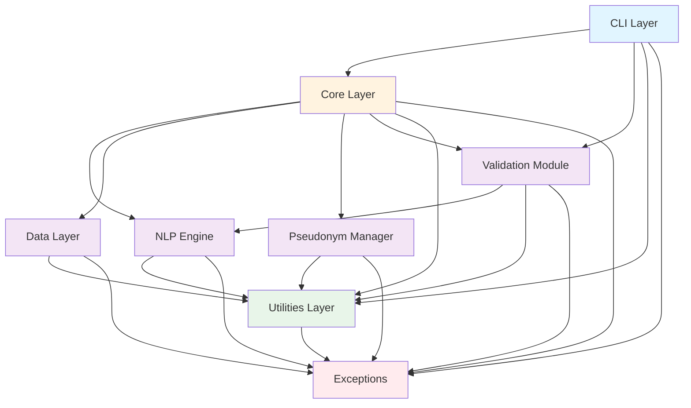

# Module Dependency Graph

This document defines the dependency relationships between modules in the GDPR Pseudonymizer application, following a layered architecture pattern.

## Dependency Principles

1. **Layered Architecture**: Dependencies flow downward through layers
2. **Interface-Based Dependencies**: Core layer depends on interfaces, not concrete implementations
3. **No Circular Dependencies**: All module dependencies form a directed acyclic graph (DAG)
4. **Dependency Injection**: Concrete implementations injected at application startup

---

## Architecture Layers

```
┌─────────────────────────────────────────┐
│              CLI Layer                  │
│         (User Interface)                │
└─────────────────┬───────────────────────┘
                  │
                  ▼
┌─────────────────────────────────────────┐
│             Core Layer                  │
│    (Orchestration & Workflow)           │
└─────┬───────────┬───────────┬───────────┘
      │           │           │
      ▼           ▼           ▼
┌─────────┐ ┌─────────┐ ┌──────────┐
│   NLP   │ │  Data   │ │Pseudonym │
│ Engine  │ │ Layer   │ │ Manager  │
└─────┬───┘ └────┬────┘ └────┬─────┘
      │          │           │
      └──────────┴───────────┘
                 │
                 ▼
┌─────────────────────────────────────────┐
│           Utilities Layer               │
│ (Config, Logging, File I/O, Encryption) │
└─────────────────────────────────────────┘
```

---

## Detailed Module Dependencies

### CLI Layer

**Module**: `gdpr_pseudonymizer.cli`

**Depends On**:
- `gdpr_pseudonymizer.core` (orchestrator, document_processor)
- `gdpr_pseudonymizer.validation` (validation workflow)
- `gdpr_pseudonymizer.utils.config_manager` (configuration loading)
- `gdpr_pseudonymizer.utils.logger` (logging)
- `gdpr_pseudonymizer.exceptions` (error handling)

**Depended On By**: None (top layer)

**Purpose**: Command-line interface for user interaction

---

### Core Layer

**Module**: `gdpr_pseudonymizer.core`

**Depends On**:
- `gdpr_pseudonymizer.nlp.entity_detector` (EntityDetector interface)
- `gdpr_pseudonymizer.data.repositories.mapping_repository` (MappingRepository interface)
- `gdpr_pseudonymizer.pseudonym.assignment_engine` (PseudonymManager interface)
- `gdpr_pseudonymizer.validation` (ValidationSession, workflow)
- `gdpr_pseudonymizer.utils.logger` (logging)
- `gdpr_pseudonymizer.utils.file_handler` (file I/O)
- `gdpr_pseudonymizer.exceptions` (error handling)

**Depended On By**: CLI layer

**Purpose**: Orchestrates pseudonymization workflow, coordinates between NLP, data, and pseudonym layers

**Critical Rule**: Core layer MUST depend on interfaces, NOT concrete implementations

---

### NLP Engine

**Module**: `gdpr_pseudonymizer.nlp`

**Depends On**:
- `gdpr_pseudonymizer.utils.logger` (logging)
- `gdpr_pseudonymizer.exceptions` (ModelNotFoundError)

**Depended On By**: Core layer

**Purpose**: Named entity detection using spaCy

**Files**:
- `entity_detector.py` - Abstract interface (DetectedEntity, EntityDetector)
- `spacy_detector.py` - spaCy implementation (SpaCyDetector)
- `stanza_detector.py` - Stanza implementation (future)

---

### Data Layer

**Module**: `gdpr_pseudonymizer.data`

**Depends On**:
- `gdpr_pseudonymizer.utils.encryption` (EncryptionService interface)
- `gdpr_pseudonymizer.utils.logger` (logging)
- `gdpr_pseudonymizer.exceptions` (EncryptionError)
- `sqlalchemy` (ORM)

**Depended On By**: Core layer

**Purpose**: Entity mapping persistence, audit logging, encryption

**Files**:
- `models.py` - SQLAlchemy models (Entity, Operation, Metadata)
- `repositories/mapping_repository.py` - Repository interface and SQLite implementation
- `repositories/audit_repository.py` - Audit log repository (Epic 2)
- `encryption.py` - Encryption service implementation (Epic 2)

---

### Pseudonym Manager

**Module**: `gdpr_pseudonymizer.pseudonym`

**Depends On**:
- `gdpr_pseudonymizer.utils.logger` (logging)
- `gdpr_pseudonymizer.exceptions` (FileProcessingError)

**Depended On By**: Core layer

**Purpose**: Pseudonym assignment with compositional logic

**Files**:
- `assignment_engine.py` - Interface (PseudonymAssignment, PseudonymManager)
- `library_manager.py` - JSON library loader (Epic 2)
- `validators.py` - Pseudonym validation (Epic 2)

---

### Validation Module

**Module**: `gdpr_pseudonymizer.validation`

**Depends On**:
- `gdpr_pseudonymizer.nlp.entity_detector` (DetectedEntity)
- `gdpr_pseudonymizer.utils.logger` (logging)
- `gdpr_pseudonymizer.exceptions` (ValidationError)
- `rich` (CLI UI components)

**Depended On By**: CLI layer, Core layer

**Purpose**: Human-in-the-loop entity validation

**Files**:
- `models.py` - Validation data models (ValidationSession, EntityReview, EntityReviewState)
- `ui.py` - Rich-based UI components (Story 1.7)
- `workflow.py` - Validation workflow orchestration (Story 1.7)

---

### Utilities Layer

**Module**: `gdpr_pseudonymizer.utils`

**Depends On**:
- `gdpr_pseudonymizer.exceptions` (ConfigurationError, FileProcessingError, EncryptionError)
- `pathlib` (stdlib)
- `yaml` (PyYAML)
- `structlog` (structured logging)
- `cryptography` (Fernet encryption)

**Depended On By**: All layers

**Purpose**: Cross-cutting concerns (config, logging, file I/O, encryption)

**Files**:
- `config_manager.py` - Configuration loading
- `logger.py` - Structured logging setup
- `file_handler.py` - File I/O utilities
- `encryption.py` - Encryption service interface
- `markdown_parser.py` - Markdown processing (Epic 3)

---

### Exceptions

**Module**: `gdpr_pseudonymizer.exceptions`

**Depends On**: None (base module)

**Depended On By**: All modules

**Purpose**: Custom exception hierarchy

**Exceptions**:
- `PseudonymizerError` (base)
- `ConfigurationError`
- `ModelNotFoundError`
- `EncryptionError`
- `ValidationError`
- `FileProcessingError`

---

## Dependency Graph (Mermaid Diagram)



---

## Circular Dependency Prevention

**Verification**: All dependencies flow downward through layers. No module depends on a module that depends on it.

**Key Rules**:
1. CLI layer never imported by other layers
2. Core layer never imports CLI
3. Domain layers (NLP, Data, Pseudonym, Validation) never import Core or CLI
4. Utilities layer never imports domain layers
5. Exceptions module is leaf-level (no dependencies)

**Interface Pattern**: Core layer depends on abstract interfaces (EntityDetector, MappingRepository, PseudonymManager), not concrete implementations. This enables:
- Swapping NLP libraries (spaCy → Stanza)
- Changing database implementations (SQLite → PostgreSQL)
- Testing with mock implementations

---

## Dependency Injection Pattern

**Startup Flow** (Story 1.5+):

```python
# 1. Load configuration
config = load_config()

# 2. Initialize utilities
configure_logging(config.log_level)
logger = get_logger(__name__)

# 3. Initialize concrete implementations
entity_detector = SpaCyDetector()
entity_detector.load_model(config.model_name)

mapping_repo = SQLiteMappingRepository(config.db_path)
pseudonym_mgr = LibraryBasedPseudonymManager()
pseudonym_mgr.load_library(config.theme)

# 4. Inject dependencies into core orchestrator
orchestrator = DocumentOrchestrator(
    detector=entity_detector,      # Interface type
    repository=mapping_repo,       # Interface type
    pseudonym_manager=pseudonym_mgr  # Interface type
)

# 5. CLI commands use orchestrator
cli_app = create_cli_app(orchestrator=orchestrator)
```

This pattern ensures:
- Core layer never imports concrete implementations
- Dependencies can be easily mocked for testing
- Implementation details can change without modifying core logic

---

## Testing Implications

**Unit Tests** (tests/unit/):
- Test each module in isolation
- Mock all dependencies using pytest-mock
- Verify interface contracts

**Integration Tests** (tests/integration/):
- Test module interactions
- Verify dependency injection works correctly
- Test end-to-end workflows

**Module Import Test** (tests/integration/test_module_loading.py):
- Verify all modules can be imported without circular dependencies
- Verify interface implementations conform to contracts

---

## Future Extensions

**Extensibility Points**:

1. **New NLP Library**: Implement `EntityDetector` interface
   ```python
   class StanzaDetector(EntityDetector):
       # Implement abstract methods
   ```

2. **New Database**: Implement `MappingRepository` interface
   ```python
   class PostgreSQLMappingRepository(MappingRepository):
       # Implement abstract methods
   ```

3. **New Pseudonym Strategy**: Implement `PseudonymManager` interface
   ```python
   class MLBasedPseudonymManager(PseudonymManager):
       # Implement abstract methods
   ```

All extensions integrate without modifying Core layer code due to interface-based dependencies.

---

**Document Version**: 1.0
**Story**: 1.4 - Project Foundation & Module Structure
**Date**: 2026-01-18
